# CI Workflow Dependencies

## What are Docker Tests and MinIO?

### **🐳 Docker Tests**

Docker tests are **integration tests** that require external services:

- **MinIO**: S3-compatible object storage for testing cloud storage functionality
- **Azurite**: Azure Blob Storage emulator for testing Azure integrations
- **Real-world simulation**: Tests how icechunk works with actual storage backends

### **📦 MinIO Explained**

MinIO is an **S3-compatible object storage server** that runs in Docker:

- **Purpose**: Icechunk stores data in object storage (S3, Azure, etc.)
- **Testing**: MinIO provides a local S3-like environment for tests
- **Why needed**: Can't test real cloud storage in every CI run (cost, complexity)
- **Setup**: `docker compose up -d minio` starts a local S3-compatible server

### **🏗️ When Docker Tests Run**

- **Ubuntu only**: Docker works reliably on Linux CI runners
- **Integration tests**: Test actual storage operations, not just unit logic
- **Scheduled runs**: Heavy integration tests run 3x daily, not on every PR
- **PR tests**: Basic functionality with MinIO, comprehensive on schedule

---

## BEFORE: Original Workflow Structure (Redundant Builds)

### Problem: Each Job Builds Independently

```mermaid
graph TB
    subgraph WASTE["⚠️ MASSIVE RESOURCE WASTE"]
        PROBLEM1["13+ Independent Rust Compilations"]
        PROBLEM2["4+ Independent Wheel Builds"]
        PROBLEM3["6+ Independent Docker Setups"]
        PROBLEM4["No Artifact Sharing"]
    end

    subgraph RUST["rust-ci.yaml"]
        R1["ubuntu-latest → Rust Build #1"]
        R2["ubuntu-arm → Rust Build #2"]
        R3["macos-13 → Rust Build #3"]
        R4["macos-latest → Rust Build #4"]
    end

    subgraph PYTHON["python-check.yaml"]
        P1["Main Job → Rust Build #5 → Wheel #1"]
        P2["XArray → Rust Build #6 → Wheel #2"]
    end

    subgraph UPSTREAM["python-upstream.yaml"]
        U1["Dev Test → Rust Build #7 → Wheel #3"]
        U2["XArray → Rust Build #8 → Wheel #4"]
    end

    subgraph RELEASE["python-ci.yaml"]
        L1["Linux → Rust Build #9"]
        L2["MuslLinux → Rust Build #10"]
        W1["Windows → Rust Build #11"]
        M1["macOS → Rust Build #12"]
    end

    WIN["windows-check → Rust Build #13"]
```

## AFTER: Multi-Architecture CI Coordinator

### Level 1: High-Level Overview

```mermaid
flowchart TD
    TRIGGER["🎯 PR/Push Event"]

    COORD["📋 ci-coordinator.yaml<br/>(Single Entry Point)"]

    subgraph BUILDS["🔨 Build Phase (Parallel)"]
        B1["Ubuntu x86_64"]
        B2["Ubuntu ARM64"]
        B3["macOS x86_64"]
        B4["macOS ARM64"]
        B5["Windows x86_64"]
    end

    subgraph TESTS["🧪 Test Phase (Parallel)"]
        T1["Ubuntu Tests<br/>(Docker + Integration)"]
        T2["Cross-Platform Tests<br/>(Unit Tests Only)"]
        T3["Python Tests<br/>(Ubuntu Only)"]
        T4["Code Quality<br/>(Independent)"]
    end

    TRIGGER --> COORD
    COORD --> BUILDS
    BUILDS --> TESTS
```

### Level 2: Detailed Architecture Flow

```mermaid
flowchart TD
    EVENT["🎯 PR/Push to main"]

    subgraph COORDINATOR["📋 ci-coordinator.yaml"]
        direction TB
        BUILD_JOBS["🔨 Build Jobs (Parallel)"]
        TEST_JOBS["🧪 Test Jobs (After Builds)"]
        BUILD_JOBS --> TEST_JOBS
    end

    subgraph PLATFORM_BUILDS["🔨 Platform-Specific Builds"]
        UB_X86["build_ubuntu_x86<br/>shared-build.yaml<br/>→ rust-artifacts-x86_64-ubuntu-latest<br/>→ python-wheels-x86_64-ubuntu-latest"]

        UB_ARM["build_ubuntu_arm<br/>shared-build.yaml<br/>→ rust-artifacts-aarch64-ubuntu-24.04-arm"]

        MAC_X86["build_macos_x86<br/>shared-build.yaml<br/>→ rust-artifacts-x86_64-macos-13"]

        MAC_ARM["build_macos_arm<br/>shared-build.yaml<br/>→ rust-artifacts-aarch64-macos-14"]

        WIN["build_windows<br/>shared-build.yaml<br/>→ rust-artifacts-x86_64-windows-latest"]
    end

    subgraph TEST_EXECUTION["🧪 Test Execution"]
        T_UB_X86["test_ubuntu_x86<br/>rust-testing.yaml<br/>include_docker_tests: true"]

        T_CROSS["Cross-Platform Tests<br/>rust-testing.yaml<br/>include_docker_tests: false"]

        T_PY["python_tests<br/>python-testing-optimized.yaml<br/>Uses Ubuntu x86 artifacts"]

        T_UP["upstream_tests<br/>python-upstream-optimized.yaml<br/>(Conditional)"]

        T_LINT["linting<br/>linting.yaml<br/>(Independent builds)"]
    end

    EVENT --> COORDINATOR
    BUILD_JOBS --> PLATFORM_BUILDS
    TEST_JOBS --> TEST_EXECUTION

    UB_X86 --> T_UB_X86
    UB_X86 --> T_PY
    UB_X86 --> T_UP
    UB_ARM --> T_CROSS
    MAC_X86 --> T_CROSS
    MAC_ARM --> T_CROSS
    WIN --> T_CROSS
```

### Level 3: Ubuntu x86_64 Deep Dive (Docker Tests)

```mermaid
flowchart TD
    subgraph UBUNTU_BUILD["🔨 build_ubuntu_x86 (shared-build.yaml)"]
        UB_CHECKOUT["📥 Checkout code"]
        UB_RUST_SETUP["🦀 Install Rust 1.89.0"]
        UB_CACHE["💾 Swatinem rust-cache"]
        UB_BUILD["🔨 cargo build --release"]
        UB_UPLOAD_RUST["📤 Upload rust-artifacts-x86_64-ubuntu-latest"]

        UB_PY_SETUP["🐍 Setup Python"]
        UB_DOWNLOAD["📥 Download rust artifacts"]
        UB_MATURIN["⚙️ maturin build --release"]
        UB_UPLOAD_PY["📤 Upload python-wheels-x86_64-ubuntu-latest"]

        UB_CHECKOUT --> UB_RUST_SETUP
        UB_RUST_SETUP --> UB_CACHE
        UB_CACHE --> UB_BUILD
        UB_BUILD --> UB_UPLOAD_RUST
        UB_UPLOAD_RUST --> UB_PY_SETUP
        UB_PY_SETUP --> UB_DOWNLOAD
        UB_DOWNLOAD --> UB_MATURIN
        UB_MATURIN --> UB_UPLOAD_PY
    end

    subgraph UBUNTU_TEST["🧪 test_ubuntu_x86 (rust-testing.yaml)"]
        UT_CHECKOUT["📥 Checkout code"]
        UT_DOWNLOAD["📥 Download rust-artifacts-x86_64-ubuntu-latest"]
        UT_DOCKER["🐳 docker compose up -d<br/>(MinIO + Azurite)"]
        UT_WAIT["⏳ Wait for MinIO health check"]
        UT_JUST["🛠️ Install Just"]
        UT_RUST["🦀 Install Rust toolchain"]
        UT_CACHE["💾 Swatinem cache"]
        UT_DENY["🔒 Install cargo-deny"]
        UT_TESTS["🧪 just pre-commit-ci<br/>(Full test suite + Docker integration)"]

        UT_CHECKOUT --> UT_DOWNLOAD
        UT_DOWNLOAD --> UT_DOCKER
        UT_DOCKER --> UT_WAIT
        UT_WAIT --> UT_JUST
        UT_JUST --> UT_RUST
        UT_RUST --> UT_CACHE
        UT_CACHE --> UT_DENY
        UT_DENY --> UT_TESTS
    end

    subgraph PYTHON_TEST["🐍 python_tests (python-testing-optimized.yaml)"]
        PT_CHECKOUT["📥 Checkout code"]
        PT_DOCKER_CACHE["💾 Restore Docker cache"]
        PT_DOCKER_LOAD["🐳 Load + start MinIO"]
        PT_DOWNLOAD_PY["📥 Download python-wheels-x86_64-ubuntu-latest"]
        PT_PYTHON["🐍 Setup Python 3.11"]
        PT_VENV["📦 Create venv + install wheels"]
        PT_PYTEST["🧪 pytest -n 4<br/>(With MinIO integration)"]

        PT_CHECKOUT --> PT_DOCKER_CACHE
        PT_DOCKER_CACHE --> PT_DOCKER_LOAD
        PT_DOCKER_LOAD --> PT_DOWNLOAD_PY
        PT_DOWNLOAD_PY --> PT_PYTHON
        PT_PYTHON --> PT_VENV
        PT_VENV --> PT_PYTEST
    end

    UB_UPLOAD_RUST --> UT_DOWNLOAD
    UB_UPLOAD_PY --> PT_DOWNLOAD_PY
    UT_DOCKER --> PT_DOCKER_CACHE
```

### Level 4: Cross-Platform Comparison

```mermaid
graph TB
    subgraph UBUNTU["🐧 Ubuntu (Full Testing)"]
        UB_BUILD["Build: cargo + maturin"]
        UB_DOCKER["🐳 Docker: MinIO + Azurite"]
        UB_TESTS["Tests: Full CI suite<br/>• Unit tests<br/>• Integration tests<br/>• Docker integration<br/>• Python tests<br/>• Examples<br/>• Linting"]
        UB_BUILD --> UB_DOCKER
        UB_DOCKER --> UB_TESTS
    end

    subgraph MACOS["🍎 macOS (Unit Tests Only)"]
        MAC_BUILD["Build: cargo only"]
        MAC_TESTS["Tests: Unit tests<br/>• cargo test --lib<br/>• No Docker<br/>• No integration"]
        MAC_BUILD --> MAC_TESTS
    end

    subgraph WINDOWS["🪟 Windows (Unit Tests Only)"]
        WIN_BUILD["Build: cargo only"]
        WIN_TESTS["Tests: Unit tests<br/>• cargo test --lib<br/>• No Docker<br/>• No integration"]
        WIN_BUILD --> WIN_TESTS
    end

    RATIONALE["💡 Rationale:<br/>• Ubuntu: Best Docker support, most comprehensive<br/>• macOS/Windows: Unit tests catch platform-specific issues<br/>• Docker integration: Complex, only needed on one platform<br/>• Cost efficient: Heavy tests run once, light tests everywhere"]
```

## Detailed Workflow Dependencies

### Step-by-Step Flow

```mermaid
graph TB
    subgraph BUILD["BUILD PHASE"]
        B1["shared-build.yaml"]
        B2["├─ Rust compilation"]
        B3["├─ Python wheels"]
        B4["└─ Docker setup"]
        B1 --> B2
        B1 --> B3
        B1 --> B4
    end

    subgraph RUST["RUST TESTING"]
        R1["rust-ci-optimized.yaml"]
        R2["├─ test_main"]
        R3["├─ test_cross_platform"]
        R4["├─ test_windows"]
        R5["└─ integration_tests"]
        R1 --> R2
        R1 --> R3
        R1 --> R4
        R1 --> R5
    end

    subgraph PYTHON["PYTHON TESTING"]
        P1["python-check-optimized.yaml"]
        P2["├─ mypy"]
        P3["├─ lint"]
        P4["├─ test"]
        P5["└─ xarray_backends"]
        P1 --> P2
        P1 --> P3
        P1 --> P4
        P1 --> P5
    end

    subgraph UPSTREAM["UPSTREAM TESTING"]
        U1["python-upstream-optimized.yaml"]
        U2["├─ upstream_dev"]
        U3["└─ xarray_backends_upstream"]
        U1 --> U2
        U1 --> U3
    end

    BUILD --> RUST
    BUILD --> PYTHON
    BUILD --> UPSTREAM
```

## Caching Strategy

### Multi-Layer Caching for Speed

```mermaid
graph TB
    subgraph RUST_CACHE["🦀 Rust Caching"]
        RC1["Swatinem/rust-cache"]
        RC2["• Cargo registry"]
        RC3["• Build artifacts"]
        RC4["• All crates"]
        RC1 --> RC2
        RC1 --> RC3
        RC1 --> RC4
    end

    subgraph PY_CACHE["🐍 Python Caching"]
        PC1["Actions Cache"]
        PC2["• Virtual environments"]
        PC3["• Pip dependencies"]
        PC4["• Hypothesis data"]
        PC1 --> PC2
        PC1 --> PC3
        PC1 --> PC4
    end

    subgraph DOCKER_CACHE["🐳 Docker Caching"]
        DC1["Container Cache"]
        DC2["• MinIO images"]
        DC3["• Azurite setup"]
        DC1 --> DC2
        DC1 --> DC3
    end

    RUST_CACHE --> RUST_WORKFLOWS["All Rust Jobs"]
    PY_CACHE --> PY_WORKFLOWS["All Python Jobs"]
    DOCKER_CACHE --> ALL_WORKFLOWS["Jobs Needing Docker"]
```

## Summary: Before vs After

### The Transformation

```mermaid
graph TB
    subgraph BEFORE["❌ BEFORE: Waste"]
        B1["13+ Rust Builds"]
        B2["4+ Wheel Builds"]
        B3["6+ Docker Setups"]
        B4["~25 minutes total"]
    end

    subgraph AFTER["✅ AFTER: Efficiency"]
        A1["1 Rust Build"]
        A2["1 Wheel Build"]
        A3["1 Docker Setup"]
        A4["~8 minutes total"]
    end

    BEFORE --> AFTER

    RESULT["💡 RESULT<br/>70% faster CI<br/>Same test coverage<br/>Better reliability"]
```

## Key Improvements

- **🔥 Single Build Source**: `shared-build.yaml` creates artifacts once
- **⚡ Parallel Efficiency**: Independent jobs run in parallel after build
- **🎯 Smart Dependencies**: Jobs only run when their dependencies complete
- **💾 Strategic Caching**: Multi-layer caching reduces rebuild frequency
- **🔄 Artifact Reuse**: Rust binaries and Python wheels shared across jobs
- **⏱️ Time Savings**: 60-70% reduction in total CI time expected
