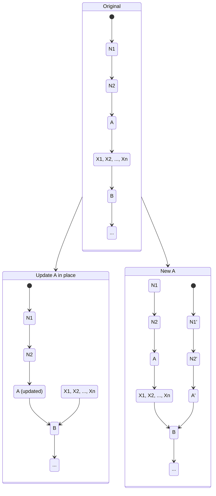
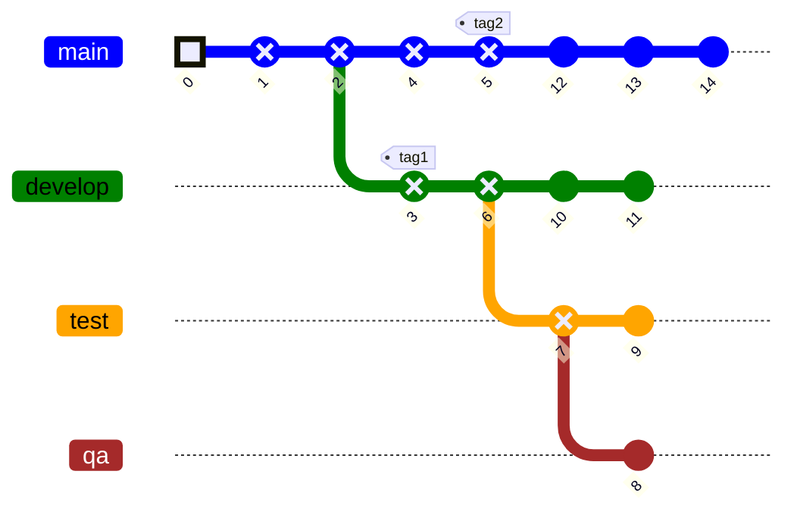
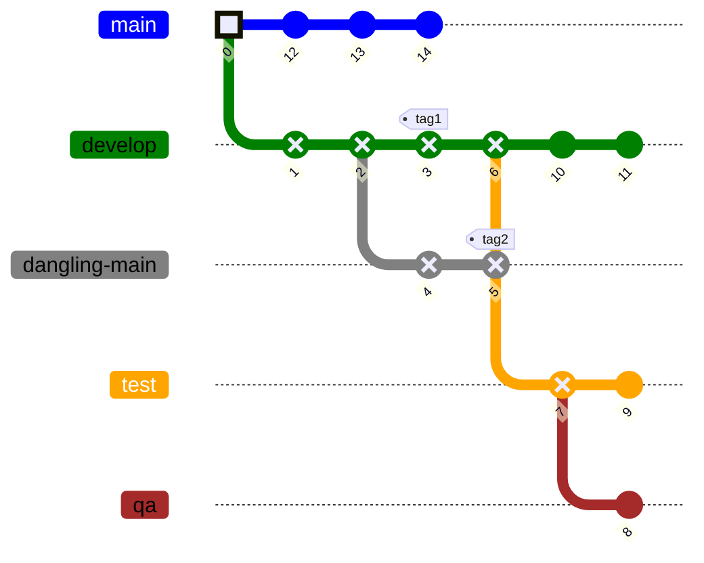
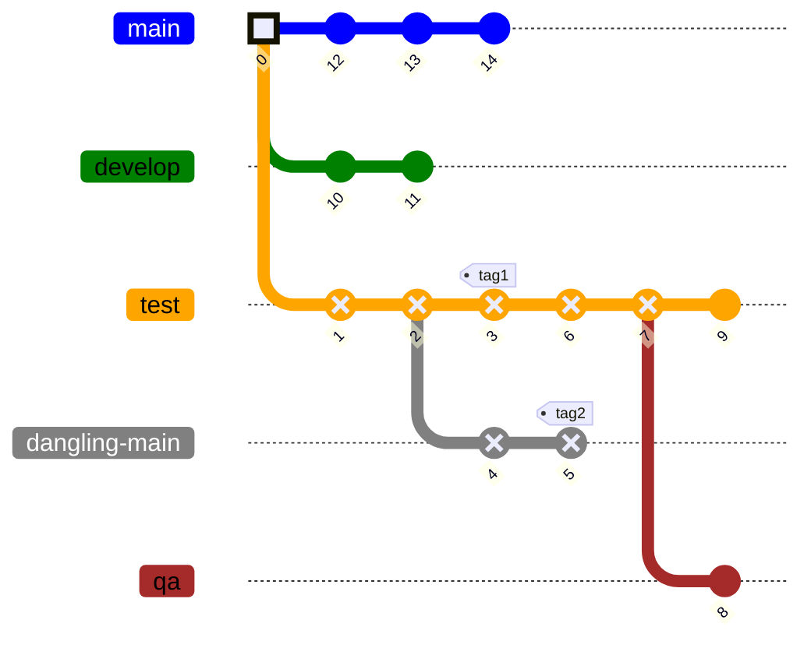
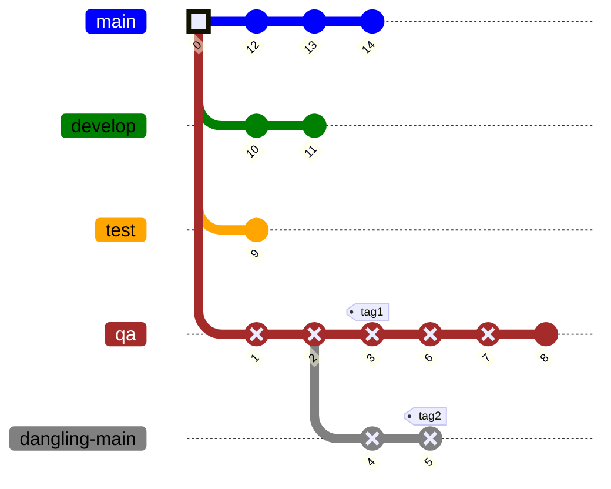
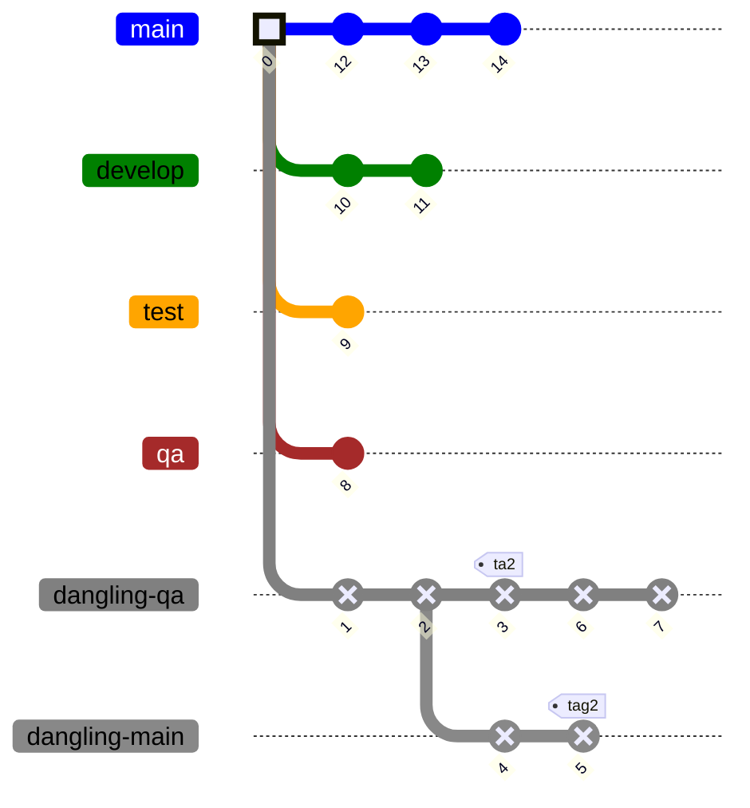

# Basic expiration algorithm

## What are _expiration_ and _garbage collection_

Icechunk keeps exhaustive track of history. Currently every snapshot ever written is available
in object store and never deleted. Many times, that is not what users want. Our experience with
Arraylake has taught us that
users usually want to keep "some history" but not all of it. The reason is:
wasted storage. If they never go back to check previous versions, why would they want to pay
for the extra storage?

There are many ways to select what versions (snapshots) should be kept
around and which ones should be deleted. In our experience, a good balance of
simplicity and power is: _Expire snapshots older than certain threshold_. Both
branches and tags retain the snapshots they point to. The user, or an
administrative operation, can delete tags that are only pointing to old snapshots.

The expiration process has two stages: history rewriting (aka expiration)
and garbage collection.

During history edits, references (branches and tags) and snapshots can be edited and added
in a way that generates a different view of the history of the repository.
During this process no objects are deleted. Some may be edited, but in a
non destructive way.

Garbage collection is the process by which objects that are no longer needed
get deleted, freeing storage space. In our case, we declare that the objects
that are no longer needed are those that cannot be reached from any tags or branches.
In this sense, tags and branches are what keep snapshots alive by pointing at them.

In this way, if history rewriting generates unreachable snapshots, then garbage
collection can free them. Importantly, once a snapshot becomes unreachable,
its exclusive manifests and its exclusive chunks are also unreachable. This
is where the storage savings actually happen, by deleting chunks that were
overwritten (or flagged as deleted) in later versions of the repository.

Keeping history is still very useful: it provides the infrastructure for
transactions, it allows users to undo mistakes, improves auditability, and,
in certain cases, it's a core feature users need (example: insurance industry).


## The simpler problem of snapshot removal

To understand how to expire old snapshots, we first need to understand
how we can abandon a series of arbitrary snapshots.
By "abandon", we mean give up the ability to check out those snapshots.

We present a diagram of a repository snapshots. Arrows point FROM the `parent`
to `child`. Above in the diagram is the original repo, and below, we show
two possible ways to abandon snapshots `X1, X2, ..., Xn`


In this diagram we want
to abandon a stream of contiguous snapshots `X1, X2,..., Xn` that sits
in the middle of some branch's history.

There are many ways in which this could be achieved. We display in the
diagram and explain below, the two we think deserve more analysis.

### Left algorithm: Update `A` in place

On the alternative displayed on the left of the diagram, we first find
snapshot `A`. It is found by traversing the commits from the
branch/tag pointer, using the `parent` relationship, and stopping
right before the first snapshot we want to abandon.

Once we have found `A` we can update its contents in place, maintaining its `SnapshotId`,
so, maintaining its path in object store. The update we do is
changing its ancestry, keeping all ancestors except the set
`{X1, X2, ..., Xn}`. In this form, `A`'s direct parent becomes `B`.
This operation is conceptually similar to a git "squash commits" operation.

No other changes are needed. Snapshots `X1, X2,..., Xn` remain on
disk, they are just no longer accessible from the starting branch/tag.

### Right algorithm: New `A`

The "ugly" part of the previous algorithm is that it requires an in-place
update of a metadata object in object store . We try to avoid that, currently
we only do updates for the persistent configuration file.

The mechanism displayed on the right, doesn't require any snapshot updates.
We write a new snapshot `A'`, to a new random snapshot id. `A'` has
the same contents as `A` except its direct parent is `B` instead of `X1`. Once we have
`A'`, we can write its parent, a new snapshot `N2'`. This new snapshot has the same
contents as `N2`, but its direct parent is `A'` instead of `A`.

We proceed in this fashion all the way to the latest snapshot in the branch.
At this point we need to update the branch to point to `N1'` instead of `N1`.
This can be achieved without mutation, using the normal branch update mechanism.

If the pointer is a tag instead of a branch, we may not need to change it.
Users of the tag will still see the same contents, except for a different
ancestry, because we haven't deleted any snapshots.


### Comparison between the algorithms

As mentioned "new `A`" has no snapshot in-place updates. But on the
other hand, it requires loading and rewriting potentially many snapshots.
"Update `A` in place" is much easier to execute.

If there are other branches or tags pointing to `X1, ..., Xn`, both
mechanisms behave similarly. Those branches and tags will continue
to work, but they will have a view of the previous ancestry, not
the modified one. This view will still be consistent, just outdated.

If there are branches or tags pointing to `N1`, `N2` or `A`,
"New `A`" is worse. All those refs may need to
be updated to point to the primed versions, to get a
more consistent view of history. This doesn't happen in
the "Update `A` in place" case, because all snapshot ids have
been preserved.

In terms of concurrency safety, both algorithms have similar properties.
We  don't evaluate the case of multiple expiration operations ran at
once. We keep undefined behavior in that case.

If a user is reading a snapshot being rewritten by the left algorithm,
they could either get the history version before or after the operation,
but never an invalid view of history or an invalid snapshot. Object stores
guarantee atomic updates to individual objects, and they also guarantee
strong read-after-update consistency (with some region caveats in the case of
Tigris).

For the right algorithm case, the "race condition" is produced when the
branch is updated, but again, this is safe and atomic.

Any operations that may require multiple passes through the repository
history, will suffer inconsistencies if expiration is running concurrently.
They can get different views of the history in each pass.
But that's true for any algorithm that modifies
history. Users will need to implement their own consistency mechanisms
for this operations, and to avoid multiple expiration operations
happening at once. Expiration is considered an administrative operation,
and in general avoided during repository usage.

We choose to implement the algorithm on the left: "Update A in place" for its
simplicity. We don't think the alternative has enough advantages to justify
its shortcomings.
We accept the tradeoff that we will have to rewrite metadata files in place.


## Using this algorithm for snapshot expiration

Now that we know how to abandon snapshots, we can expire snapshots based
on age. Here is a rough pseudo-code overview of the algorithm:

```python
for ref in repo.tags + repo.branches:
    snapshot_id = resolve_ref(ref)
    snapshot = fetch_snapshot(snapshot_id)

    # we do nothing if the ref points to a snapshot that is fully expired already
    if snapshot.timestamp < TIME_THRESHOLD:
        continue

    # find the root of the tree
    # this is B in our algorithm, the root
    root = next(for parent in snapshot.ancestry if parent.parent is None)

    # find the last non-expired snapshot
    # this is A in our algorithm
    editable = last(for parent in snapshot.ancestry if parent.timestamp >= TIME_THRESHOLD)
    editable.parent = root
    write_snapshot(editable)
```

This process can be executed with branches and tags in any order. In the end,
the expired snapshots will be left with either, no branches/tags pointing to them,
or with branches or tags pointed directly to them, with no intermediate non-expired snapshots
such as `N1` and `N2`.

This end state is the ideal one for the garbage collection algorithm to start.
Non-pointed snapshots will be deleted, together with their exclusive manifests
and chunks. Branches or tags pointing directly to expired snapshots can be
deleted too, which will generate extra garbage GC can clean.

## Forbidden Expiration Operations

- Expiring any snapshot that is directly pointed by a branch
- Expiring any snapshot that is directly pointed by a tag

### Sample run of the algorithm:

**Imagine the following history tree**, `X` marks snapshots that are to be expired.



We will process the branches and tags in the arbitrary order:
* `main`
* `develop`
* `test`
* `qa`
* `tag1`
* `tag2`

**Output after processing the `main` branch**


As we can see, we have created two dangling snapshots: `4` and `5`. All other
snapshots continue to be pointed by some branch. Notice that `4` and `5` are
not actually dangling, they are still pointed by `tag2`, but `tag2`
points directly to an expired snapshot, so it will probably be deleted
when the user wants to free storage space.

**Output after processing the `develop` branch**


Now both `main` and `develop` have a much shorter history, but we haven't
created any new dangling snapshots that could be garbage collected.

**Output after processing the `test` branch**


**Output after processing the `qa` branch**


Now snapshots `6` and `7` are dangling. They are ready to be garbage collected
when GC runs. Snapshots `1` to `5` are still pointed by tags, but those
tags are candidates for delete.

When the algorithm processes tags `tag1` and `tag2` nothing new happens, because
they already point to expired snapshots.

The final result of the algorithm is a tree with a much wider shape. Garbage
collection can already free two snapshots, and 5 more would be deleted if
we delete the "expired tags". This process of deleting tags that are pointing to
expired snapshots, could be optional part of the expiration process.


## On timestamps

There is a causality relationship between a snapshot and its parent: We know
the parent was always written before the child, because it includes its id.
But:

* How do we enforce monotonicity of snapshot timestamps?
* what should we use as the timestamp for a snapshot in the expiration process?

Snapshots store the timestamp at which they were created, but, this time
comes from the user's clock. Clocks do drift.

A better source of time would be the metadata in the object store, we could
use `Last Updated At` for this, but:

* It's hard to implement well, we only get the timestamp after writing or retrieving the object.
* It would break when we update the snapshot in place, because that also updates the timestamp.

Here is one approach we could use:

* Enforce monotonicity: don't let a snapshot be written unless its timestamp is larger than the
parent timestamp.
* When a snapshot is written for the first time, compare the `last-updated-at` field from
the object store with the snapshot internal timestamp, and interrupt the flush process
if the difference is larger than a few minutes. The snapshot will be left dangling, which is OK.
* On snapshot in-place update, maintain the same timestamp and ignore the value retrieved from
object store.
