# CI Infrastructure

This document explains Icechunk's Continuous Integration (CI) infrastructure, including the multi-architecture build system, testing strategy, and optimization techniques used to minimize build times while maintaining comprehensive test coverage.

## Overview

Icechunk uses a **multi-architecture CI coordinator** approach that builds artifacts once per platform and reuses them across multiple test jobs. This design reduces CI time by 60-70% compared to the previous approach where each job built independently.

The CI pipeline has been optimized with comprehensive caching strategies and separated Docker infrastructure to eliminate unnecessary delays for non-Docker dependent tests.

### Key Components

- **🐳 Docker Tests**: Integration tests with MinIO (S3-compatible storage) and Azurite (Azure emulator)
- **🔨 Multi-Architecture Builds**: Ubuntu x86/ARM, macOS x86/ARM, Windows x86
- **🧪 Strategic Testing**: Full integration tests on Ubuntu, unit tests on other platforms
- **💾 Artifact Sharing**: Rust binaries and Python wheels shared between jobs

## Architecture Overview

```mermaid
flowchart TD
    TRIGGER["🎯 PR/Push Event"]

    COORD["📋 ci-coordinator.yaml<br/>(Single Entry Point)"]

    subgraph BUILDS["🔨 Build Phase (Parallel)"]
        B1["Ubuntu x86_64"]
        B2["macOS ARM64"]
        B3["Windows x86_64"]
    end

    subgraph TESTS["🧪 Test Phase (Parallel)"]
        T1["Ubuntu Tests<br/>(Docker + Integration)"]
        T2["Cross-Platform Tests<br/>(Unit Tests Only)"]
        T3["Python Tests<br/>(Ubuntu Only)"]
        T4["Code Quality<br/>(Independent)"]
    end

    TRIGGER --> COORD
    COORD --> BUILDS
    BUILDS --> TESTS
```

## Detailed Workflow Architecture

```mermaid
flowchart TD
    EVENT["🎯 PR/Push to main"]

    subgraph COORDINATOR["📋 ci-coordinator.yaml"]
        direction TB
        BUILD_JOBS["🔨 Build Jobs (Parallel)"]
        TEST_JOBS["🧪 Test Jobs (After Builds)"]
        BUILD_JOBS --> TEST_JOBS
    end

    subgraph PLATFORM_BUILDS["🔨 Platform-Specific Builds"]
        UB_X86["build_ubuntu_x86<br/>shared-build.yaml<br/>→ rust-artifacts-x86_64-ubuntu-latest<br/>→ python-wheels-x86_64-ubuntu-latest"]

        UB_ARM["build_ubuntu_arm<br/>shared-build.yaml<br/>→ rust-artifacts-aarch64-ubuntu-24.04-arm"]

        MAC_X86["build_macos_x86<br/>shared-build.yaml<br/>→ rust-artifacts-x86_64-macos-13"]

        MAC_ARM["build_macos_arm<br/>shared-build.yaml<br/>→ rust-artifacts-aarch64-macos-14"]

        WIN["build_windows<br/>shared-build.yaml<br/>→ rust-artifacts-x86_64-windows-latest"]
    end

    subgraph TEST_EXECUTION["🧪 Test Execution"]
        T_UB_X86["test_ubuntu_x86<br/>rust-testing.yaml<br/>include_docker_tests: true"]

        T_CROSS["Cross-Platform Tests<br/>rust-testing.yaml<br/>include_docker_tests: false"]

        T_PY["python_tests<br/>python-testing-optimized.yaml<br/>Uses Ubuntu x86 artifacts"]

        T_UP["upstream_tests<br/>python-upstream-optimized.yaml<br/>(Conditional)"]

        T_LINT["linting<br/>linting.yaml<br/>(Independent builds)"]
    end

    EVENT --> COORDINATOR
    BUILD_JOBS --> PLATFORM_BUILDS
    TEST_JOBS --> TEST_EXECUTION

    UB_X86 --> T_UB_X86
    UB_X86 --> T_PY
    UB_X86 --> T_UP
    UB_ARM --> T_CROSS
    MAC_X86 --> T_CROSS
    MAC_ARM --> T_CROSS
    WIN --> T_CROSS
```

## Docker Tests and MinIO

### What are Docker Tests?

Docker tests are **integration tests** that require external services:

- **MinIO**: S3-compatible object storage for testing cloud storage functionality
- **Azurite**: Azure Blob Storage emulator for testing Azure integrations
- **Real-world simulation**: Tests how icechunk works with actual storage backends

### MinIO Explained

MinIO is an **S3-compatible object storage server** that runs in Docker:

- **Purpose**: Icechunk stores data in object storage (S3, Azure, etc.)
- **Testing**: MinIO provides a local S3-like environment for tests
- **Why needed**: Can't test real cloud storage in every CI run (cost, complexity)
- **Setup**: `docker compose up -d minio` starts a local S3-compatible server

### When Docker Tests Run

- **Ubuntu only**: Docker works reliably on Linux CI runners
- **Integration tests**: Test actual storage operations, not just unit logic
- **Scheduled runs**: Heavy integration tests run 3x daily, not on every PR
- **PR tests**: Basic functionality with MinIO, comprehensive on schedule

## Platform-Specific Testing Strategy

```mermaid
graph TB
    subgraph UBUNTU["🐧 Ubuntu (Full Testing)"]
        UB_BUILD["Build: cargo + maturin"]
        UB_DOCKER["🐳 Docker: MinIO + Azurite"]
        UB_TESTS["Tests: Full CI suite<br/>• Unit tests<br/>• Integration tests<br/>• Docker integration<br/>• Python tests<br/>• Examples<br/>• Linting"]
        UB_BUILD --> UB_DOCKER
        UB_DOCKER --> UB_TESTS
    end

    subgraph MACOS["🍎 macOS (Unit Tests Only)"]
        MAC_BUILD["Build: cargo only"]
        MAC_TESTS["Tests: Unit tests<br/>• cargo test --lib<br/>• No Docker<br/>• No integration"]
        MAC_BUILD --> MAC_TESTS
    end

    subgraph WINDOWS["🪟 Windows (Unit Tests Only)"]
        WIN_BUILD["Build: cargo only"]
        WIN_TESTS["Tests: Unit tests<br/>• cargo test --lib<br/>• No Docker<br/>• No integration"]
        WIN_BUILD --> WIN_TESTS
    end

    RATIONALE["💡 Rationale:<br/>• Ubuntu: Best Docker support, most comprehensive<br/>• macOS/Windows: Unit tests catch platform-specific issues<br/>• Docker integration: Complex, only needed on one platform<br/>• Cost efficient: Heavy tests run once, light tests everywhere"]
```

## Caching Strategy

The CI system uses multi-layer caching for optimal performance, including recent optimizations for Rust toolchain caching and cargo-deny binary caching:

```mermaid
graph TB
    subgraph RUST_CACHE["🦀 Rust Caching"]
        RC1["Swatinem/rust-cache<br/>• Cargo registry<br/>• Build artifacts<br/>• All crates"]
        RC2["Rustup Toolchain Cache<br/>• ~/.rustup/toolchains<br/>• ~/.rustup/update-hashes<br/>• ~/.rustup/settings.toml"]
        RC3["cargo-deny Binary<br/>• ~/.cargo/bin/cargo-deny<br/>• Version-specific caching"]
    end

    subgraph PY_CACHE["🐍 Python Caching"]
        PC1["Actions Cache"]
        PC2["• Virtual environments"]
        PC3["• Pip dependencies"]
        PC4["• Hypothesis data"]
        PC1 --> PC2
        PC1 --> PC3
        PC1 --> PC4
    end

    subgraph DOCKER_CACHE["🐳 Docker Caching"]
        DC1["Container Cache"]
        DC2["• MinIO images"]
        DC3["• Azurite setup"]
        DC1 --> DC2
        DC1 --> DC3
    end

    RUST_CACHE --> RUST_WORKFLOWS["All Rust Jobs"]
    PY_CACHE --> PY_WORKFLOWS["All Python Jobs"]
    DOCKER_CACHE --> ALL_WORKFLOWS["Jobs Needing Docker"]
```

## Workflow Files

### Core Workflows

- **`ci-coordinator.yaml`**: Main entry point that orchestrates all builds and tests
- **`shared-build.yaml`**: Reusable workflow for building Rust artifacts and Python wheels
- **`rust-testing-safe.yaml`**: Safe testing workflow (no secrets, runs on all PRs)
- **`rust-testing-integration.yaml`**: Integration testing workflow (requires secrets, trusted runs only)

### Specialized Workflows

- **`python-testing-optimized.yaml`**: Python tests using shared artifacts
- **`python-upstream-optimized.yaml`**: Upstream dependency testing
- **`linting.yaml`**: Code quality checks (independent builds for fast feedback)

### Artifact Naming Convention

Artifacts are named using the pattern: `{type}-{target}-{runner}`

Examples:
- `rust-artifacts-x86_64-ubuntu-latest`
- `python-wheels-aarch64-macos-14`
- `rust-artifacts-x86_64-windows-latest`

## Performance Improvements

### Before vs After

```mermaid
graph TB
    subgraph BEFORE["❌ BEFORE: Waste"]
        B1["13+ Rust Builds"]
        B2["4+ Wheel Builds"]
        B3["6+ Docker Setups"]
        B4["~25 minutes total"]
    end

    subgraph AFTER["✅ AFTER: Efficiency"]
        A1["1 Rust Build per Platform"]
        A2["1 Wheel Build per Platform"]
        A3["1 Docker Setup"]
        A4["~8 minutes total"]
    end

    BEFORE --> AFTER

    RESULT["💡 RESULT<br/>70% faster CI<br/>Same test coverage<br/>Better reliability"]
```

### Key Improvements

- **🔥 Single Build Source**: `shared-build.yaml` creates artifacts once per platform
- **⚡ Parallel Efficiency**: Independent jobs run in parallel after build
- **🎯 Smart Dependencies**: Jobs only run when their dependencies complete
- **💾 Strategic Caching**: Multi-layer caching reduces rebuild frequency
- **🔄 Artifact Reuse**: Rust binaries and Python wheels shared across jobs
- **⏱️ Time Savings**: 60-70% reduction in total CI time
- **🐳 Docker Separation**: Docker setup only runs for workflows that need it
- **🦀 Toolchain Caching**: Rustup installations cached across all workflows
- **📦 Binary Caching**: cargo-deny and other tools cached to avoid recompilation

## Security Model and Conditional Testing

The CI system implements a **dual-workflow security model** to protect cloud credentials:

### Safe Tests (All PRs)
- **`rust-testing-safe.yaml`**: No secrets exposed
- **Local Docker only**: MinIO and Azurite for S3/Azure simulation
- **All platform tests**: Ubuntu, macOS, Windows unit tests
- **Fast feedback**: Runs on every PR from any contributor

### Integration Tests (Trusted Only)
- **`rust-testing-integration.yaml`**: Requires cloud secrets
- **Real cloud storage**: R2, AWS S3, Tigris testing
- **Conditional execution**: Only runs when:
  - Scheduled runs (3x daily)
  - Manual workflow dispatch
  - Pushes to main branch
  - PRs with `test-with-secrets` label (maintainer approval)

### Test Categories
- **Unit Tests**: Run on all platforms without secrets
- **Docker Integration**: Safe MinIO/Azurite tests on Ubuntu
- **Cloud Integration**: Real cloud storage tests (secrets required)
- **Upstream Tests**: Dependency compatibility (labeled/scheduled only)

This **defense-in-depth** approach ensures:
- **Fast PR feedback** with comprehensive safe testing
- **Full validation** on trusted runs with cloud credentials
- **Zero secret exposure** to untrusted contributors
- **Maintainer control** via labels for special testing needs
