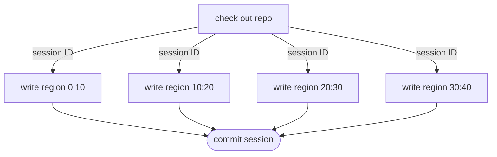
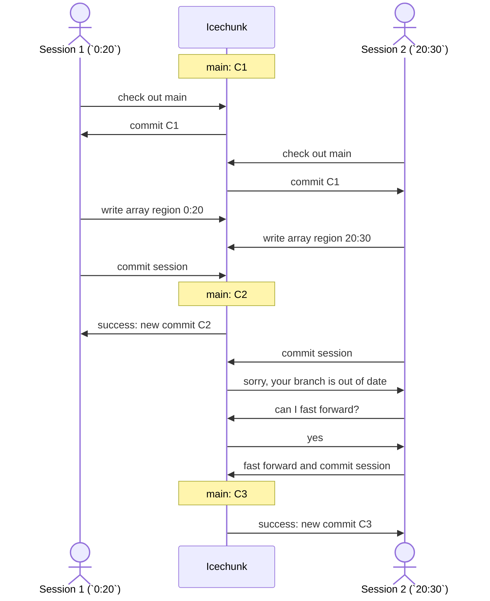
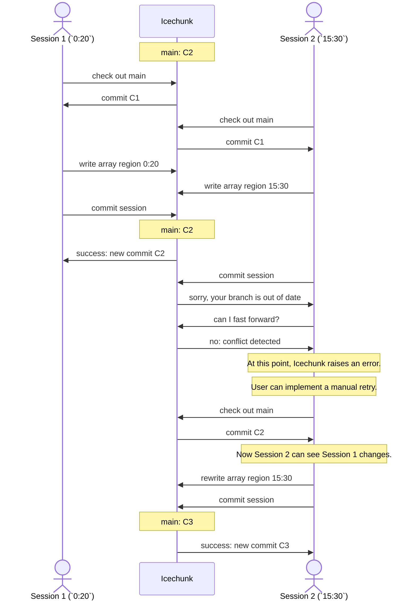

# Concurrency Modes

Concurrency refers to when multiple operations are performing I/O operations on Icechunk at the same time.
Concurrency is desirable when doing large-scale data processing, as it allows parallel reading / writing,
greatly increasing the throughput of a workflow. Concurrency can take many forms:
- Asynchronous operations
- Multithreading (multiple threads within a single machine)
- Multiprocessing (multiple processes within a single machine)
- Distributed processing (multiple machines working together)

Concurrent reading is never a problem with Icechunk and works well in any scenario.
Concurrent writing is more complicated.
Icechunk allows for two distinct approaches to concurrent writing to repos:

## Cooperative Mode

In **cooperative mode**, the concurrent writes occurs as part of a single job in which the user
can plan how each worker will act. Specifically, the software doing the writing should take
care not to overwrite chunks written by other workers, e.g. by aligning writes with
chunk boundaries. These concurrent writes can happen within a single session
and be committed via a single commit. Cooperative mode is simpler and less expensive,
but requires more planning by the user.

Cooperative writes often occur in jobs managed by a workflow scheduling system like
Dask, Apache Airflow, Prefect, Apache Beam, etc. All of these systems use
directed acyclic graphs (DAGs) to represent computations. A DAG for a cooperative write to an
array with chunk size 10 would look something like this:

(Note that each worker's write evenly aligns with the chunk boundaries.)

For frameworks that allow serialization of Python objects and passing them directly between tasks
(e.g. Dask, Prefect), the `arraylake.Repo` object can be passed directly between tasks to maintain
a single session.

Cooperative mode is the recommended way to make large updates to arrays in Icechunk.
Non-cooperative mode should only be used when cooperative mode is not feasible.

## Non-cooperative mode

In **non-cooperative mode**, the concurrent writes come from distinct, uncoordinated processes
which may potentially conflict with each other. In this case, it may be better to have one process
fail rather than make an inconsistent change to the repository.

## Examples
### Example 1: No Conflicts

As an example, consider two sessions writing to to the same array with chunk size 10.
In the first example, the two processes write to different regions of the array (`0:20` and `20:30`)
in a way that evenly aligns with the chunk boundaries:

In this case, the optimistic concurrency system is able to resolve the situation and both sessions
can commit successfully.
However, this is significantly more complex and expensive in terms of communication with Icechunk
than using cooperative mode. This approach would not scale well to hundreds of simultaneous commits,
since the fast-forward block would have to loop over and over until finding a consistent state it can commit.
_If possible, it would have been better to use cooperative mode for this update,_
since the writes were aligned with chunk boundaries.

### Example 1: Chunk Conflicts

In a second example, let's consider what happens when the two sessions write to _the same chunk_.
One session writes to `0:20` while the other writes to `15:30`.
They overlap writes on the chunk spanning the range `10:20`.
In this case, only one commit will succeed, and the other will raise an error.
_This is good!_ It means Icechunk helped us avoid a potentially inconsistent update to the array
that would have produced an incorrect end state.
!!! tip
    This sort of consistency problem is not possible to detect when using Zarr directly on object storage.

It is now up to the user to decide what to do next.
In the example below, the user's code implements a manual retry by checking out the repo in its
latest state and re-applying the update.

It would not have been possible to have these two updates occur within a single session,
since the updates from 2 would overwrite the updates from 2, or vice versa, in an
unpredictable way.
