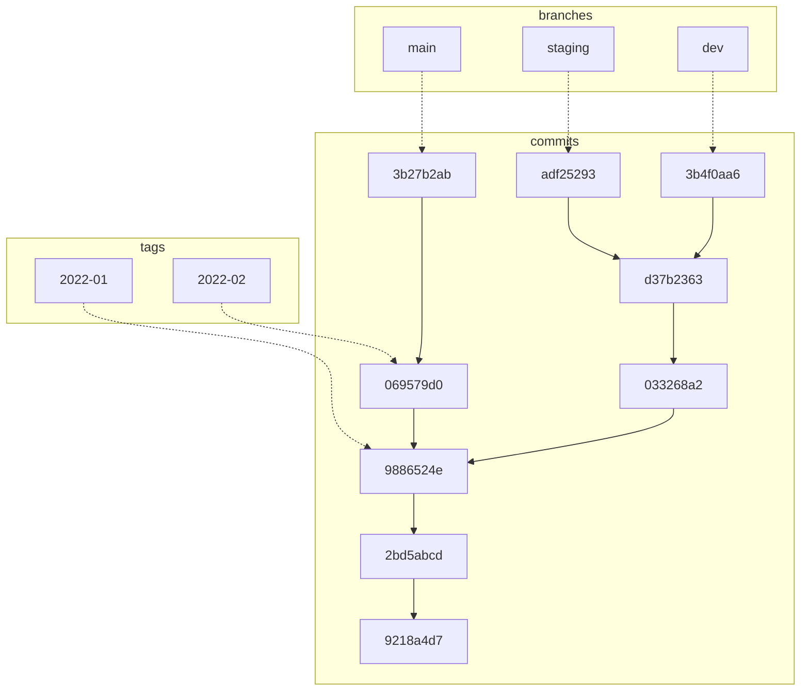

# Transactions and Version Control

Icechunk was designed to solve several interrelated problems typically encountered
by teams working with Zarr data in cloud object storage (e.g. AWS S3):
- challenges making safe, consistent updates to active Zarr groups and arrays
- difficulty rolling back changes in the case of a failed or interrupted write operation
- no easy way to manage multiple related versions of Zarr data

To understand how Icechunk solves these problems, first [review how Zarr storage works](./data-model.md).

[Zarr V3](https://zarr-specs.readthedocs.io/en/latest/v3/core/v3.0.html) stores both metadata and chunk data into a physical storage device
according to a specified system of "keys".
For example, a Zarr array called `myarray`,  within a group called `mygroup`, might generate
the following keys in the storage device:

```
# metadata for mygroup
mygroup/zarr.json
# metadata for myarray
mygroup/myarray/zarr.json
# chunks of data
mygroup/myarray/c/0/0
mygroup/myarray/c/0/1
```

When writing data, a Zarr implementation will create these keys and populate them with data.
When modifying existing arrays or groups, a Zarr implementation will potentially overwrite existing keys with new data.
This is generally not a problem, as long there is only one person or process coordinating access to the data.
However, when multiple uncoordinated readers and writers attempt to access the same Zarr data at the same time,
consistency problems emerge.
These consistency problems can occur in both file storage and object storage; they are particularly severe in
a cloud setting where Zarr is being used as an active store for data that are frequently changed while also
being read.

## Consistency Problems with Zarr

In these examples, we refer to independent, uncoordinated processes as different _clients_.
- Client A reads from an array while Client B is in the process of overwriting chunks.
  It's ambiguous which data Client A will see.
- Client A and Client B both attempt to modify array contents in different ways.
  Some of A's modifications will overwrite B's, and vice versa, depending on the exact timing of the updates.
  There is no way to guarantee that the resulting data are correct.
- Client A is writing to an array while client B is resizing the same array to a smaller size.
  Some of client A's modifications will be lost.
- A more complex example, involving consistency across multiple arrays:
  - Client A reads the contents of array `foo` and then writes certain data to array `bar` which are dependent
    on what was found in `foo`.
  - While Client A is writing `bar`, Client B modifies `foo`.
  - The changes client A made to `bar` are now no longer correct.

All of these problems arise from the fact that the state of the data is distributed over multiple keys within
the store, each of which can be modified independently by any process with write access to the store.
While most popular object storage services offer some consistency guarantees around access to a specific key
(e.g. [AWS S3 consistency model](https://docs.aws.amazon.com/AmazonS3/latest/userguide/Welcome.html#ConsistencyModel)),
these do not extend to operations that involve multiple keys.

## Icechunk is a Database for Zarr

These problems can all be solved by using well-established ideas from databases--and this is exactly what Icechunk does.
The theory of Database management systems (DMBS) defines specific [isolation levels](https://www.geeksforgeeks.org/transaction-isolation-levels-dbms/)
which explain how the actions of one client interact with another.
Viewed as a DBMS for array data, Standard Zarr in files storage or object storage offers the lowest level of isolation ("read uncommitted", which means that one client may read uncommitted changes made by another client)
and no guarantees around atomicity and consistency.

You can think of Icechunk as a key-value database specialized to the Zarr data model which provides
**atomicity**, **consistency** and **serializable isolation** for transactions over multiple keys.
Icechunk is designed to be light weight and cloud-native, relying on object storage for the actual data (chunks)
and a lower-latency service for the metadata (which are generally very small compared to the chunks).
This allows Icechunk to leverage the cloud-scale performance of object storage for scale-out workloads
(clients access chunk data directly from the object store), while also solving the consistency problems
outlined above.

### Snapshots

Rather than allowing independent clients to modify the Zarr keys directly (which leads to consistency problems),
Icechunk packages a series of changes within a Repository (or repo) into a single unit called a **snapshot**.
Each snapshot is identified by a unique ID, the `snapshot_id`, and is associated with an exact timestamp
for when the snapshot was made. The `snapshot_id` is a string generated by Icechunk.
Each snapshot also records its **parent snapshot**, a pointer to the snapshot that came before.
The ancestry of a snapshot allows all clients to agree on the order in which changes are made for each repo.

The `snapshot_id` can be considered an immutable identifier for the state of the repo.
Multiple clients can check out any commit and are guaranteed to always see the exact same data.
This is a very important property when building systems that require verification and auditability.
Such guarantees are impossible when using file storage or object storage, since keys in both systems are mutable.

### Branches and Tags
To keep track of the "current" version of each repo, Icechunk has **branches**.
A branch is a mutable pointer to a commit.
By default, each repo has a single branch called `main`.
As the state of the repo evolves over time, the branch pointer is moved to newer commits.

The relationship between commits, branches, and tags is illustrated below.



### Transactions and Isolation

<!-- A key concept required to solve the consistency and isolation problems is the idea of a **session**. -->
<!-- From a DBMS point of view, operations that occur within a session are part of a single transaction. -->

<!-- Whenever a client connects to an Icechunk repo, it initiates a session. This session records: -->
<!-- - The most recent latest `commit_id` for the active branch. This is called the **base commit**. -->
<!--   This will be used as a the parent commit for the next commit. -->
<!-- - A new, unique `session_id` for the session. -->
<!-- - An `expiration` timestamp, at which point the session will be automatically -->
<!--   closed for writing. Session expiration is configurable. If not explicitly -->
<!--   specified, a session will last 24 hours by default, but can be set to expire -->
<!--   after any duration up to seven (7) days. -->

<!-- When writing new keys or overwriting existing keys, Icechunk uses a _copy-on-write_ strategy. -->
<!-- New records are created in the metastore and associated with the `session_id`. -->

<!-- When reading data, both the `commit_id` and the `session_id` are used to resolve the correct record. -->
<!-- If a record exists for `session_id`, that always takes precedence. -->
<!-- Otherwise, Icechunk will fetch the most recent version of the document according to the commit history. -->

<!-- For this reason, all of the updates to the repo within a session must be cooperative and coordinated by the user. -->
<!-- They can still be concurrent, as long as the concurrent processes are cooperating not to clobber each other's data. -->
<!-- This allows distributed compute engines to do parallel I/O on the repo within the context of a session. -->

After a client has finished making changes to a repo, it can finalize the changes by making a commit.
Alternatively, the client can abandon the session (by simply never calling `commit()`), and the changes will be lost.

### Commit Process and Conflict Resolution

To illustrated the commit process, let's assume that we are on the branch `main` inside a session with a base commit of **C1**.
We make changes to our repo by writing or deleting records, and we are now ready to commit.

Committing to a branch is a two step process.

1. Create a new commit record. Icechunk issues a new `commit_id`. Let's call this **C2**.
   The parent for this commit is the session's current base commit: **C1**.
   This operation will always succeed.
2. Move the branch pointer to the new `commit_id`.
   This can fail if a new commit was made to the branch since the current session was initiated.


To detect whether moving the branch is possible, Icechunk verifies that the new commit's parent `commit_id` (**C1**)
matches `commit_id` of the branch. If the answer is "yes", then the branch is updated, and the commit process succeeds.

If the answer is "no", that means that a different session has committed to the same branch since our last checkout.
(Let's call this commit **C3**.)
At this point, Icechunk adopts an "optimistic concurrency" strategy to retry the commit.
If there are conflicts between the changes in **C2** and **C3**, the commit fails.
(The changes made in the session are still available to read via **C2**.)
If there are no conflicts, then the session creates a new commit (call this **C4**) with **C3** as the parent.
(This is equivalent to a "fast forward" operation in Git parlance.)
The session then again requests to move the branch pointer to **C4**, and the process repeats until
eventual success, failure (due to conflicts), or a configurable timeout.

This process is illustrated via the flowchart below:


!!! caution
    The "optimistic concurrency" approach is relatively expensive and assumes that conflicts
    are unlikely. It makes the assumption that users will design their workloads to avoid
    deliberately creating many simultaneous commits at the same time.
    This is elaborated further in [Best Practices](best-practices).
