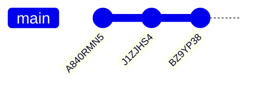
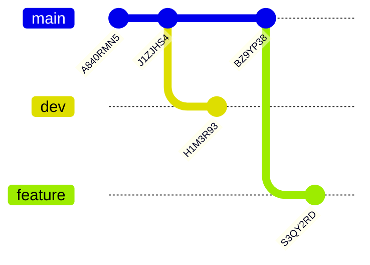
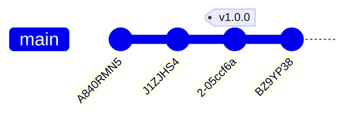

# Version Control

Icechunk carries over concepts from other version control software (e.g. Git) to multidimensional arrays. Doing so helps ease the burden of managing multiple versions of your data, and helps you be precise about which version of your dataset is being used for downstream purposes.

Core concepts of Icechunk's version control system are:

- A snapshot bundles together related data and metadata changes in a single "transaction".
- A branch points to the latest snapshot in a series of snapshots. Multiple branches can co-exist at a given time, and multiple users can add snapshots to a single branch. One common pattern is to use dev, stage, and prod branches to separate versions of a dataset.
- A tag is an immutable reference to a snapshot, usually used to represent an "important" version of the dataset such as a release.

Snapshots, branches, and tags all refer to specific versions of your dataset. You can time-travel/navigate back to any version of your data as referenced by a snapshot, a branch, or a tag using a snapshot ID, a branch name, or a tag name when creating a new `Session`.

## Setup

To get started, we can create a new `Repository`.

!!! note

    This example uses an in-memory storage backend, but you can also use any other storage backend instead.

```python
import icechunk

repo = icechunk.Repository.create(icechunk.in_memory_storage())
```

On creating a new [`Repository`](../reference/#icechunk.Repository), it will automatically create a `main` branch with an initial snapshot. We can take a look at the ancestry of the `main` branch to confirm this.

```python
repo.ancestry(branch="main")

# [SnapshotInfo(id="A840RMN5CF807CM66RY0", parent_id=None, written_at=datetime.datetime(2025,1,30,19,52,41,592998, tzinfo=datetime.timezone.utc), message="Repository...")]
```

!!! note

    The [`ancestry`](./reference/#icechunk.Repository.ancestry) method can be used to inspect the ancestry of any branch, snapshot, or tag.

We get back a list of [`SnapshotInfo`](../reference/#icechunk.SnapshotInfo) objects, which contain information about the snapshot, including its ID, the ID of its parent snapshot, and the time it was written.


## Creating a snapshot

Now that we have a `Repository` with a `main` branch, we can modify the data in the repository and create a new snapshot. First we need to create a writable from the `main` branch.

!!! note

    Writable `Session` objects are required to create new snapshots, and can only be created from the tip of a branch. Checking out tags or other snapshots is read-only.

```python
session = repo.writable_session(branch="main")
```

We can now access the `zarr.Store` from the `Session` and create a new root group. Then we can modify the attributes of the root group and create a new snapshot.

```python
import zarr

root = zarr.group(session.store)
root.attrs["foo"] = "bar"
session.commit(message="Add foo attribute to root group")

# 'J1ZJHS4EEQW3ATKMV9TG'
```

Success! We've created a new snapshot with a new attribute on the root group.

Once we've committed the snapshot, the `Session` will become read-only, and we can no longer modify the data using our existing `Session`. If we want to modify the data again, we need to create a new writable `Session` from the branch. Notice that we don't have to refresh the `Repository` to get the updates from the `main` branch. Instead, the `Repository` will automatically fetch the latest snapshot from the branch when we create a new writable `Session` from it.

```python
session = repo.writable_session(branch="main")
root = zarr.group(session.store)
root.attrs["foo"] = "baz"
session.commit(message="Update foo attribute on root group")

# 'BZ9YP38SWPW2E784VAB0'
```

With a few snapshots committed, we can take a look at the ancestry of the `main` branch:

```python
for snapshot in repo.ancestry(branch="main"):
    print(snapshot)

# SnapshotInfo(id="BZ9YP38SWPW2E784VAB0", parent_id="J1ZJHS4EEQW3ATKMV9TG", written_at=datetime.datetime(2025,1,30,20,26,51,115330, tzinfo=datetime.timezone.utc), message="Update foo...")
# SnapshotInfo(id="J1ZJHS4EEQW3ATKMV9TG", parent_id="A840RMN5CF807CM66RY0", written_at=datetime.datetime(2025,1,30,20,26,50,9616, tzinfo=datetime.timezone.utc), message="Add foo at...")
# SnapshotInfo(id="A840RMN5CF807CM66RY0", parent_id=None, written_at=datetime.datetime(2025,1,30,20,26,47,66157, tzinfo=datetime.timezone.utc), message="Repository...")
```

Visually, this looks like below, where the arrows represent the parent-child relationship between snapshots.



## Time Travel

Now that we've created a new snapshot, we can time-travel back to the previous snapshot using the snapshot ID.

!!! note

    It's important to note that because the `zarr Store` is read-only, we need to pass `mode="r"` to the `zarr.open_group` function.

```python
session = repo.readonly_session(snapshot_id="BSHY7B1AGAPWQC14Q18G")
root = zarr.open_group(session.store, mode="r")
root.attrs["foo"]

# 'bar'
```

## Branches

If we want to modify the data from a previous snapshot, we can create a new branch from that snapshot with [`create_branch`](../reference/#icechunk.Repository.create_branch).

```python
repo.create_branch("dev", snapshot_id=main_branch_snapshot_id)
```

We can now create a new writable `Session` from the `dev` branch and modify the data.

```python
session = repo.writable_session(branch="dev")
root = zarr.group(session.store)
root.attrs["foo"] = "balogna"
session.commit(message="Update foo attribute on root group")

# 'H1M3R93ZW19MYKCYASH0'
```

We can also create a new branch from the tip of the `main` branch if we want to modify our current working branch without modifying the `main` branch.

```python
main_branch_snapshot_id = repo.lookup_branch("main")
repo.create_branch("feature", snapshot_id=main_branch_snapshot_id)

session = repo.writable_session(branch="feature")
root = zarr.group(session.store)
root.attrs["foo"] = "cherry"
session.commit(message="Update foo attribute on root group")

# 'S3QY2RDQQTRYFGJDTB6G'
```

With these branches created, the hierarchy of the repository now looks like below.



## Tags

Tags are immutable references to a snapshot. They are created with [`create_tag`](../reference/#icechunk.Repository.create_tag).

```python
repo.create_tag("v1.0.0", snapshot_id="J1ZJHS4EEQW3ATKMV9TG")
```

Because tags are immutable, we need to use a readonly `Session` to access the data referenced by a tag.

```python
session = repo.readonly_session(tag="v1.0.0")
root = zarr.open_group(session.store, mode="r")
root.attrs["foo"]

# 'bar'
```



## Conflict Resolution

Icechunk is a serverless distributed system, and as such, it is possible to have multiple users or processes modifying the same data at the same time. Icechunk relies on the consistency guarantees of the underlying storage backends to ensure that the data is always consistent. In situations where two users or processes attempt to modify the same data at the same time, Icechunk will detect the conflict and raise an exception at commit time. This can be illustrated with the following example.

Let's create a fresh repository, add some attributes to the root group and create an array named `data`.

```python
import icechunk
import numpy as np
import zarr

repo = icechunk.Repository.create(icechunk.in_memory_storage())
session = repo.writable_session(branch="main")
root = zarr.group(session.store)
root.attrs["foo"] = "bar"
root.create_dataset("data", shape=(10, 10), chunks=(1, 1), dtype=np.int32)
session.commit(message="Add foo attribute and data array")

# 'BG0W943WSNFMMVD1FXJ0'
```

Lets try to modify the `data` array in two different sessions, created from the `main` branch.

```python
session1 = repo.writable_session(branch="main")
session2 = repo.writable_session(branch="main")

root1 = zarr.group(session1.store)
root2 = zarr.group(session2.store)
```

First, we'll modify the attributes of the root group from both sessions.

```python
root1.attrs["foo"] = "bar"
root2.attrs["foo"] = "baz"
```

and then try to commit the changes.

```python
session1.commit(message="Update foo attribute on root group")
session2.commit(message="Update foo attribute on root group")

# AE9XS2ZWXT861KD2JGHG
# ---------------------------------------------------------------------------
# ConflictError                             Traceback (most recent call last)
# Cell In[7], line 11
#      8 root2.attrs["foo"] = "baz"
#      10 print(session1.commit(message="Update foo attribute on root group"))
# ---> 11 print(session2.commit(message="Update foo attribute on root group"))

# File ~/Developer/icechunk/icechunk-python/python/icechunk/session.py:224, in Session.commit(self, message, metadata)
#     222     return self._session.commit(message, metadata)
#     223 except PyConflictError as e:
# --> 224     raise ConflictError(e) from None

# ConflictError: Failed to commit, expected parent: Some("BG0W943WSNFMMVD1FXJ0"), actual parent: Some("AE9XS2ZWXT861KD2JGHG")
```

The first session was able to commit successfully, but the second session failed with a [`ConflictError`](../reference/#icechunk.ConflictError). When the second session was created, the changes made were relative to the tip of the `main` branch, but the tip of the `main` branch had been modified by the first session.

To resolve this conflict, we can use the [`rebase`](../reference/#icechunk.Session.rebase) functionality.

### Rebasing

To update the second session so it is based off the tip of the `main` branch, we can use the [`rebase`](../reference/#icechunk.Session.rebase) method.

First, we can try to rebase, without merging any conflicting changes:

```python
session2.rebase(icechunk.ConflictDetector())

# ---------------------------------------------------------------------------
# RebaseFailedError                         Traceback (most recent call last)
# Cell In[8], line 1
# ----> 1 session2.rebase(icechunk.ConflictDetector())

# File ~/Developer/icechunk/icechunk-python/python/icechunk/session.py:247, in Session.rebase(self, solver)
#     245     self._session.rebase(solver)
#     246 except PyRebaseFailedError as e:
# --> 247     raise RebaseFailedError(e) from None

# RebaseFailedError: Rebase failed on snapshot AE9XS2ZWXT861KD2JGHG: 1 conflicts found
```

This however fails because both sessions modified the `foo` attribute on the root group. We can use the `ConflictError` to get more information about the conflict.

```python
try:
    session2.rebase(icechunk.ConflictDetector())
except icechunk.RebaseFailedError as e:
    print(e.conflicts)

# [Conflict(UserAttributesDoubleUpdate, path=/)]
```

This tells us that the conflict is caused by the two sessions modifying the user attributes of the root group (`/`). In this casewe have decided that second session set the `foo` attribute to the correct value, so we can now try to rebase by instructing the `rebase` method to use the second session's changes with the [`BasicConflictSolver`](../reference/#icechunk.BasicConflictSolver).

```python
session2.rebase(icechunk.BasicConflictSolver(on_user_attributes_conflict=icechunk.VersionSelection.UseOurs))
```

Success! We can now try and commit the changes again.

```python
session2.commit(message="Update foo attribute on root group")

# 'SY4WRE8A9TVYMTJPEAHG'
```

This same process can be used to resolve conflicts with arrays. Let's try to modify the `data` array from both sessions.

```python
session1 = repo.writable_session(branch="main")
session2 = repo.writable_session(branch="main")

root1 = zarr.group(session1.store)
root2 = zarr.group(session2.store)

root1["data"][0,0] = 1
root2["data"][0,:] = 2
```

We have now created a conflict, because the first session modified the first element of the `data` array, and the second session modified the first row of the `data` array. Let's commit the changes from the second session first, then see what conflicts are reported when we try to commit the changes from the first session.


```python
print(session2.commit(message="Update first row of data array"))
print(session1.commit(message="Update first element of data array"))

# ---------------------------------------------------------------------------
# ConflictError                             Traceback (most recent call last)
# Cell In[15], line 2
#      1 print(session2.commit(message="Update first row of data array"))
# ----> 2 print(session1.commit(message="Update first element of data array"))

# File ~/Developer/icechunk/icechunk-python/python/icechunk/session.py:224, in Session.commit(self, message, metadata)
#     222     return self._session.commit(message, metadata)
#     223 except PyConflictError as e:
# --> 224     raise ConflictError(e) from None

# ConflictError: Failed to commit, expected parent: Some("SY4WRE8A9TVYMTJPEAHG"), actual parent: Some("5XRDGZPSG747AMMRTWT0")
```

Okay! We have a conflict. Lets see what conflicts are reported.

```python
try:
    session1.rebase(icechunk.ConflictDetector())
except icechunk.RebaseFailedError as e:
    for conflict in e.conflicts:
        print(f"Conflict at {conflict.path}: {conflict.conflicted_chunks}")

# Conflict at /data: [[0, 0]]
```

We get a clear indication of the conflict, and the chunks that are conflicting. In this case we have decided that the first session's changes are correct, so we can again use the [`BasicConflictSolver`](../reference/#icechunk.BasicConflictSolver) to resolve the conflict.

```python
session1.rebase(icechunk.BasicConflictSolver(on_chunk_conflict=icechunk.VersionSelection.UseOurs))
session1.commit(message="Update first element of data array")

# 'R4WXW2CYNAZTQ3HXTNK0'
```

Success! We have now resolved the conflict and committed the changes.

Let's look at the value of the `data` array to confirm that the conflict was resolved correctly.

```python
session = repo.readonly_session(branch="main")
root = zarr.open_group(session.store, mode="r")
root["data"][0,:]

# array([1, 2, 2, 2, 2, 2, 2, 2, 2, 2], dtype=int32)
```

Lastly, if you make changes to non-conflicting chunks or attributes, you can rebase without having to resolve any conflicts.

```python
session1 = repo.writable_session(branch="main")
session2 = repo.writable_session(branch="main")

root1 = zarr.group(session1.store)
root2 = zarr.group(session2.store)

root1["data"][3,:] = 3
root2["data"][4,:] = 4

session1.commit(message="Update fourth row of data array")

try:
    session2.rebase(icechunk.ConflictDetector())
    print("Rebase succeeded")
except icechunk.RebaseFailedError as e:
    print(e.conflicts)

session2.commit(message="Update fifth row of data array")

# Rebase succeeded
```

And now we can see the data in the `data` array to confirm that the changes were committed correctly.

```python
session = repo.readonly_session(branch="main")
root = zarr.open_group(session.store, mode="r")
root["data"][:,:]

# array([[1, 2, 2, 2, 2, 2, 2, 2, 2, 2],
#        [0, 0, 0, 0, 0, 0, 0, 0, 0, 0],
#        [0, 0, 0, 0, 0, 0, 0, 0, 0, 0],
#        [3, 3, 3, 3, 3, 3, 3, 3, 3, 3],
#        [4, 4, 4, 4, 4, 4, 4, 4, 4, 4],
#        [0, 0, 0, 0, 0, 0, 0, 0, 0, 0],
#        [0, 0, 0, 0, 0, 0, 0, 0, 0, 0],
#        [0, 0, 0, 0, 0, 0, 0, 0, 0, 0],
#        [0, 0, 0, 0, 0, 0, 0, 0, 0, 0],
#        [0, 0, 0, 0, 0, 0, 0, 0, 0, 0]], dtype=int32)
```

#### Limitations

At the moment, the rebase functionality is limited to resolving conflicts with attributes on arrays and groups, and conflicts with chunks in arrays. Other types of conflicts are not able to be resolved by icechunk yet and must be resolved manually.
