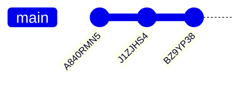
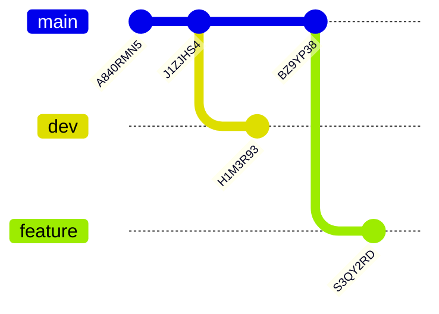

# Version Control

Icechunk carries over concepts from other version control software (e.g. Git) to multidimensional arrays. Doing so helps ease the burden of managing multiple versions of your data, and helps you be precise about which version of your dataset is being used for downstream purposes.

Core concepts of Icechunk's version control system are:

- A snapshot bundles together related data and metadata changes in a single "transaction".
- A branch points to the latest snapshot in a series of snapshots. Multiple branches can co-exist at a given time, and multiple users can add snapshots to a single branch. One common pattern is to use dev, stage, and prod branches to separate versions of a dataset.
- A tag is an immutable reference to a snapshot, usually used to represent an "important" version of the dataset such as a release.

Snapshots, branches, and tags all refer to specific versions of your dataset. You can time-travel/navigate back to any version of your data as referenced by a snapshot, a branch, or a tag using a snapshot ID, a branch name, or a tag name when creating a new `Session`.

## Setup

To get started, we can create a new `Repository`.

!!! note

    This example uses an in-memory storage backend, but you can also use any other storage backend instead.

```python
import icechunk

repo = icechunk.Repository.create(icechunk.in_memory_storage())
```

On creating a new [`Repository`](../reference/#icechunk.Repository), it will automatically create a `main` branch with an initial snapshot. We can take a look at the ancestry of the `main` branch to confirm this.

```python
repo.ancestry(branch="main")
# [SnapshotInfo(id="A840RMN5CF807CM66RY0", parent_id=None, written_at=datetime.datetime(2025,1,30,19,52,41,592998, tzinfo=datetime.timezone.utc), message="Repository...")]
```

!!! note

    The [`ancestry`](./reference/#icechunk.Repository.ancestry) method can be used to inspect the ancestry of any branch, snapshot, or tag.

We get back a list of [`SnapshotInfo`](../reference/#icechunk.SnapshotInfo) objects, which contain information about the snapshot, including its ID, the ID of its parent snapshot, and the time it was written.


## Creating a snapshot

Now that we have a `Repository` with a `main` branch, we can modify the data in the repository and create a new snapshot. First we need to create a writable from the `main` branch.

!!! note

    Writable `Session` objects are required to create new snapshots, and can only be created from the tip of a branch. Checking out tags or other snapshots is read-only.

```python
session = repo.writable_session(branch="main")
```

We can now access the `zarr.Store` from the `Session` and create a new root group. Then we can modify the attributes of the root group and create a new snapshot.

```python
import zarr

root = zarr.group(session.store)
root.attrs["foo"] = "bar"
session.commit(message="Add foo attribute to root group")
# 'J1ZJHS4EEQW3ATKMV9TG'
```

Success! We've created a new snapshot with a new attribute on the root group. 

Once we've committed the snapshot, the `Session` will become read-only, and we can no longer modify the data using our existing `Session`. If we want to modify the data again, we need to create a new writable `Session` from the branch. Notice that we don't have to refresh the `Repository` to get the updates from the `main` branch. Instead, the `Repository` will automatically fetch the latest snapshot from the branch when we create a new writable `Session` from it.

```python
session = repo.writable_session(branch="main")
root = zarr.group(session.store)
root.attrs["foo"] = "baz"
session.commit(message="Update foo attribute on root group")
# 'BZ9YP38SWPW2E784VAB0'
```

With a few snapshots committed, we can take a look at the ancestry of the `main` branch:

```python
for snapshot in repo.ancestry(branch="main"):
    print(snapshot)
# SnapshotInfo(id="BZ9YP38SWPW2E784VAB0", parent_id="J1ZJHS4EEQW3ATKMV9TG", written_at=datetime.datetime(2025,1,30,20,26,51,115330, tzinfo=datetime.timezone.utc), message="Update foo...")
# SnapshotInfo(id="J1ZJHS4EEQW3ATKMV9TG", parent_id="A840RMN5CF807CM66RY0", written_at=datetime.datetime(2025,1,30,20,26,50,9616, tzinfo=datetime.timezone.utc), message="Add foo at...")
# SnapshotInfo(id="A840RMN5CF807CM66RY0", parent_id=None, written_at=datetime.datetime(2025,1,30,20,26,47,66157, tzinfo=datetime.timezone.utc), message="Repository...")
```

Visually, this looks like below, where the arrows represent the parent-child relationship between snapshots.




## Time Travel

Now that we've created a new snapshot, we can time-travel back to the previous snapshot using the snapshot ID.

!!! note

    It's important to note that because the `zarr Store` is read-only, we need to pass `mode="r"` to the `zarr.open_group` function.

```python
session = repo.readonly_session(snapshot_id="BSHY7B1AGAPWQC14Q18G")
root = zarr.open_group(session.store, mode="r")
root.attrs["foo"]
# 'bar'
```

## Branches

If we want to modify the data from a previous snapshot, we can create a new branch from that snapshot with [`create_branch`](../reference/#icechunk.Repository.create_branch).

```python
repo.create_branch("dev", snapshot_id=main_branch_snapshot_id)
```

We can now create a new writable `Session` from the `dev` branch and modify the data.

```python
session = repo.writable_session(branch="dev")
root = zarr.group(session.store)
root.attrs["foo"] = "balogna"
session.commit(message="Update foo attribute on root group")
# 'H1M3R93ZW19MYKCYASH0'
```

We can also create a new branch from the tip of the `main` branch if we want to modify our current working branch without modifying the `main` branch.

```python
main_branch_snapshot_id = repo.lookup_branch("main")
repo.create_branch("feature", snapshot_id=main_branch_snapshot_id)

session = repo.writable_session(branch="feature")
root = zarr.group(session.store)
root.attrs["foo"] = "cherry"
session.commit(message="Update foo attribute on root group")
# 'S3QY2RDQQTRYFGJDTB6G'
```

With these branches created, the hierarchy of the repository now looks like below.



## Tags

Tags are immutable references to a snapshot. They are created with [`create_tag`](../reference/#icechunk.Repository.create_tag).

```python
repo.create_tag("v1.0.0", snapshot_id="J1ZJHS4EEQW3ATKMV9TG")
```

Because tags are immutable, we need to use a readonly `Session` to access the data referenced by a tag.

```python
session = repo.readonly_session(tag="v1.0.0")
root = zarr.open_group(session.store, mode="r")
root.attrs["foo"]
# 'bar'
```


## Rebasing and Conflict Resolution

