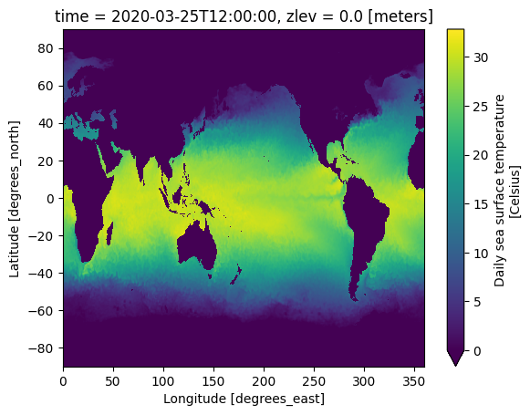

# Virtual Datasets

While Icechunk works wonderfully with native chunks managed by Zarr, there is lots of archival data out there in other formats already. To interoperate with such data, Icechunk supports "Virtual" chunks, where any number of chunks in a given dataset may reference external data in existing archival formats, such as netCDF, HDF, GRIB, or TIFF. Virtual chunks are loaded directly from the original source without copying or modifying the original achival data files. This enables Icechunk to manage large datasets from existing data without needing that data to be in Zarr format already.

!!! note

    The concept of a "virtual Zarr dataset" originates from the [Kerchunk](https://fsspec.github.io/kerchunk/) project, which preceded and inspired [VirtualiZarr](https://virtualizarr.readthedocs.io/en/latest/). Like `VirtualiZarr`, the `kerchunk` package provides functionality to scan metadata of existing data files and combine these references into larger virtual datasets, but unlike `VirtualiZarr` the `Kerchunk` package currently has no facility for writing to `Icechunk` stores. If you previously were interested in "Kerchunking" your data, you can now achieve a similar result by using `VirtualiZarr` to create virtual datasets and write them to `icechunk`.

`VirtualiZarr` lets users ingest existing data files into virtual datasets using various different tools under the hood, including `kerchunk`, `xarray`, `zarr`, and now `icechunk`. It does so by creating virtual references to existing data that can be combined and manipulated to create larger virtual datasets using `xarray`. These datasets can then be exported to `kerchunk` reference format or to an `Icechunk` repository, without ever copying or moving the existing data files.

!!! note

    [Currently only `s3` compatible storage and `local` storage are supported for virtual references](#virtual-reference-storage-support). Support for other storage types like [`gcs`](https://github.com/earth-mover/icechunk/issues/524), [`azure`](https://github.com/earth-mover/icechunk/issues/602), and [`https`](https://github.com/earth-mover/icechunk/issues/526) are on the roadmap.

## Creating a virtual dataset with VirtualiZarr

We are going to create a virtual dataset pointing to all of the [OISST](https://www.ncei.noaa.gov/products/optimum-interpolation-sst) data for August 2024. This data is distributed publicly as netCDF files on AWS S3, with one netCDF file containing the Sea Surface Temperature (SST) data for each day of the month. We are going to use `VirtualiZarr` to combine all of these files into a single virtual dataset spanning the entire month, then write that dataset to Icechunk for use in analysis.

Before we get started, we need to install `virtualizarr`, and `icechunk`. We also need to install `fsspec` and `s3fs` for working with data on s3.

```shell
pip install virtualizarr icechunk fsspec s3fs
```

First, we need to find all of the files we are interested in, we will do this with fsspec using a `glob` expression to find every netcdf file in the August 2024 folder in the bucket:

```python
import fsspec

fs = fsspec.filesystem('s3')

oisst_files = fs.glob('s3://noaa-cdr-sea-surface-temp-optimum-interpolation-pds/data/v2.1/avhrr/202408/oisst-avhrr-v02r01.*.nc')

oisst_files = sorted(['s3://'+f for f in oisst_files])
#['s3://noaa-cdr-sea-surface-temp-optimum-interpolation-pds/data/v2.1/avhrr/201001/oisst-avhrr-v02r01.20100101.nc',
# 's3://noaa-cdr-sea-surface-temp-optimum-interpolation-pds/data/v2.1/avhrr/201001/oisst-avhrr-v02r01.20100102.nc',
# 's3://noaa-cdr-sea-surface-temp-optimum-interpolation-pds/data/v2.1/avhrr/201001/oisst-avhrr-v02r01.20100103.nc',
# 's3://noaa-cdr-sea-surface-temp-optimum-interpolation-pds/data/v2.1/avhrr/201001/oisst-avhrr-v02r01.20100104.nc',
#...
#]
```

Now that we have the filenames of the data we need, we can create virtual datasets with `VirtualiZarr`. This may take a minute.

```python
from virtualizarr import open_virtual_dataset

virtual_datasets =[
    open_virtual_dataset(url, indexes={})
    for url in oisst_files
]
```

We can now use `xarray` to combine these virtual datasets into one large virtual dataset (For more details on this operation see [`VirtualiZarr`'s documentation](https://virtualizarr.readthedocs.io/en/latest/usage.html#combining-virtual-datasets)). We know that each of our files share the same structure but with a different date. So we are going to concatenate these datasets on the `time` dimension.

```python
import xarray as xr

virtual_ds = xr.concat(
    virtual_datasets,
    dim='time',
    coords='minimal',
    compat='override',
    combine_attrs='override'
)

#<xarray.Dataset> Size: 257MB
#Dimensions:  (time: 31, zlev: 1, lat: 720, lon: 1440)
#Coordinates:
#    time     (time) float32 124B ManifestArray<shape=(31,), dtype=float32, ch...
#    lat      (lat) float32 3kB ManifestArray<shape=(720,), dtype=float32, chu...
#    zlev     (zlev) float32 4B ManifestArray<shape=(1,), dtype=float32, chunk...
#    lon      (lon) float32 6kB ManifestArray<shape=(1440,), dtype=float32, ch...
#Data variables:
#    sst      (time, zlev, lat, lon) int16 64MB ManifestArray<shape=(31, 1, 72...
#    anom     (time, zlev, lat, lon) int16 64MB ManifestArray<shape=(31, 1, 72...
#    ice      (time, zlev, lat, lon) int16 64MB ManifestArray<shape=(31, 1, 72...
#    err      (time, zlev, lat, lon) int16 64MB ManifestArray<shape=(31, 1, 72...
```

We have a virtual dataset with 31 timestamps! One hint that this worked correctly is that the readout shows the variables and coordinates as [`ManifestArray`](https://virtualizarr.readthedocs.io/en/latest/usage.html#manifestarray-class) instances, the representation that `VirtualiZarr` uses for virtual arrays. Let's create an Icechunk repo to write this dataset to in the `oisst` directory on our local filesystem.

!!! note

    Take note of the [`VirtualChunkContainer`](./reference.md#icechunk.VirtualChunkContainer) passed into the [`RepositoryConfig`](./reference.md#icechunk.RepositoryConfig) when creating the store. We specify the storage configuration necessary to access the anonymous S3 bucket that holds the OISST netCDF files, along with credentials that match. This creates a mapping between the `s3` virtual chunk container and the credentials passed for the `s3` namespace. For more configuration options, see the [configuration page](./configuration.md).

```python
import icechunk

storage = icechunk.local_filesystem_storage(
    path='oisst',
)

config = icechunk.RepositoryConfig.default()
config.set_virtual_chunk_container(icechunk.VirtualChunkContainer("s3", "s3://", icechunk.s3_store(region="us-east-1")))
credentials = icechunk.containers_credentials(s3=icechunk.s3_credentials(anonymous=True))
repo = icechunk.Repository.create(storage, config, credentials)
```

With the repo created, lets write our virtual dataset to Icechunk with VirtualiZarr!

```python
session = repo.writable_session("main")
virtual_ds.virtualize.to_icechunk(session.store)
```

The refs are written so lets save our progress by committing to the store.

!!! note

    Your commit hash will be different! For more on the version control features of Icechunk, see the [version control page](./version-control.md).

```python
session.commit("My first virtual store!")

# 'THAJHTYQABGD2B10D5C0'
```

Now we can read the dataset from the store using xarray to confirm everything went as expected. `xarray` reads directly from the Icechunk store because it is a fully compliant `zarr Store` instance.

```python
ds = xr.open_zarr(
    store,
    zarr_version=3,
    consolidated=False,
    chunks={},
)

#<xarray.Dataset> Size: 1GB
#Dimensions:  (lon: 1440, time: 31, zlev: 1, lat: 720)
#Coordinates:
#  * lon      (lon) float32 6kB 0.125 0.375 0.625 0.875 ... 359.4 359.6 359.9
#  * zlev     (zlev) float32 4B 0.0
#  * time     (time) datetime64[ns] 248B 2024-08-01T12:00:00 ... 2024-08-31T12...
#  * lat      (lat) float32 3kB -89.88 -89.62 -89.38 -89.12 ... 89.38 89.62 89.88
#Data variables:
#    sst      (time, zlev, lat, lon) float64 257MB dask.array<chunksize=(1, 1, 720, 1440), meta=np.ndarray>
#    ice      (time, zlev, lat, lon) float64 257MB dask.array<chunksize=(1, 1, 720, 1440), meta=np.ndarray>
#    anom     (time, zlev, lat, lon) float64 257MB dask.array<chunksize=(1, 1, 720, 1440), meta=np.ndarray>
#    err      (time, zlev, lat, lon) float64 257MB dask.array<chunksize=(1, 1, 720, 1440), meta=np.ndarray>
```

Success! We have created our full dataset with 31 timesteps spanning the month of august, all with virtual references to pre-existing data files in object store. This means we can now version control our dataset, allowing us to update it, and roll it back to a previous version without copying or moving any data from the original files.

Finally, let's make a plot of the sea surface temperature!

```python
ds.sst.isel(time=26, zlev=0).plot(x='lon', y='lat', vmin=0)
```



## Virtual Reference API

While `VirtualiZarr` is the easiest way to create virtual datasets with Icechunk, the Store API that it uses to create the datasets in Icechunk is public. `IcechunkStore` contains a [`set_virtual_ref`](./reference.md#icechunk.IcechunkStore.set_virtual_ref) method that specifies a virtual ref for a specified chunk.

### Virtual Reference Storage Support

Currently, Icechunk supports two types of storage for virtual references:

#### S3 Compatible

References to files accessible via S3 compatible storage.

##### Example

Here is how we can set the chunk at key `c/0` to point to a file on an s3 bucket,`mybucket`, with the prefix `my/data/file.nc`:

```python
store.set_virtual_ref('c/0', 's3://mybucket/my/data/file.nc', offset=1000, length=200)
```

##### Configuration

S3 virtual references require configuring credential for the store to be able to access the specified s3 bucket. See [the configuration docs](./configuration.md#virtual-reference-storage-config) for instructions.


#### Local Filesystem

References to files accessible via local filesystem. This requires any file paths to be **absolute** at this time.

##### Example

Here is how we can set the chunk at key `c/0` to point to a file on my local filesystem located at `/path/to/my/file.nc`:

```python
store.set_virtual_ref('c/0', 'file:///path/to/my/file.nc', offset=20, length=100)
```

No extra configuration is necessary for local filesystem references.

### Virtual Reference File Format Support

Currently, Icechunk supports `HDF5`, `netcdf4`, and `netcdf3` files for use in virtual references with `VirtualiZarr`. Support for other filetypes is under development in the VirtualiZarr project. Below are some relevant issues:

- [meta issue for file format support](https://github.com/zarr-developers/VirtualiZarr/issues/218)
- [Support for GRIB2 files](https://github.com/zarr-developers/VirtualiZarr/issues/312)
- [Support for GRIB2 files with datatree](https://github.com/zarr-developers/VirtualiZarr/issues/11)
- [Support for TIFF files](https://github.com/zarr-developers/VirtualiZarr/issues/291)
