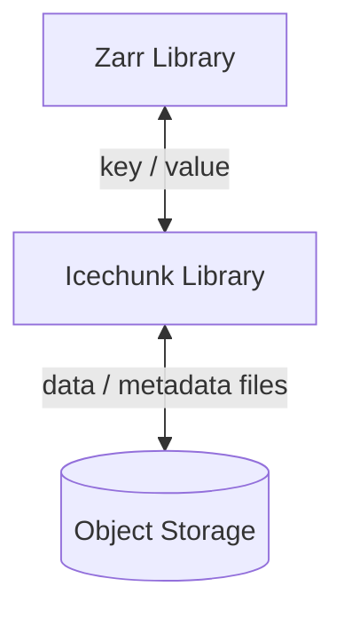

# Icechunk

!!! info "Welcome to Icechunk!"
    Icechunk is a transactional storage engine for Zarr designed for use on cloud object storage.

Let's break down what that means:

- **[Zarr](https://zarr.dev/)** is an open source specification for the storage of multidimensional array (a.k.a. tensor) data.
  Zarr defines the metadata for describing arrays (shape, dtype, etc.) and the way these arrays are chunked, compressed, and converted to raw bytes for storage. Zarr can store its data in any key-value store.
- **Storage engine** - Icechunk exposes a key-value interface to Zarr and manages all of the actual I/O for getting, setting, and updating both metadata and chunk data in cloud object storage.
  Zarr libraries don't have to know exactly how icechunk works under the hood in order to use it.
- **Transactional** - The key improvement that Icechunk brings on top of regular Zarr is to provide consistent serializable isolation between transactions.
  This means that Icechunk data are safe to read and write in parallel from multiple uncoordinated processes.
  This allows Zarr to be used more like a database.

## Goals of Icechunk

The core entity in Icechunk is a **store**.
A store is defined as a Zarr hierarchy containing one or more Arrays and Groups.
The most common scenario is for an Icechunk store to contain a single Zarr group with multiple arrays, each corresponding to different physical variables but sharing common spatiotemporal coordinates.
However, formally a store can be any valid Zarr hierarchy, from a single Array to a deeply nested structure of Groups and Arrays.
Users of Icechunk should aim to scope their stores only to related arrays and groups that require consistent transactional updates.

Icechunk aspires to support the following core requirements for stores:

1. **Object storage** - the format is designed around the consistency features and performance characteristics available in modern cloud object storage. No external database or catalog is required to maintain a store.
1. **Serializable isolation** - Reads are isolated from concurrent writes and always use a committed snapshot of a store. Writes are committed atomically and are never partially visible. Readers will not acquire locks.
1. **Time travel** - Previous snapshots of a store remain accessible after new ones have been written.
1. **Data Version Control** - Stores support both _tags_ (immutable references to snapshots) and _branches_ (mutable references to snapshots).
1. **Chunk sharding and references** - Chunk storage is decoupled from specific file names. Multiple chunks can be packed into a single object (sharding). Zarr-compatible chunks within other file formats (e.g. HDF5, NetCDF) can be referenced.
1. **Schema Evolution** - Arrays and Groups can be added, renamed, and removed from the hierarchy with minimal overhead.

## The Project

This Icechunk project consists of three main parts:

1. The [Icechunk specification](./spec.md).
1. A Rust implementation
1. A Python wrapper which exposes a Zarr store interface

All of this is open source, licensed under the Apache 2.0 license.

The Rust implementation is a solid foundation for creating bindings in any language.
We encourage adopters to collaborate on the Rust implementation, rather than reimplementing Icechunk from scratch in other languages.

We encourage collaborators from the broader community to contribute to Icechunk.
Governance of the project will be managed by Earthmover PBC.

## How Can I Use It?

We recommend using [Icechunk from Python](./icechunk-python/index.md), together with the Zarr-Python library. 

!!! warning "Icechunk is a very new project."
    It is not recommended for production use at this time.
    These instructions are aimed at Icechunk developers and curious early adopters.

## Key Concepts: Snapshots, Branches, and Tags

Every update to an Icechunk store creates a new **snapshot** with a unique ID.
Icechunk users must organize their updates into groups of related operations called **transactions**.
For example, appending a new time slice to mutliple arrays should be done as single transactions, comprising the following steps
1. Update the array metadata to resize the array to accommodate the new elements.
2. Write new chunks for each array in the group.

While the transaction is in progress, none of these changes will be visible to other users of the store.
Once the transaction is committed, a new snapshot is generated.
Readers can only see and use committed snapshots.

Additionally, snapshots occur in a specific linear (i.e. serializable) order within  **branch**.
A branch is a mutable reference to a snapshot--a pointer that maps the branch name to a snapshot ID.
The default branch is `main`.
Every commit to the main branch updates this reference.
Icechunk's design protects against the race condition in which two uncoordinated sessions attempt to update the branch at the same time; only one can succeed.

Finally, Icechunk defines **tags**--_immutable_ references to snapshot.
Tags are appropriate for publishing specific releases of a repository or for any application which requires a persistent, immutable identifier to the store state.

## How Does It Work?

!!! note
    For more detailed explanation, have a look at the [Icechunk spec](./spec.md)

Zarr itself works by storing both metadata and chunk data into a abstract store according to a specified system of "keys".
For example, a 2D Zarr array called myarray, within a group called mygroup, would generate the following keys:

```
mygroup/zarr.json
mygroup/myarray/zarr.json
mygroup/myarray/c/0/0
mygroup/myarray/c/0/1
```

In standard regular Zarr stores, these key map directly to filenames in a filesystem or object keys in an object storage system.
When writing data, a Zarr implementation will create these keys and populate them with data. When modifying existing arrays or groups, a Zarr implementation will potentially overwrite existing keys with new data.

This is generally not a problem, as long there is only one person or process coordinating access to the data.
However, when multiple uncoordinated readers and writers attempt to access the same Zarr data at the same time, [various consistency problems](https://docs.earthmover.io/concepts/version-control-system#consistency-problems-with-zarr) problems emerge.
These consistency problems can occur in both file storage and object storage; they are particularly severe in a cloud setting where Zarr is being used as an active store for data that are frequently changed while also being read.

With Icechunk, we keep the same core Zarr data model, but add a layer of indirection between the Zarr keys and the on-disk storage.
The Icechunk library translates between the Zarr keys and the actual on-disk data given the particular context of the user's state.
Icechunk defines a series of interconnected metadata and data files that together enable efficient isolated reading and writing of metadata and chunks.
Once written, these files are immutable.
Icechunk keeps track of every single chunk explicitly in a "chunk manifest".



## FAQ

1. _Why not just use Iceberg directly?_

   Iceberg and all other "table formats" (Delta, Hudi, LanceDB, etc.) are based on tabular data model.
   This data model cannot accommodate large, multidimensional arrays (tensors) in a general, scalable way.

1. Is Icechunk part of Zarr?

   Formally, no.
   Icechunk is a separate specification from Zarr.
   However, it is designed to interoperate closely with Zarr.
   In the future, we may propose a more formal integration between the Zarr spec and Icechunk spec if helpful.
   For now, keeping them separate allows us to evolve Icechunk quickly while maintaining the stability and backwards compatibility of the Zarr data model.

## Inspiration

Icechunk's was inspired by several existing projects and formats, most notably

- [FSSpec Reference Filesystem](https://filesystem-spec.readthedocs.io/en/latest/api.html#fsspec.implementations.reference.ReferenceFileSystem)
- [Apache Iceberg](https://iceberg.apache.org/spec/)
- [LanceDB](https://lancedb.github.io/lance/format.html)
- [TileDB](https://docs.tiledb.com/main/background/key-concepts-and-data-format)
- [OCDBT](https://google.github.io/tensorstore/kvstore/ocdbt/index.html)