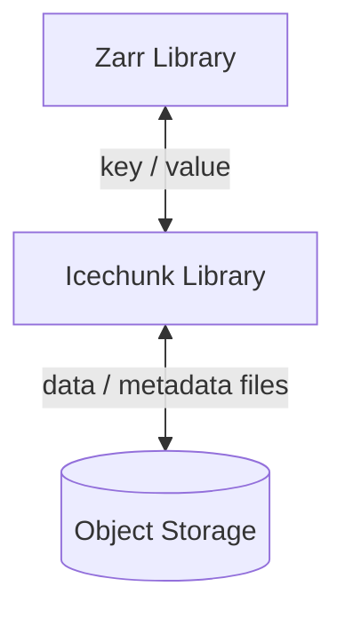

# Icechunk

Icechunk is an open-source (Apache 2.0), transactional storage engine for tensor / ND-array data designed for use on cloud object storage.
Icechunk works together with **[Zarr](https://zarr.dev/)**, augmenting the Zarr core data model with features 
that enhance performance, collaboration, and safety in a cloud-computing context. 

## Docs Organization

This is the Icechunk documentation. It's organized into the following parts.

- This page: a general overview of the project's goals and components.
- [Frequently Asked Questions](./faq.md)
- Documentation for [Icechunk Python](./icechunk-python), the main user-facing
  library
- Documentation for the [Icechunk Rust Crate](./icechunk-rust.md)
- The [Icechunk Spec](./spec.md)

## Icechunk Overview

Let's break down what "transactional storage engine for Zarr" actually means:

- **[Zarr](https://zarr.dev/)** is an open source specification for the storage of multidimensional array (a.k.a. tensor) data.
  Zarr defines the metadata for describing arrays (shape, dtype, etc.) and the way these arrays are chunked, compressed, and converted to raw bytes for storage. Zarr can store its data in any key-value store.
  There are many different implementations of Zarr in different languages. _Right now, Icechunk only supports
  [Zarr Python](https://zarr.readthedocs.io/en/stable/)._
  If you're interested in implementing Icehcunk support, please [open an issue](https://github.com/earth-mover/icechunk/issues) so we can help you.
- **Storage engine** - Icechunk exposes a key-value interface to Zarr and manages all of the actual I/O for getting, setting, and updating both metadata and chunk data in cloud object storage.
  Zarr libraries don't have to know exactly how icechunk works under the hood in order to use it.
- **Transactional** - The key improvement that Icechunk brings on top of regular Zarr is to provide consistent serializable isolation between transactions.
  This means that Icechunk data are safe to read and write in parallel from multiple uncoordinated processes.
  This allows Zarr to be used more like a database.

The core entity in Icechunk is a repository or **repo**.
A repo is defined as a Zarr hierarchy containing one or more Arrays and Groups, and a repo functions as 
self-contained _Zarr Store_.
The most common scenario is for an Icechunk repo to contain a single Zarr group with multiple arrays, each corresponding to different physical variables but sharing common spatiotemporal coordinates.
However, formally a repo can be any valid Zarr hierarchy, from a single Array to a deeply nested structure of Groups and Arrays.
Users of Icechunk should aim to scope their repos only to related arrays and groups that require consistent transactional updates.

Icechunk supports the following core requirements:

1. **Object storage** - the format is designed around the consistency features and performance characteristics available in modern cloud object storage. No external database or catalog is required to maintain a repo.
(It also works with file storage.)
1. **Serializable isolation** - Reads are isolated from concurrent writes and always use a committed snapshot of a repo. Writes are committed atomically and are never partially visible. No locks are required for reading.
1. **Time travel** - Previous snapshots of a repo remain accessible after new ones have been written.
1. **Data version control** - Repos support both _tags_ (immutable references to snapshots) and _branches_ (mutable references to snapshots).
1. **Chunk shardings** - Chunk storage is decoupled from specific file names. Multiple chunks can be packed into a single object (sharding).
1. **Chunk references** - Zarr-compatible chunks within other file formats (e.g. HDF5, NetCDF) can be referenced.
1. **Schema evolution** - Arrays and Groups can be added, renamed, and removed from the hierarchy with minimal overhead.

## Key Concepts

### Groups, Arrays, and Chunks

Icechunk is designed around the Zarr data model, widely used in scientific computing, data science, and AI / ML.
(The Zarr high-level data model is effectively the same as HDF5.)
The core data structure in this data model is the **array**.
Arrays have two fundamental properties:

- **shape** - a tuple of integers which specify the dimensions of each axis of the array. A 10 x 10 square array would have shape (10, 10)
- **data type** - a specification of what type of data is found in each element, e.g. integer, float, etc. Different data types have different precision (e.g. 16-bit integer, 64-bit float, etc.)

In Zarr / Icechunk, arrays are split into **chunks**, 
A chunk is the minimum unit of data that must be read / written from storage, and thus choices about chunking have strong implications for performance.
Zarr leaves this completely up to the user.
Chunk shape should be chosen based on the anticipated data access pattern for each array
An Icechunk array is not bounded by an individual file and is effectively unlimited in size.

For further organization of data, Icechunk supports **groups** within a single repo.
Group are like folders which contain multiple arrays and or other groups.
Groups enable data to be organized into hierarchical trees.
A common usage pattern is to store multiple arrays in a group representing a NetCDF-style dataset.

Arbitrary JSON-style key-value metadata can be attached to both arrays and groups.

### Snapshots

Every update to an Icechunk store creates a new **snapshot** with a unique ID.
Icechunk users must organize their updates into groups of related operations called **transactions**.
For example, appending a new time slice to multiple arrays should be done as a single transaction, comprising the following steps
1. Update the array metadata to resize the array to accommodate the new elements.
2. Write new chunks for each array in the group.

While the transaction is in progress, none of these changes will be visible to other users of the store.
Once the transaction is committed, a new snapshot is generated.
Readers can only see and use committed snapshots.

### Branches and Tags

Additionally, snapshots occur in a specific linear (i.e. serializable) order within  **branch**.
A branch is a mutable reference to a snapshot--a pointer that maps the branch name to a snapshot ID.
The default branch is `main`.
Every commit to the main branch updates this reference.
Icechunk's design protects against the race condition in which two uncoordinated sessions attempt to update the branch at the same time; only one can succeed.

Icechunk also defines **tags**--_immutable_ references to snapshot.
Tags are appropriate for publishing specific releases of a repository or for any application which requires a persistent, immutable identifier to the store state.

### Chunk References

Chunk references are "pointers" to chunks that exist in other files--HDF5, NetCDF, GRIB, etc.
Icechunk can store these references alongside native Zarr chunks as "virtual datasets".
You can then can update these virtual datasets incrementally (overwrite chunks, change metadata, etc.) without touching the underlying files.

## How Does It Work?

!!! note
    For more detailed explanation, have a look at the [Icechunk spec](./spec.md)

Zarr itself works by storing both metadata and chunk data into a abstract store according to a specified system of "keys".
For example, a 2D Zarr array called `myarray`, within a group called `mygroup`, would generate the following keys:

```
mygroup/zarr.json
mygroup/myarray/zarr.json
mygroup/myarray/c/0/0
mygroup/myarray/c/0/1
```

In standard regular Zarr stores, these key map directly to filenames in a filesystem or object keys in an object storage system.
When writing data, a Zarr implementation will create these keys and populate them with data. When modifying existing arrays or groups, a Zarr implementation will potentially overwrite existing keys with new data.

This is generally not a problem, as long there is only one person or process coordinating access to the data.
However, when multiple uncoordinated readers and writers attempt to access the same Zarr data at the same time, [various consistency problems](https://docs.earthmover.io/concepts/version-control-system#consistency-problems-with-zarr) problems emerge.
These consistency problems can occur in both file storage and object storage; they are particularly severe in a cloud setting where Zarr is being used as an active store for data that are frequently changed while also being read.

With Icechunk, we keep the same core Zarr data model, but add a layer of indirection between the Zarr keys and the on-disk storage.
The Icechunk library translates between the Zarr keys and the actual on-disk data given the particular context of the user's state.
Icechunk defines a series of interconnected metadata and data files that together enable efficient isolated reading and writing of metadata and chunks.
Once written, these files are immutable.
Icechunk keeps track of every single chunk explicitly in a "chunk manifest".



