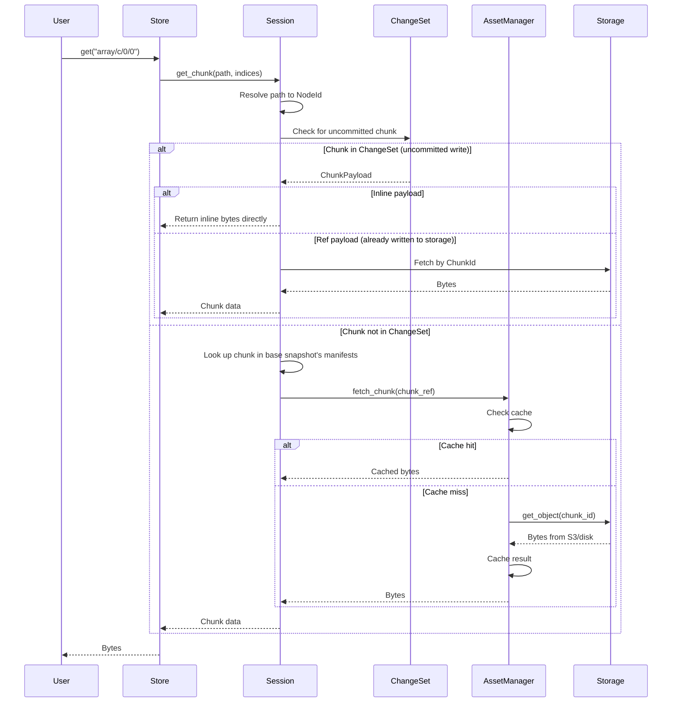
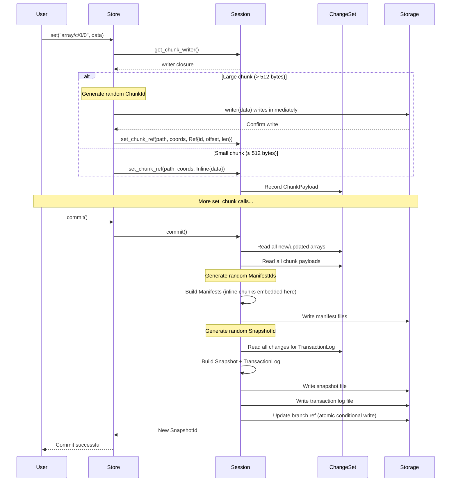
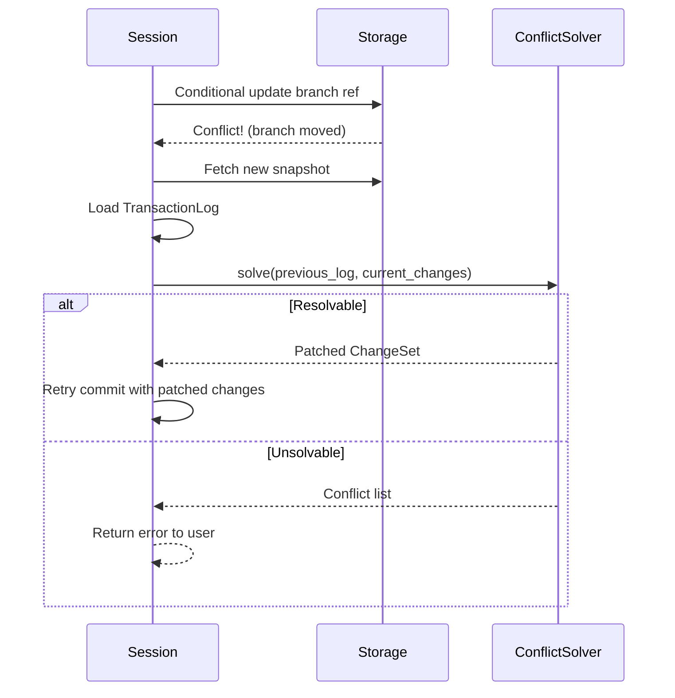

# Architecture

## The Big Picture: Layered Design

Icechunk separates concerns into three abstraction layers.

This document explains these layers and how data flows through them.

> **Scope**: This document provides a high-level map of how components relate. For details on each component, see the individual pages: [Repository](repository.md), [Session](session.md), [Store](store.md), [Core Types](core-types.md), [Storage](storage.md).

### 1. High-Level API: Repository

The [`Repository`](repository.md) type (in `repository.rs`) is the entry point for version control operations:

- Opening/creating repositories
- Working with branches and tags (see [Refs](core-types.md#refs-branches-and-tags))
- Resolving version specifiers (`VersionInfo`)
- Creating [Sessions](#2-transaction-layer-session--changeset) for reading or writing

`Repository` doesn't directly handle data—it delegates to `Session` for all read/write operations.

### 2. Transaction Layer: Session + ChangeSet

The [`Session`](session.md) type (in `session.rs`) maintains:

- A reference to the base [Snapshot](core-types.md#snapshot) being read or modified
- A [`ChangeSet`](session.md#changeset) that accumulates all modifications
- Methods for reading/writing arrays, groups, and chunks

The `ChangeSet` (in `change_set.rs`) is a data structure that tracks:

- New groups and arrays created
- Updated array metadata
- Chunks written, updated, or deleted (as [ChunkPayloads](core-types.md#chunkpayload-aka-chunk-reference))
- Move/rename operations

When a session commits, the `ChangeSet` is serialized into a new [Snapshot](core-types.md#snapshot) and [TransactionLog](core-types.md#transactionlog).

### 3. Zarr Interface: Store

The [`Store`](store.md) type (in `store.rs`) provides a key-value interface that Zarr libraries expect:

- `get(key)` / `set(key, value)` for zarr keys like `"myarray/c/0/0"`
- `list_dir(prefix)` for directory listing
- Key parsing to translate Zarr [Paths](core-types.md#path) and [ChunkIndices](core-types.md#chunkindices) to Icechunk operations

Store is backed by a [`Session`](session.md) and translates string keys to typed method calls.

## Data Flow

### Read Path

<!-- TODO: Simplify this diagram

-->

Key points:

- **ChangeSet is checked first** for uncommitted writes in the current session
- **Inline chunks** return data directly from memory (no storage fetch)
- **Ref chunks** (uncommitted but already written) require a storage fetch
- **Committed chunks** are looked up via the base snapshot's manifests, with caching

### Write Path

<!-- TODO: Simplify this diagram

-->

Key points:

- **Object IDs** (`ChunkId`, `ManifestId`, `SnapshotId`): randomly generated when the object is created
- **Large chunks** (> `inline_chunk_threshold_bytes`, default 512): written to storage immediately during `set_chunk`
- **Small chunks** (≤ threshold): stored in `ChangeSet`, embedded in manifest files at commit time
- **Commit reads from ChangeSet** to build manifests, snapshot, and transaction log
- **Transaction log** records what changed, written alongside the snapshot

### Commit with Conflict

<!-- TODO: Simplify this diagram

-->

## Module Dependencies

The dependency graph flows downward (higher modules depend on lower ones):

```
┌─────────────────────────────────────────────┐
│                 repository.rs               │
│            (version control API)            │
└─────────────────────┬───────────────────────┘
                      │
┌─────────────────────▼───────────────────────┐
│     session.rs          store.rs            │
│   (transactions)    (zarr interface)        │
└────────┬────────────────────┬───────────────┘
         │                    │
┌────────▼────────┐  ┌────────▼────────┐
│  change_set.rs  │  │ asset_manager.rs│
│ (modifications) │  │    (caching)    │
└─────────────────┘  └────────┬────────┘
                              │
         ┌────────────────────▼───────────────┐
         │    format/              storage/   │
         │  (serialization)    (I/O backends) │
         └────────────────────────────────────┘
```

> **Note**: `change_set.rs` and `asset_manager.rs` are parallel components both used by `session.rs`—`ChangeSet` tracks modifications while `AssetManager` handles cached reads.

## Key Relationships

| Component | Owns/Contains | Used By |
|-----------|---------------|---------|
| `Repository` | Config, storage ref | External callers, `Store` |
| `Session` | `ChangeSet`, snapshot ref, `AssetManager` | `Store`, `Repository` |
| `ChangeSet` | In-memory modifications | `Session` |
| `Store` | `Session` (wrapped) | Python bindings |
| `AssetManager` | Caches, `Storage` ref | `Session` |
| `Storage` | Backend connection | `AssetManager` |

## Thread Safety

- `Repository` is [`Clone`](https://doc.rust-lang.org/std/clone/trait.Clone.html) and can be shared across threads
- `Session` is [`!Sync`](https://doc.rust-lang.org/nomicon/send-and-sync.html)—each thread/task should have its own session
- `AssetManager` is internally synchronized with [`Arc`](https://doc.rust-lang.org/std/sync/struct.Arc.html) and uses async-aware caches
- `Storage` implementations are [`Send + Sync`](https://doc.rust-lang.org/nomicon/send-and-sync.html)

## Error Handling

Each layer defines its own error kind enum:

- `RepositoryErrorKind` - version control errors
- `SessionErrorKind` - transaction errors (wraps lower errors)
- `StoreErrorKind` - zarr interface errors (wraps session errors)
- `StorageErrorKind` - I/O errors
- `IcechunkFormatErrorKind` - serialization errors

All errors are wrapped in `ICError<E>` which captures a [`SpanTrace`](https://docs.rs/tracing-error/latest/tracing_error/struct.SpanTrace.html) from the [`tracing`](https://docs.rs/tracing/latest/tracing/) crate for debugging async call stacks.

## Next Steps

- [Core Types](core-types.md) - Understanding Snapshots, Manifests, and IDs
- [Session & ChangeSet](session.md) - Deep dive into the transaction layer
