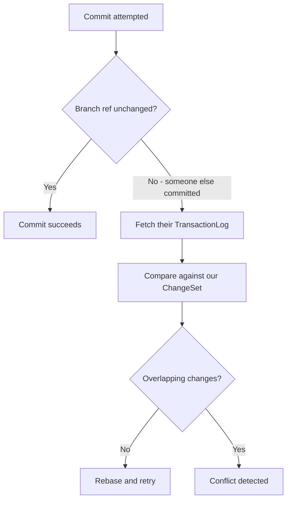
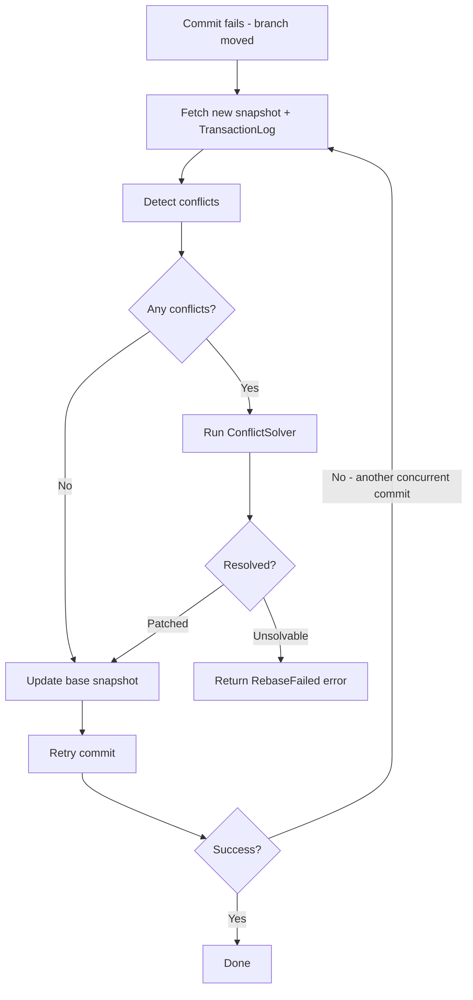

# Conflict Resolution

## The Big Picture: Optimistic Concurrency

Icechunk is designed for cloud object storage where locks are expensive or impossible. Instead of pessimistic locking, it uses **optimistic concurrency**: writers assume they'll succeed, and handle conflicts only when they actually occur.

When two writers commit at the same time, the first one wins. The second writer's commit fails, but they can **rebase** their changes onto the new snapshot. Most of the time this works automatically—conflicts only occur when both writers touched the same data.

This document explains how conflicts are detected, what types exist, and how they're resolved.

> **Scope**: This document covers conflict detection and resolution. For how commits work, see [Session](session.md#commit-process). For the TransactionLog that enables conflict detection, see [Core Types](core-types.md#transactionlog).

---

## How Conflicts Are Detected

Conflict detection compares what the other writer changed (from their [TransactionLog](core-types.md#transactionlog)) against what you're trying to change (from your [ChangeSet](session.md#changeset)).



The key insight: TransactionLogs record **what changed**, not the full snapshot. This makes comparison fast—we only check for overlapping modifications.

---

## Conflict Types

The `Conflict` enum (defined in `conflicts/mod.rs`) identifies what went wrong:

```rust
pub enum Conflict {
    // Node creation conflicts
    NewNodeConflictsWithExistingNode(Path),
    NewNodeInInvalidGroup(Path),

    // Metadata conflicts
    ZarrMetadataDoubleUpdate(Path),
    ZarrMetadataUpdateOfDeletedArray(Path),
    ZarrMetadataUpdateOfDeletedGroup(Path),

    // Chunk conflicts
    ChunkDoubleUpdate {
        path: Path,
        node_id: NodeId,
        chunk_coordinates: HashSet<ChunkIndices>,
    },
    ChunksUpdatedInDeletedArray { path: Path, node_id: NodeId },
    ChunksUpdatedInUpdatedArray { path: Path, node_id: NodeId },

    // Delete conflicts
    DeleteOfUpdatedArray { path: Path, node_id: NodeId },
    DeleteOfUpdatedGroup { path: Path, node_id: NodeId },

    // Move conflicts
    MoveOperationCannotBeRebased,
}
```

### What Each Conflict Means

| Conflict | Situation |
|----------|-----------|
| `NewNodeConflictsWithExistingNode` | Both writers created a node at the same path |
| `NewNodeInInvalidGroup` | You created a node under a path that no longer exists |
| `ZarrMetadataDoubleUpdate` | Both writers modified the same array/group metadata |
| `ZarrMetadataUpdateOfDeletedArray` | You updated metadata for an array the other writer deleted |
| `ZarrMetadataUpdateOfDeletedGroup` | You updated metadata for a group the other writer deleted |
| `ChunkDoubleUpdate` | Both writers modified the same chunk(s) |
| `ChunksUpdatedInDeletedArray` | You wrote chunks to an array the other writer deleted |
| `ChunksUpdatedInUpdatedArray` | You wrote chunks to an array the other writer also modified |
| `DeleteOfUpdatedArray` | You deleted an array the other writer updated |
| `DeleteOfUpdatedGroup` | You deleted a group the other writer updated |
| `MoveOperationCannotBeRebased` | Move operations can't be automatically rebased |

### Why `ChunkDoubleUpdate` Uses `HashSet<ChunkIndices>`

When the same array has multiple conflicting chunks, they're grouped together rather than reported separately. This makes it easier to understand the scope of the conflict—"chunks [0,0], [0,1], [1,0] all conflict" rather than three separate errors.

---

## Conflict Resolution

The `ConflictSolver` trait defines how conflicts are handled:

```rust
#[async_trait]
pub trait ConflictSolver {
    async fn solve(
        &self,
        previous_change: &TransactionLog,
        previous_repo: &Session,
        current_changes: ChangeSet,
        current_repo: &Session,
    ) -> SessionResult<ConflictResolution>;
}

pub enum ConflictResolution {
    /// Conflicts resolved, here's the patched ChangeSet
    Patched(ChangeSet),

    /// Cannot resolve automatically
    Unsolvable {
        reason: Vec<Conflict>,
        unmodified: ChangeSet,
    },
}
```

The solver receives:
- **previous_change**: What the other writer changed (their TransactionLog)
- **previous_repo**: A read session at the new snapshot (to inspect their changes)
- **current_changes**: Your ChangeSet
- **current_repo**: Your session (to inspect your changes)

### BasicSolver

The default `BasicSolver` (in `conflicts/basic_solver.rs`) implements configurable resolution rules:

```rust
pub struct BasicConflictSolver {
    pub on_chunk_conflict: VersionSelection,  // UseOurs, UseTheirs, or Fail
    pub fail_on_delete_of_updated_array: bool,
    pub fail_on_delete_of_updated_group: bool,
}
```

**Always Resolvable:**

| Situation | Resolution |
|-----------|------------|
| Different arrays modified | Merge both changes |
| Same array, different chunks | Merge chunk sets |

**Configurable (resolved by default):**

| Situation | Default Resolution | Config to Fail |
|-----------|-------------------|----------------|
| Same chunk modified by both | Use ours (`on_chunk_conflict: UseOurs`) | Set to `Fail` |
| You deleted an array they updated | Allow delete | `fail_on_delete_of_updated_array: true` |
| You deleted a group they updated | Allow delete | `fail_on_delete_of_updated_group: true` |

**Never Resolvable:**

| Situation | Why |
|-----------|-----|
| You wrote chunks to a deleted array | Data would be lost |
| Same metadata modified by both | Can't merge JSON safely |
| Move operations | Path semantics are complex |
| New node conflicts with existing | Ambiguous which to keep |

---

## Rebase Flow

When a commit fails due to a concurrent commit:



Key points:

1. **No conflicts** = just update the base snapshot and retry
2. **Conflicts detected** = run the ConflictSolver
3. **Patched** = solver modified your ChangeSet to avoid conflicts
4. **Unsolvable** = manual intervention needed
5. **Loop possible** = another writer might commit while you're rebasing

---

## Detection Logic

The detector (in `conflicts/detector.rs`) compares fields from the TransactionLog against the ChangeSet:

| Their TransactionLog | Your ChangeSet | Conflict |
|---------------------|----------------|----------|
| `new_arrays` | `new_arrays` (same path) | `NewNodeConflictsWithExistingNode` |
| `updated_arrays` | `updated_arrays` (same node) | `ZarrMetadataDoubleUpdate` |
| `deleted_arrays` | `updated_arrays` (same node) | `ZarrMetadataUpdateOfDeletedArray` |
| `deleted_arrays` | `set_chunks` (same node) | `ChunksUpdatedInDeletedArray` |
| `updated_chunks` | `set_chunks` (same node+indices) | `ChunkDoubleUpdate` |
| `updated_arrays` | `deleted_arrays` (same node) | `DeleteOfUpdatedArray` |

The comparison is symmetric where it makes sense—if they deleted what you updated, that's the same problem as you deleting what they updated.

---

## Error Handling

When rebase fails with unsolvable conflicts, the session returns:

```rust
SessionErrorKind::RebaseFailed {
    snapshot: SnapshotId,    // The snapshot you couldn't rebase onto
    conflicts: Vec<Conflict>, // What went wrong
}
```

The `unmodified` ChangeSet in `ConflictResolution::Unsolvable` preserves your original changes, allowing retry after manual resolution.

---

## Next Steps

- [Session & ChangeSet](session.md) - Where changes accumulate before commit
- [Core Types](core-types.md#transactionlog) - The TransactionLog structure
- [Repository](repository.md#ref-management) - How branch refs enable conflict detection
