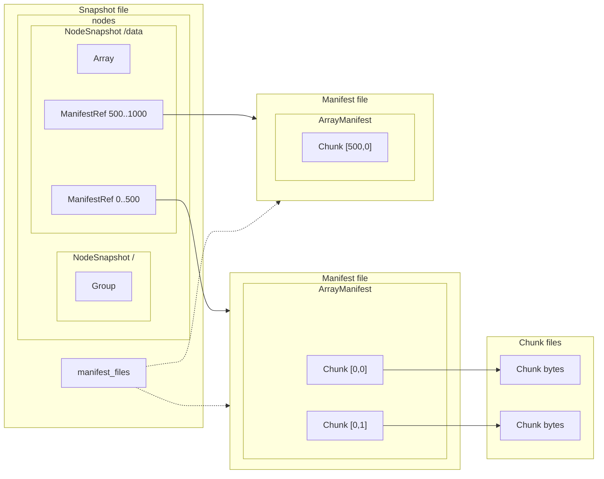

# Core Types

## The Big Picture: Snapshots

A **[Snapshot](#snapshot)** is like a git commit—it captures the entire repository at a specific moment. If you have a [`SnapshotId`](#content-addressable-ids), you can reconstruct exactly what every array and group looked like at that version: their metadata, shapes, and where all their chunks are stored.

Snapshots are composed of many smaller pieces: they contain **[NodeSnapshots](#nodesnapshot)** (one per array/group), which point to **[Manifests](#manifest)**, which contain **[ChunkPayloads](#chunkpayload-aka-chunk-reference)** that describe where each chunk's bytes live. All of these are tied together with typed **[IDs](#content-addressable-ids)**.

This document defines these types **from the ground up**—starting with the simplest building blocks and working toward the [Snapshot](#snapshot) that ties them all together.

> **Scope**: This document covers types that are **persisted to storage**. For in-memory types used during transactions ([Session](session.md), [ChangeSet](session.md#changeset)), see [Session & ChangeSet](session.md).

---

## Primitive Types

These types have no dependencies on other Icechunk types.

### Content-Addressable IDs

Icechunk uses typed identifiers to reference different objects. These are defined in `format/mod.rs`:

| ID Type | Definition | Identifies |
|---------|------------|------------|
| `SnapshotId` | `ObjectId<12, SnapshotTag>` | A commit—a specific version of the repository |
| `ManifestId` | `ObjectId<12, ManifestTag>` | A manifest file containing chunk locations |
| `ChunkId` | `ObjectId<12, ChunkTag>` | A single chunk of array data |
| `AttributesId` | `ObjectId<12, AttributesTag>` | User-defined metadata attached to a node |
| `NodeId` | `ObjectId<8, NodeTag>` | A group or array in the repository hierarchy |

#### ObjectId Design

`ObjectId<N, Tag>` is a generic wrapper around `[u8; N]` with a [phantom type](https://doc.rust-lang.org/nomicon/phantom-data.html) tag:

- **N** = byte length (12 for most IDs, 8 for NodeId)
- **Tag** = [zero-sized type](https://doc.rust-lang.org/nomicon/exotic-sizes.html#zero-sized-types-zsts) to prevent mixing ID types at compile time

This prevents bugs like passing a `ChunkId` where a `ManifestId` is expected. See also the [newtype pattern](https://doc.rust-lang.org/rust-by-example/generics/new_types.html) in Rust by Example.

#### How IDs Work

IDs are **random bytes** generated when an object is created:

- 12 bytes = 96 bits of entropy (collision resistant)
- Generated at creation time, not derived from content

When IDs need to be used in **file paths**, they're encoded as strings using [Crockford Base32](https://www.crockford.com/base32.html):

- 12 raw bytes → 20-character string
- Case-insensitive, avoids ambiguous characters (0/O, 1/I/L)
- Example: `VY76P925PRY57WFEK410`

You'll see these Base32-encoded IDs in storage paths and in user-facing APIs:

| Object | Example |
|--------|---------------------|
| Commit ID (SnapshotId) | `VY76P925PRY57WFEK410` |
| Snapshot file | `snapshots/VY76P925PRY57WFEK410` |
| Manifest file | `manifests/ABC123DEF456GHJ789KL` |
| Chunk file | `chunks/MNP012QRS345TUV678WX` |
| Transaction log | `transactions/VY76P925PRY57WFEK410` |

So the ID is the bytes internally; the Base32 string is how it's displayed to users and used in storage paths.

### Path

A `Path` is the location of a group or array within the repository, like a file path in a filesystem. When you want to read or write an array at `/climate/temperature`, the path tells Icechunk which node you're referring to.

Paths identify nodes in the repository hierarchy:

```rust
// Examples:
Path::root()            // "/"
Path::new("/group")     // "/group"
Path::new("/group/arr") // "/group/arr"
```

Paths are always absolute (start with `/`) and normalized (no trailing slash except root).

### ChunkIndices

Arrays are divided into chunks for efficient storage and access. `ChunkIndices` identifies which chunk you want within an array—like coordinates on a grid. Combined with a `Path`, you can locate any specific chunk: "chunk (0, 0, 1) of the array at /climate/temperature".

Coordinates identifying a specific chunk within an array:

```rust
// For a 3D array with chunks at (0,0,0), (0,0,1), etc.
// Note: indices are u32
ChunkIndices(vec![0u32, 0, 1])
```

The number of indices matches the array's dimensionality. Indices are `u32` values.

### ByteRange

Specifies which bytes to read from a chunk or object. Used for partial reads:

```rust
pub enum ByteRange {
    /// Fixed range [start, end)
    Bounded(Range<ChunkOffset>),
    /// All bytes from offset to end
    From(ChunkOffset),
    /// Last n bytes
    Last(ChunkLength),
    /// All bytes except last n
    Until(ChunkOffset),
}
```

| Variant | Example | Reads |
|---------|---------|-------|
| `Bounded(10..20)` | Bytes 10-19 | Fixed slice |
| `From(100)` | Bytes 100 to end | Tail of object |
| `Last(50)` | Last 50 bytes | Footer/trailer |
| `Until(50)` | All except last 50 | Skip trailer |

---

## Chunk Storage

These types describe how chunk data is stored and referenced.

### ChunkPayload (aka "chunk reference")

A `ChunkPayload`—also called a **chunk reference**—tells Icechunk how to get the bytes for a chunk. Since chunks can live in different places—inside Icechunk's storage, embedded in a [Manifest](#manifest), or in an external file like HDF5—the payload describes where to find the data.

Throughout Icechunk, when you see "chunk reference" or "chunk ref", it means a `ChunkPayload`.

Chunks can be stored in three ways:

| Variant | Description | Use Case |
|---------|-------------|----------|
| `Ref` | Stored in Icechunk's chunk storage | Normal chunks |
| `Inline` | Embedded directly in the manifest | Small chunks (coordinates) |
| `Virtual` | Reference to external file (HDF5, NetCDF) | Virtual datasets |

```rust
enum ChunkPayload {
    Ref(ChunkRef),        // Stored in Icechunk's storage
    Inline {              // Raw chunk data embedded in manifest
        bytes: Bytes,
        offset: ChunkOffset,
        length: ChunkLength,
    },
    Virtual(VirtualChunkRef),  // Reference to external file
}

struct ChunkRef {
    id: ChunkId,          // See Content-Addressable IDs above
    offset: ChunkOffset,  // Offset within chunk file (u64)
    length: ChunkLength,  // Compressed size (u64)
}

struct VirtualChunkRef {
    location: VirtualChunkLocation,  // URL of external file
    offset: ChunkOffset,             // Byte offset in external file
    length: ChunkLength,             // Byte length to read
    checksum: Option<Checksum>,      // Optional ETag or last-modified
}
```

- **Ref**: Uses a [ChunkId](#content-addressable-ids) to locate the chunk in Icechunk's storage at `chunks/{ChunkId}`
- **Inline**: Data is embedded directly in the [Manifest](#manifest) (no separate file)
- **Virtual**: Points to a byte range in an external file (HDF5, NetCDF, etc.)

**Storage location for Ref chunks**: `chunks/{ChunkId}` (e.g., `chunks/MNP012QRS345TUV678WX`)

Chunk files are written immediately when `set_chunk` is called (for chunks above the inline threshold). They are immutable—updating a chunk writes a new file with a new ChunkId.

### Manifest

When you want to read a chunk, Icechunk needs to know where that chunk's bytes are stored. `Manifest`s are the indexes that answer this question. They map [ChunkIndices](#chunkindices) to [ChunkPayload](#chunkpayload-aka-chunk-reference)s.

A `Manifest` (defined in `format/manifest.rs`) stores [chunk references](#chunkpayload-aka-chunk-reference) for one or more arrays. Each manifest is identified by a [ManifestId](#content-addressable-ids) and stored as a separate file in storage.

```
Manifest
├── id: ManifestId
└── arrays: BTreeMap<NodeId, ArrayManifest>
```

**Storage location**: `manifests/{ManifestId}` (e.g., `manifests/ABC123DEF456GHJ789KL`)

Manifests are serialized using [FlatBuffers](#serialization) and stored as immutable files. When chunks change, a new manifest file is written with a new ManifestId—the old one remains until garbage collection removes it.

#### ArrayManifest

[Chunk references](#chunkpayload-aka-chunk-reference) for a single array, keyed by [chunk coordinates](#chunkindices):

```
ArrayManifest
├── node_id: NodeId            # Identifies which array these chunks belong to
└── chunks: BTreeMap<ChunkIndices, ChunkPayload>
```

A manifest can contain chunks from multiple arrays (keyed by [NodeId](#content-addressable-ids)), and a single array's chunks can be spread across multiple manifests.

#### Why Multiple Manifests?

For small arrays, all chunk references fit in a single manifest. But for large arrays with millions of chunks, a single manifest would be:

- **Slow to load**: You'd have to read a huge file just to find one chunk
- **Slow to update**: Changing one chunk means rewriting the entire manifest
- **Hard to write in parallel**: Multiple writers would conflict on the same file

Icechunk solves this by **splitting** large arrays across multiple manifests, each covering a range of [ChunkIndices](#chunkindices). The [ManifestRef](#manifestref) stores the coordinate ranges (`extents`) so Icechunk can jump directly to the right manifest for any chunk.

This splitting is configured via [`ManifestSplittingConfig`](https://docs.rs/icechunk/latest/icechunk/config/struct.ManifestSplittingConfig.html) and happens automatically based on array dimensions.

---

## Repository Structure

These types describe the structure and history of a repository, starting from the top-level Snapshot and drilling down into its components.

### Snapshot

A `Snapshot` (defined in `format/snapshot.rs`) is the central data structure [introduced above](#the-big-picture-snapshots)—it represents the **complete state of a repository at a point in time**.

```
Snapshot
├── id: SnapshotId
├── parent_id: Option<SnapshotId>       # None for first commit
├── metadata
│   ├── message: String                 # Commit message
│   ├── flushed_at: DateTime
│   └── properties: BTreeMap<String, Value>
├── nodes: Iterator<NodeSnapshot>       # All groups and arrays
│   ├── NodeSnapshot for "/"            # Root group
│   ├── NodeSnapshot for "/foo"         # A group or array
│   ├── NodeSnapshot for "/foo/bar"     # Another group or array
│   └── ...
└── manifest_files: Vec<ManifestFileInfo>  # Summary for GC/bookkeeping
```

**Storage location**: `snapshots/{SnapshotId}` (e.g., `snapshots/VY76P925PRY57WFEK410`)

Snapshots are serialized using [FlatBuffers](#serialization) and stored as immutable files. Each commit creates a new snapshot file; old snapshots remain accessible until garbage collection.

#### ManifestFileInfo vs ManifestRef

There are two places manifest IDs appear—this distinction is important:

| Type | Stored In | Purpose | Contains |
|------|-----------|---------|----------|
| `ManifestFileInfo` | Snapshot (top-level) | Bookkeeping, GC | `id`, `size_bytes`, `num_chunk_refs` |
| `ManifestRef` | NodeSnapshot (per-array) | Chunk lookup | `id`, `extents` (coordinate ranges) |

- **ManifestFileInfo**: A flat list of all manifest files referenced anywhere in this snapshot. Used for garbage collection (which manifests are still needed?) and statistics. Does NOT tell you which array uses which manifest.

- **ManifestRef**: Stored inside each array's `NodeData::Array.manifests`. Contains `extents` so Icechunk can find the right manifest for a given chunk coordinate. This is what you use when reading/writing chunks.

Key relationships:

- Each snapshot points to its **parent** snapshot (forming a commit history)
- The snapshot contains all **[NodeSnapshots](#nodesnapshot)** (groups and arrays) embedded in the snapshot file
- Array nodes contain **[ManifestRefs](#manifestref)** (with extents) that point to separate [Manifest](#manifest) files
- Manifests contain **[ArrayManifests](#arraymanifest)** (keyed by [NodeId](#content-addressable-ids)), which contain the **[chunk references](#chunkpayload-aka-chunk-reference)**
- A single manifest file can contain chunks from **multiple arrays** (each in its own ArrayManifest)
- The snapshot's `manifest_files` is a summary of all manifests used by any array in this snapshot



### NodeSnapshot

A `NodeSnapshot` captures everything about a single group or array at a point in time: its [Path](#path), its [NodeId](#content-addressable-ids), its Zarr metadata, and (for arrays) pointers to [Manifests](#manifest) containing its chunks. When you look up an array in a [Snapshot](#snapshot), you get back a `NodeSnapshot`.

Each node (group or array) in the repository tree:

```
NodeSnapshot
├── id: NodeId
├── path: Path                  # e.g., "/group/array"
├── user_data: Bytes            # Zarr metadata JSON
└── node_data: NodeData         # Group or Array specific
```

For groups, `NodeData::Group` is empty (just a marker).

For arrays, `NodeData::Array` contains:

```
NodeData::Array
├── shape: ArrayShape              # Contains both array and chunk dimensions
├── dimension_names: Option<Vec<DimensionName>>
└── manifests: Vec<ManifestRef>    # Pointers to chunk manifests
```

`ArrayShape` wraps `Vec<DimensionShape>`, where each `DimensionShape` contains both the array dimension length and chunk length for that axis.

The `manifests` field contains [ManifestRefs](#manifestref) that point to [Manifests](#manifest) where this array's [chunk references](#chunkpayload-aka-chunk-reference) are stored.

### ManifestRef

Large arrays may have their chunks spread across multiple [Manifests](#manifest). A `ManifestRef` is a pointer from a [NodeSnapshot](#nodesnapshot) to one of these manifest files, along with information about which [chunk coordinates](#chunkindices) that manifest covers. This lets Icechunk quickly find the right manifest without scanning all of them.

Each `ManifestRef` points to one manifest file:

```
ManifestRef
├── object_id: ManifestId
└── extents: ManifestExtents    # Wraps Vec<Range<u32>>
```

An array with chunks split across multiple manifests would have multiple `ManifestRef`s:

```
NodeData::Array.manifests: [
    ManifestRef { id: M1, extents: [0..500, 0..500] },    # Chunks [0-499, 0-499]
    ManifestRef { id: M2, extents: [500..1000, 0..500] }, # Chunks [500-999, 0-499]
]
```

The `extents` field enables efficient manifest lookup—when reading chunk `[750, 100]`, Icechunk checks the extents and goes directly to manifest `M2`.

---

## Version Control

### TransactionLog

When two writers commit at the same time, Icechunk needs to detect conflicts. Comparing full [Snapshots](#snapshot) would be expensive, so each commit also stores a `TransactionLog`—a summary of what changed. By comparing transaction logs, Icechunk can quickly determine if two commits touched the same chunks or arrays.

A `TransactionLog` (defined in `format/transaction_log.rs`) records what changed in a commit. It's stored alongside each [Snapshot](#snapshot) and used for:

- Fast [conflict detection](conflicts.md) (compare logs instead of full snapshots)
- Commit diffs
- Rebase operations

```
TransactionLog
├── new_groups: Vec<NodeId>
├── new_arrays: Vec<NodeId>
├── deleted_groups: Vec<NodeId>
├── deleted_arrays: Vec<NodeId>
├── updated_groups: Vec<NodeId>         # Metadata changes
├── updated_arrays: Vec<NodeId>         # Metadata changes
├── updated_chunks: Vec<(NodeId, ChunkIndices)>
└── moved_nodes: Vec<MoveOperation>     # Path renames
```

**Storage location**: `transactions/{SnapshotId}` (e.g., `transactions/VY76P925PRY57WFEK410`)

Note: The transaction log uses the same SnapshotId as the snapshot it describes—they're written together during commit.

Each entry uses [NodeId](#content-addressable-ids) to identify which nodes changed, [ChunkIndices](#chunkindices) to identify specific chunks that were modified, and `MoveOperation` to record path renames (from/to paths).

### Refs (Branches and Tags)

[SnapshotIds](#content-addressable-ids) are random bytes. Even when displayed as Base32 strings (like `VY76P925PRY57WFEK410`), they're not easy for humans to remember. Refs give [Snapshots](#snapshot) human-readable names. The `main` branch always points to the latest commit, while tags like `v1.0` can mark specific releases.

Refs are named pointers to snapshots, defined in `refs.rs`. See also [Repository](repository.md) for branch/tag operations.

```rust
pub enum Ref {
    Tag(String),      // Immutable pointer to snapshot
    Branch(String),   // Mutable pointer, updated on commit
}
```

#### Branches

- Stored as JSON files: `refs/branch.{name}/ref.json`
- Updated atomically using [conditional writes](https://docs.aws.amazon.com/AmazonS3/latest/userguide/conditional-requests.html) (only succeeds if the file hasn't changed since last read—this is how commits detect conflicts)
- Default branch is `main`

#### Tags

- Stored as: `refs/tag.{name}/ref.json`
- Created with "create if not exists" semantics
- Immutable: once created, a tag always points to the same snapshot
- Deleted by creating a [tombstone](https://en.wikipedia.org/wiki/Tombstone_(data_store)) file (a marker that prevents reuse of the tag name)

---

## Serialization

The following file types are serialized using [FlatBuffers](https://google.github.io/flatbuffers/) ([Rust API docs](https://docs.rs/flatbuffers/latest/flatbuffers/)):

| File | Path | Contents |
|------|------|----------|
| Snapshot | `snapshots/{SnapshotId}` | Node tree, metadata, manifest file list |
| Manifest | `manifests/{ManifestId}` | Chunk references for arrays |
| TransactionLog | `transactions/{SnapshotId}` | Summary of changes for conflict detection |

FlatBuffers supports zero-copy reads—you can access fields directly from the stored bytes without parsing the entire structure first.

**Not FlatBuffers**:

- **Chunk files** (`chunks/{ChunkId}`) — raw bytes (possibly compressed by Zarr codecs)
- **Ref files** (`refs/branch.{name}/ref.json`) — JSON

Schema files are in `icechunk/flatbuffers/*.fbs`, with generated code in `format/flatbuffers/`.

## Next Steps

- [Session & ChangeSet](session.md) - How these types are created and modified
- [Storage Backends](storage.md) - How they're persisted
