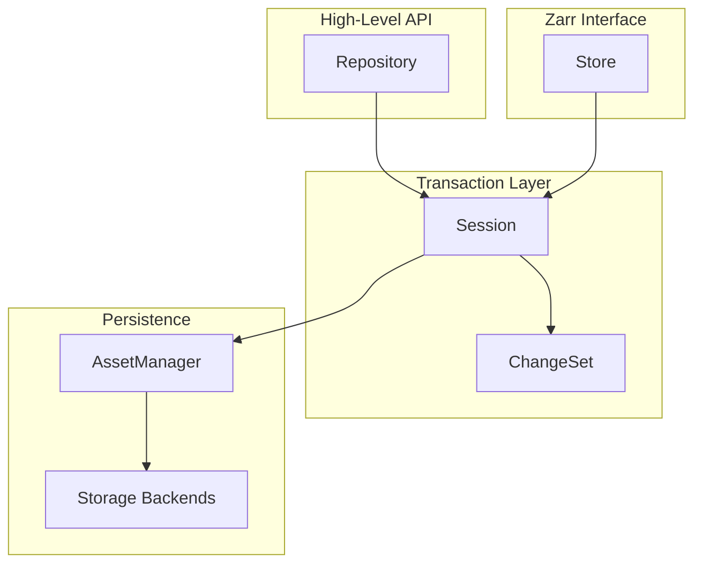

<!-- TODO: Replace file path references (e.g., `format/mod.rs`) with GitHub permalinks
     based on the version the docs are built with. This would allow readers to click
     through to the actual source code at the correct commit/tag. -->

# Rust Library Overview

This section documents the internals of the Icechunk Rust library.

At a high level, the organization is:

- [Repository](repository.md) is the entry point—it provides access to branches and tags, and creates sessions.
- [Sessions](session.md) handle transactions for reading and writing data.
- [ChangeSets](session.md#changeset) track which chunks and metadata changed, for inclusion in the next snapshot.
- [Snapshots](core-types.md#snapshot) capture the entire repository state at a point in time.
- [Manifests](core-types.md#manifest) index where chunks are stored.
- The [Storage](storage.md) layer abstracts away whether you're on S3 or a local disk.

For the user-facing concepts, see [Core Concepts](../concepts.md). For the on-disk format specification, see [Specification](../spec.md).

## Where to Start

- **Getting the big picture**: See [Architecture](architecture.md) for how the layers fit together and how data flows.
- **Understanding the data model**: Start with [Core Types](core-types.md) to learn about Snapshots, Manifests, and content-addressable IDs.
- **Understanding writes**: Read [Session & ChangeSet](session.md) to see how modifications flow through the system.
- **Working on storage**: See [Storage Backends](storage.md) for the `Storage` trait and implementations.
- **Working on the Zarr interface**: See [Store](store.md) for how Zarr keys map to Icechunk operations.
- **Debugging conflicts**: Check [Conflict Resolution](conflicts.md) for how concurrent writes are handled.

## Key Design Principles

1. **Async-first**: All I/O operations are async to support cloud storage efficiently.
2. **Immutable snapshots**: Historical versions are append-only; data is never overwritten.
3. **Content-addressable IDs**: Objects are identified by typed, collision-resistant IDs.
4. **Multi-level caching**: Snapshots → Manifests → Chunks with weight-based eviction.
5. **Optimistic concurrency**: Writers assume success and handle conflicts on commit.

## Architecture at a Glance

Icechunk has three abstraction layers, from highest to lowest:

## Module Map

The `icechunk/src/` directory is organized as follows:

| Module | Purpose |
|--------|---------|
| `repository.rs` | High-level API for version management |
| `session.rs` | Transaction context for batched changes |
| `store.rs` | Zarr-compatible key-value interface |
| `change_set.rs` | Accumulates modifications during a session |
| `asset_manager.rs` | Caches and coordinates storage access |
| `refs.rs` | Branch and tag management |
| `format/` | Serialization schemas (FlatBuffers) |
| `storage/` | Backend implementations |
| `conflicts/` | Conflict detection and resolution |
| `virtual_chunks.rs` | External data references |
| `ops/` | Utilities (GC, stats, expiration) |
