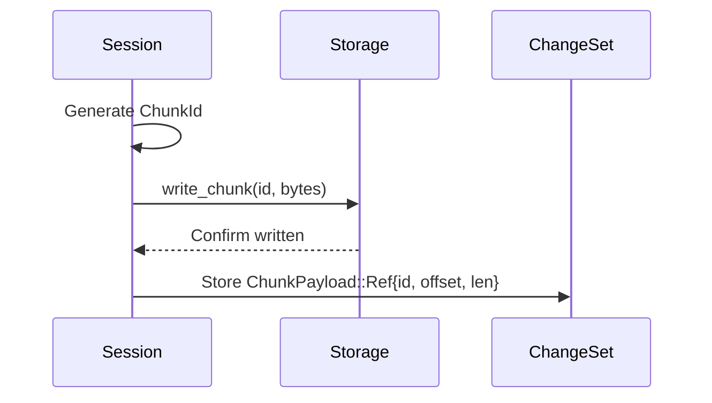
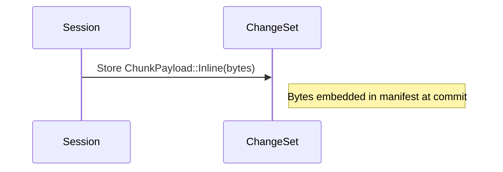
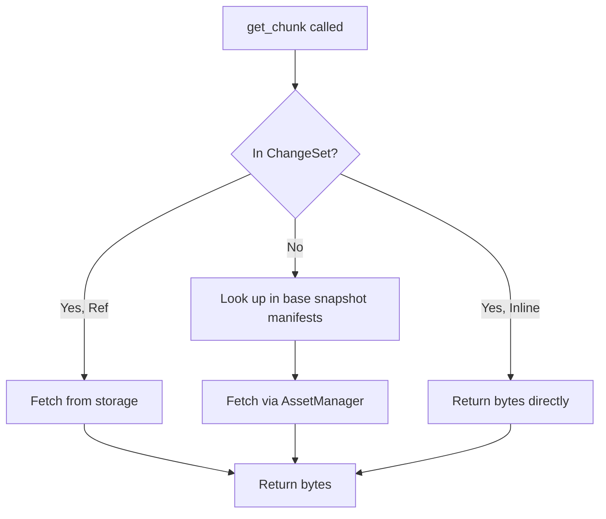
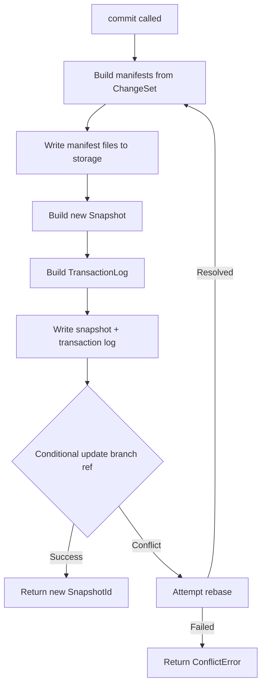

# Session & ChangeSet

## The Big Picture: Transactions

A **Session** is where all reading and writing happens. It's like a database transaction—you see a consistent view of the data, make changes, and either commit them atomically or discard them. This ensures repositories never end up in a half-written state.

The **ChangeSet** tracks what's been modified since the session started. When you commit, the ChangeSet is used to build a new [Snapshot](core-types.md#snapshot) that incorporates all your changes.

This document explains how Sessions and ChangeSets work internally—how they track modifications, handle different chunk sizes, and coordinate the commit process.

> **Scope**: This document covers in-memory transaction state. For the persisted data structures (Snapshots, Manifests), see [Core Types](core-types.md). For version management and branch operations, see [Repository](repository.md).

---

## Session Modes

Sessions come in three modes, each with different capabilities:

| Mode | Can Read | Can Write Chunks | Can Move/Rename |
|------|----------|------------------|-----------------|
| **Read-only** | Yes | No | No |
| **Writable** | Yes | Yes | No |
| **Rearrange** | Yes | No | Yes |

### Why Three Modes?

- **Read-only**: No ChangeSet needed—just reads from the base snapshot. Multiple read-only sessions can share the same cached data.

- **Writable**: The common case for data updates. Tracks new arrays, updated metadata, and chunk writes in a ChangeSet.

- **Rearrange**: Special mode for reorganizing hierarchy (move/rename operations) without touching chunk data. Kept separate because move operations have complex semantics that don't mix well with chunk writes.

---

## The Session Handle

`Session` (defined in `session.rs`) holds everything needed to read and write data:

```rust
pub struct Session {
    config: RepositoryConfig,
    storage_settings: Arc<storage::Settings>,
    storage: Arc<dyn Storage + Send + Sync>,
    asset_manager: Arc<AssetManager>,
    virtual_resolver: Arc<VirtualChunkResolver>,
    branch_name: Option<String>,
    snapshot_id: SnapshotId,
    change_set: ChangeSet,
    default_commit_metadata: SnapshotProperties,
    splits: HashMap<NodeId, ManifestSplits>,
}
```

### Why These Fields?

| Field | Purpose |
|-------|---------|
| `config` | Settings like inline chunk threshold |
| `storage` / `storage_settings` | Backend access for writing chunks |
| `asset_manager` | Shared cache (from [Repository](repository.md)) for reading |
| `virtual_resolver` | Resolves references to external files |
| `branch_name` | Which branch to update on commit (`None` for read-only) |
| `snapshot_id` | The base version this session started from |
| `change_set` | Accumulated modifications (see below) |
| `splits` | Cached manifest split boundaries per array |

The `Arc` wrappers mean Sessions share the cache with their parent Repository and with each other.

---

## ChangeSet

The `ChangeSet` (defined in `change_set.rs`) is an **enum** with two variants—one for each writable session mode:

```rust
pub enum ChangeSet {
    Edit(EditChanges),      // For writable sessions
    Rearrange(MoveTracker), // For rearrange sessions
}
```

This design enforces at the type level that you can't mix chunk writes with move operations in the same session.

### EditChanges

For writable sessions, `EditChanges` tracks all modifications:

```rust
pub struct EditChanges {
    // New nodes created in this session
    new_groups: HashMap<Path, (NodeId, Bytes)>,
    new_arrays: HashMap<Path, (NodeId, ArrayData)>,

    // Metadata updates to existing nodes
    updated_arrays: HashMap<NodeId, ArrayData>,
    updated_groups: HashMap<NodeId, Bytes>,

    // Chunk modifications (keyed by array, then by manifest extent)
    set_chunks: BTreeMap<NodeId, HashMap<ManifestExtents, SplitManifest>>,

    // Chunks deleted outside current array bounds (edge case for resizes)
    deleted_chunks_outside_bounds: BTreeMap<NodeId, HashSet<ChunkIndices>>,

    // Deleted nodes
    deleted_groups: HashSet<(Path, NodeId)>,
    deleted_arrays: HashSet<(Path, NodeId)>,
}
```

**Why the complex `set_chunks` structure?**

Large arrays split their chunks across multiple [Manifests](core-types.md#manifest). The nested map structure:
- Outer key (`NodeId`): which array
- Inner key (`ManifestExtents`): which manifest covers these coordinates
- Value (`SplitManifest`): the actual chunk changes for that manifest

This enables parallel manifest writes and incremental updates—only manifests with changes need to be rewritten.

### MoveTracker

For rearrange sessions, `MoveTracker` records path changes:

```rust
pub struct MoveTracker(Vec<Move>);

pub struct Move {
    pub from: Path,
    pub to: Path,
}
```

Moves are stored as an ordered list because the sequence matters—moving `/a` to `/b` then `/b` to `/c` is different from moving `/a` directly to `/c`.

### ArrayData

Metadata for new or updated arrays:

```rust
pub struct ArrayData {
    pub shape: ArrayShape,
    pub dimension_names: Option<Vec<DimensionName>>,
    pub user_data: Bytes,  // Zarr metadata JSON
}
```

---

## Chunk Write Path

When a chunk is written, the path depends on its size relative to `inline_chunk_threshold_bytes` (default: 512).

### Large Chunks (> threshold)

Large chunks are written to storage **immediately**:



The chunk bytes are already safe on storage. The ChangeSet just stores a reference.

### Small Chunks (≤ threshold)

Small chunks stay in memory until commit:



No storage round-trip—the bytes are embedded directly in the [Manifest](core-types.md#manifest) when it's written.

### Why This Split?

- **Large chunks**: Writing immediately avoids memory pressure and ensures data is durable even if the process crashes before commit.
- **Small chunks**: Embedding avoids the overhead of a separate storage operation for tiny data (like coordinate arrays).

---

## Read Path

When reading, Session checks both uncommitted changes and the base snapshot:



This means reads always see your uncommitted writes—the session provides a consistent view that includes pending changes.

---

## Commit Process

When `commit()` is called:



Key points:

1. **Large chunks already written** during `set_chunk` calls
2. **Inline chunks embedded** in manifests during step B
3. **TransactionLog** records what changed (for [conflict detection](conflicts.md))
4. **Conditional write** on branch ref detects concurrent commits
5. **Rebase** attempts to merge changes if someone else committed first

### Manifest Building

The ChangeSet's `set_chunks` structure maps directly to manifest files:

- Each `(NodeId, ManifestExtents)` pair corresponds to one manifest
- Manifests are built in parallel where possible
- Only manifests with changes are rewritten; unchanged manifests are referenced from the base snapshot

---

## ChangeSet Merging

ChangeSets can be merged, which is used during rebase:

```rust
impl ChangeSet {
    pub fn merge(&mut self, other: ChangeSet) -> SessionResult<()> {
        // Only Edit + Edit can be merged
        // Rearrange sessions cannot be merged
    }
}
```

Merge semantics for `EditChanges`:
- **New nodes**: Union of both sets (conflict if same path)
- **Updated metadata**: Later update wins
- **Chunk writes**: Later write wins
- **Deletes**: Applied in order

---

## Error Types

```rust
pub enum SessionErrorKind {
    // Wrapped errors
    RepositoryError(RepositoryErrorKind),
    StorageError(StorageErrorKind),
    FormatError(IcechunkFormatErrorKind),
    VirtualReferenceError(VirtualReferenceErrorKind),
    RefError(RefErrorKind),

    // Session mode errors
    ReadOnlySession,
    RearrangeSessionOnly,
    NonRearrangeSession,

    // Node errors
    SnapshotNotFound { id: SnapshotId },
    AncestorNodeNotFound { prefix: Path },
    NodeNotFound { path: Path, message: String },
    NotAnArray { node: Box<NodeSnapshot>, message: String },
    NotAGroup { node: Box<NodeSnapshot>, message: String },
    AlreadyExists { node: Box<NodeSnapshot>, message: String },
    MoveWontOverwrite(String),

    // Commit errors
    NoChangesToCommit,
    Conflict { expected_parent: Option<SnapshotId>, actual_parent: Option<SnapshotId> },
    RebaseFailed { snapshot: SnapshotId, conflicts: Vec<Conflict> },

    // Validation errors
    InvalidIndex { coords: ChunkIndices, path: Path },
    InvalidIndexForSplitManifests { coords: ChunkIndices },
    IncompatibleSplittingConfig { ours: ManifestSplittingConfig, theirs: ManifestSplittingConfig },
    InvalidSnapshotTimestampOrdering { parent: DateTime<Utc>, child: DateTime<Utc> },
    InvalidSnapshotTimestamp { object_store_time: DateTime<Utc>, snapshot_time: DateTime<Utc> },

    // Serialization
    JsonSerializationError(serde_json::Error),
    SerializationError(Box<rmp_serde::encode::Error>),
    DeserializationError(Box<rmp_serde::decode::Error>),

    // Other
    ConflictingPathNotFound(NodeId),
    OtherFlushError,
    ConcurrencyError(JoinError),
}
```

The most important for understanding the system:

- **`ReadOnlySession`**: Write attempted on read-only session
- **`Conflict`**: Branch moved since session started—see [Conflict Resolution](conflicts.md)
- **`RebaseFailed`**: Automatic conflict resolution failed

---

## Next Steps

- [Conflict Resolution](conflicts.md) - How conflicts are detected and resolved
- [Core Types](core-types.md) - The persisted data structures
- [Repository](repository.md) - Creating and managing sessions
