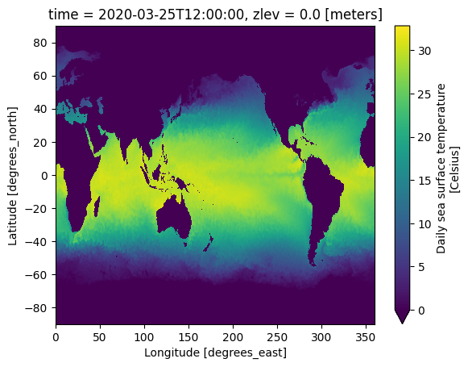

# Sample Datasets

## Native Datasets


## Virtual Datasets

### NOAA [OISST](https://www.ncei.noaa.gov/products/optimum-interpolation-sst) Data

> The NOAA 1/4° Daily Optimum Interpolation Sea Surface Temperature (OISST) is a long term Climate Data Record that incorporates observations from different platforms (satellites, ships, buoys and Argo floats) into a regular global grid

Check out an example dataset built using all virtual references pointing to daily Sea Surface Temperature data from 2020 to 2024 on NOAA's S3 bucket using python:

```python
import icechunk

storage = icechunk.StorageConfig.s3_anonymous(
    bucket='earthmover-sample-data',
    prefix='icechunk/oisst.2020-2024/',
    region='us-east-1',
)

store = icechunk.IcechunkStore.open_existing(storage=storage, mode="r", config=icechunk.StoreConfig(
    virtual_ref_config=icechunk.VirtualRefConfig.s3_anonymous(region='us-east-1'),
))
```


