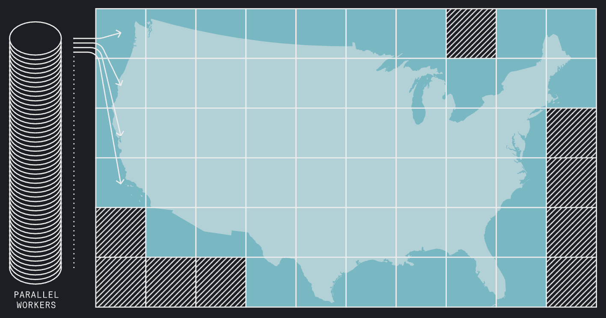

# Blog Posts

A curated list of blog posts about Icechunk.

## 2026

-   [{ loading=lazy }](https://carbonplan.org/blog/producing-ocr-data)

    **[Designing a data pipeline for our highest-resolution dataset yet](https://carbonplan.org/blog/producing-ocr-data)**

    *April 22, 2026* — CarbonPlan on using Icechunk's transactional writes to build a fault-tolerant, idempotent pipeline for their highest-resolution wildfire risk dataset.

-   [{ loading=lazy }](https://www.earthmover.io/blog/engineering-rigor-in-icechunk-part-1)

    **[Ship fast, break nothing: Engineering rigor in Icechunk with property and stateful testing](https://www.earthmover.io/blog/engineering-rigor-in-icechunk-part-1)**

    *April 22, 2026* — How property-based and stateful testing keep Icechunk reliable as it evolves.

-   [{ loading=lazy }](https://www.earthmover.io/blog/announcing-icechunk-2-better-consistency-performance-and-reliability-for-tensor-storage)

    **[Announcing Icechunk 2: Better Consistency, Performance, and Reliability for Tensor Storage](https://www.earthmover.io/blog/announcing-icechunk-2-better-consistency-performance-and-reliability-for-tensor-storage)**

    *April 9, 2026* — Release announcement for Icechunk 2, covering node rename, chunk reindexing, and performance wins.

-   [{ loading=lazy }](https://www.earthmover.io/blog/cursed-venvs-confident-releases-testing-icechunk-across-major-versions)

    **[Cursed venvs, Confident Releases: Testing Icechunk Across Major Versions](https://www.earthmover.io/blog/cursed-venvs-confident-releases-testing-icechunk-across-major-versions)**

    *March 20, 2026* — Introducing `third-wheel`, the tool used to test cross-version compatibility for the Icechunk 2 release.

## 2025

-   [{ loading=lazy }](https://www.earthmover.io/blog/evolving-our-tensor-storage-engine-a-preview-of-icechunk-2)

    **[Evolving our Tensor Storage Engine: A Preview of Icechunk 2](https://www.earthmover.io/blog/evolving-our-tensor-storage-engine-a-preview-of-icechunk-2)**

    *December 2, 2025* — Preview of Icechunk 2 features and the migration path from 1.x.

-   [{ loading=lazy }](https://developmentseed.org/blog/2025-10-13-zarr/)

    **[Zarr Everywhere](https://developmentseed.org/blog/2025-10-13-zarr/)**

    *October 13, 2025* — Development Seed's overview of their work on cloud-native array tooling, including Icechunk, VirtualiZarr, and Zarr v3 adoption across the ecosystem.

-   [{ loading=lazy }](https://www.earthmover.io/blog/from-10-minutes-to-10-seconds-how-woods-hole-scientists-used-icechunk-to-optimize-ocean-data-access)

    **[From 10 Minutes to 10 Seconds: How Woods Hole Scientists used Icechunk to Optimize Ocean Data Access](https://www.earthmover.io/blog/from-10-minutes-to-10-seconds-how-woods-hole-scientists-used-icechunk-to-optimize-ocean-data-access)**

    *October 8, 2025* — Case study on converting OPeNDAP-served NetCDF to Icechunk for dramatic latency improvements.

-   [{ loading=lazy }](https://www.earthmover.io/blog/multi-player-mode-why-teams-that-use-zarr-need-icechunk)

    **[Multi-Player Mode: Why Teams That Use Zarr Need Icechunk](https://www.earthmover.io/blog/multi-player-mode-why-teams-that-use-zarr-need-icechunk)**

    *August 25, 2025* — Why atomic updates, consistent snapshots, and Git-like version control matter for teams writing Zarr collaboratively.

-   [{ loading=lazy }](https://www.earthmover.io/blog/icechunk-1-0-production-grade-cloud-native-array-storage-is-here)

    **[Icechunk 1.0: Production-Grade Cloud-Native Array Storage Is Here](https://www.earthmover.io/blog/icechunk-1-0-production-grade-cloud-native-array-storage-is-here)**

    *July 10, 2025* — The stable 1.0 release: transactional safety, versioning, and virtual file references.

-   [{ loading=lazy }](https://www.earthmover.io/blog/everything-you-need-to-know-about-icechunk-garbage-collection)

    **[Everything you need to know about Icechunk garbage collection](https://www.earthmover.io/blog/everything-you-need-to-know-about-icechunk-garbage-collection)**

    *May 30, 2025* — Practical guide to garbage collection and expiration for reclaiming storage.

-   [{ loading=lazy }](https://www.earthmover.io/blog/icechunk-efficient-storage-of-versioned-array-data)

    **[Icechunk: Efficient storage of versioned array data](https://www.earthmover.io/blog/icechunk-efficient-storage-of-versioned-array-data)**

    *May 14, 2025* — How Icechunk stores versioned data efficiently by avoiding chunk duplication.

-   [{ loading=lazy }](https://www.earthmover.io/blog/learning-about-icechunk-consistency)

    **[Learning about Icechunk consistency with a clichéd but instructive example](https://www.earthmover.io/blog/learning-about-icechunk-consistency)**

    *April 23, 2025* — Transaction semantics and conflict detection, illustrated with a bank-transfer analogy.

-   [{ loading=lazy }](https://www.earthmover.io/blog/exploring-icechunk-scalability)

    **[Exploring Icechunk scalability: untangling S3's prefix story](https://www.earthmover.io/blog/exploring-icechunk-scalability)**

    *April 10, 2025* — Demonstrating that Icechunk scales to hundreds of thousands of requests per second on S3.

-   [{ loading=lazy }](https://www.earthmover.io/blog/nasa-icechunk)

    **[Solving NASA's Cloud Data Dilemma: How Icechunk Revolutionizes Earth Data Access](https://www.earthmover.io/blog/nasa-icechunk)**

    *March 27, 2025* — Case study on the Earthmover and Development Seed NASA pilot, enabling 100x faster cloud-native access to archival Earth science datasets without costly data migration.

## 2024

-   [{ loading=lazy }](https://www.earthmover.io/blog/icechunk)

    **[Announcing Icechunk!](https://www.earthmover.io/blog/icechunk)**

    *October 15, 2024* — The original announcement introducing Icechunk as an open-source transactional storage engine for Zarr.

