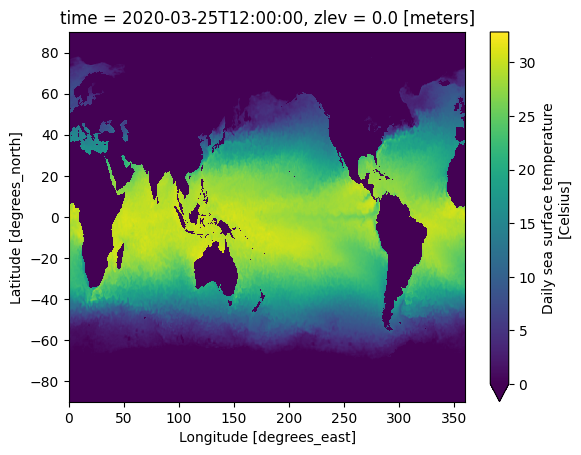

# Sample Datasets

This page contains links to various example Icechunk datasets, all of which are open-access and hosted in anonymous-access buckets, so you can try reading them immediately!

All examples only require `icechunk` and `xarray` as dependencies.

## Earthmover-hosted examples

### Weatherbench2 ERA5 (native, Icechunk v1)

A subset of the Weatherbench2 copy of the ERA5 reanalysis dataset.

=== "AWS"

    ```python
    import icechunk as ic
    import xarray as xr

    storage = ic.s3_storage(
        bucket="icechunk-public-data",
        prefix="v1/era5_weatherbench2",
        region="us-east-1",
        anonymous=True,
    )

    repo = ic.Repository.open(storage=storage)
    session = repo.readonly_session("main")
    ds = xr.open_dataset(
        session.store, group="1x721x1440", engine="zarr", chunks=None, consolidated=False
    )
    ```

=== "Google Cloud"

    ```python
    import icechunk as ic
    import xarray as xr

    storage = ic.gcs_storage(
        bucket="icechunk-public-data-gcs",
        prefix="v01/era5_weatherbench2",
    )

    repo = ic.Repository.open(storage=storage)
    session = repo.readonly_session("main")
    ds = xr.open_dataset(
        session.store, group="1x721x1440", engine="zarr", chunks=None, consolidated=False
    )
    ```

=== "Cloudflare R2"

    ```python
    import icechunk as ic
    import xarray as xr

    storage = ic.r2_storage(
        prefix="v1/era5_weatherbench2",
        endpoint_url="https://data.icechunk.cloud",
        anonymous=True,
    )

    repo = ic.Repository.open(storage=storage)
    session = repo.readonly_session("main")
    ds = xr.open_dataset(
        session.store, group="1x721x1440", engine="zarr", chunks=None, consolidated=False
    )
    ```


<!-- === "Tigris" -->

<!-- ```python -->
<!-- import icechunk as ic -->
<!-- import xarray as xr -->

<!-- storage = ic.tigris_storage( -->
<!--     bucket="icechunk-public-data-tigris", -->
<!--     prefix="v01/era5_weatherbench2", -->
<!--     anonymous=True, -->
<!-- ) -->

<!-- repo = ic.Repository.open(storage=storage) -->
<!-- session = repo.readonly_session(branch="main") -->
<!-- ds = xr.open_dataset( -->
<!--     session.store, group="1x721x1440", engine="zarr", chunks=None, consolidated=False -->
<!-- ) -->
<!-- ``` -->

<!-- ### NOAA [OISST](https://www.ncei.noaa.gov/products/optimum-interpolation-sst) Data (virtual) -->

<!-- > The NOAA 1/4° Daily Optimum Interpolation Sea Surface Temperature (OISST) is a long term Climate Data Record that incorporates observations from different platforms (satellites, ships, buoys and Argo floats) into a regular global grid -->

<!-- Check out an example dataset built using all virtual references pointing to daily Sea Surface Temperature data from 2020 to 2024 on NOAA's S3 bucket using python: -->

<!-- ```python -->
<!-- import icechunk as ic -->

<!-- storage = ic.s3_storage( -->
<!--     bucket='earthmover-sample-data', -->
<!--     prefix='icechunk/oisst.2020-2024/', -->
<!--     region='us-east-1', -->
<!--     anonymous=True, -->
<!-- ) -->

<!-- virtual_credentials = ic.containers_credentials({"s3": ic.s3_credentials(anonymous=True)}) -->

<!-- repo = ic.Repository.open( -->
<!--         storage=storage, -->
<!--         virtual_chunk_credentials=virtual_credentials) -->
<!-- ``` -->

<!--  -->

### GLAD Land Cover Land Use (native, Icechunk v1)

A copy of the GLAD Land Cover Land Use dataset distributed under a [Creative Commons Attribution 4.0 International License](http://creativecommons.org/licenses/by/4.0/).

See [source](https://storage.googleapis.com/earthenginepartners-hansen/GLCLU2000-2020/v2/download.html).

=== "AWS"

    ```python
    import icechunk as ic
    import xarray as xr

    storage = ic.s3_storage(
        bucket="icechunk-public-data",
        prefix=f"v1/glad",
        region="us-east-1",
        anonymous=True,
    )
    repo = ic.Repository.open(storage=storage)
    session = repo.readonly_session("main")
    ds = xr.open_dataset(
        session.store, chunks=None, consolidated=False, engine="zarr"
    )
    ```

## 3rd-party examples

### NOAA GFS archive (native, Icechunk v1)

A copy of the [NOAA GFS](https://www.ncei.noaa.gov/products/weather-climate-models/global-forecast) analysis dataset distributed under a [Creative Commons Attribution 4.0 International License](http://creativecommons.org/licenses/by/4.0/).

Provided by [dynamical.org](https://dynamical.org/), see [source](https://dynamical.org/catalog/noaa-gfs-analysis/).

=== "AWS"

    ```python
    import icechunk as ic
    import xarray as xr

    storage = ic.s3_storage(
        bucket="dynamical-noaa-gfs",
        prefix="noaa-gfs-analysis/v0.1.0.icechunk",
        region="us-west-2",
        anonymous=True,
    )
    repo = ic.Repository.open(storage=storage)
    session = repo.readonly_session("main")
    ds = xr.open_zarr(session.store, chunks=None)
    ```

### NASA RASI (virtual, Icechunk v1)

A copy of the [NASA RASI](https://www.nasa.gov/rasi/) dataset distributed under a [Creative Commons Attribution 4.0 International License](http://creativecommons.org/licenses/by/4.0/).

Provided by [Development Seed](https://developmentseed.org/), see https://github.com/virtual-zarr/rasi-icechunk.

=== "AWS"

    ```python
    import icechunk as ic
    import xarray as xr

    storage = ic.s3_storage(
        bucket='nasa-waterinsight',
        prefix="virtual-zarr-store/icechunk/RASI/HISTORICAL", #replace HISTORICAL with SSP245/SSP585 for future scenarios
        anonymous=True,
        region="us-west-2",
    )

    chunk_url = "s3://nasa-waterinsight/RASI/"
    virtual_credentials = ic.credentials.containers_credentials({
        chunk_url: ic.credentials.s3_anonymous_credentials()
    })

    repo = ic.Repository.open(
        storage=storage,
        authorize_virtual_chunk_access=virtual_credentials,
    )

    session = repo.readonly_session('main')
    ds = xr.open_zarr(session.store, chunks=None)
    ```
