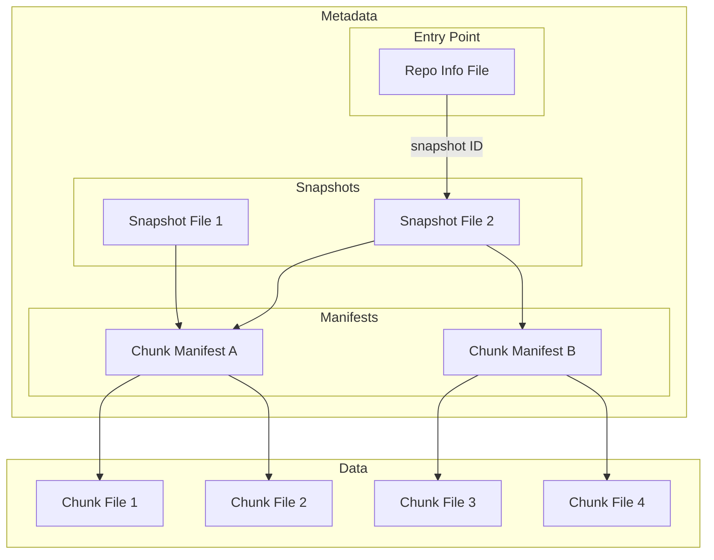

# Icechunk Specification

!!! Note

    The key words "MUST", "MUST NOT", "REQUIRED", "SHALL", "SHALL NOT", "SHOULD", "SHOULD NOT", "RECOMMENDED", "MAY", and "OPTIONAL" in this document are to be interpreted as described in [RFC 2119](https://www.rfc-editor.org/rfc/rfc2119.html).

    Sections marked **"For implementers"** are non-normative guidance for anyone writing a conforming implementation. They do not define the on-disk format.

    Comments within the inline flatbuffers definitions are part of the normative specification.

## Introduction

The Icechunk specification is a storage specification for [Zarr](https://zarr-specs.readthedocs.io/en/latest/specs.html) data.
Icechunk is inspired by Apache Iceberg and borrows many concepts and ideas from the [Iceberg Spec](https://iceberg.apache.org/spec/#version-2-row-level-deletes).

This specification describes a single Icechunk **repository**.
A repository is defined as a Zarr store containing one or more Arrays and Groups.
The most common scenario is for a repository to contain a single Zarr group with multiple arrays, each corresponding to different physical variables but sharing common spatiotemporal coordinates.
However, formally a repository can be any valid Zarr hierarchy, from a single Array to a deeply nested structure of Groups and Arrays.
Users of Icechunk should aim to scope their repository only to related arrays and groups that require consistent transactional updates.

Icechunk defines a series of interconnected metadata and data files that together comprise the format.
All the data and metadata for a repository are stored in a directory in object storage or file storage.

## Goals

The goals of the specification are as follows:

1. **Object storage** - the format is designed around the consistency features and performance characteristics available in modern cloud object storage. No external database or catalog is required.
1. **Serializable isolation** - Reads will be isolated from concurrent writes and always use a committed snapshot of a repository. Writes to repositories will be committed atomically and will not be partially visible. Readers will not acquire locks.
1. **Time travel** - Previous snapshots of a repository remain accessible after new ones have been written.
1. **Chunk sharding and references** - Chunk storage is decoupled from specific file names. Multiple chunks can be packed into a single object (sharding). Zarr-compatible chunks within other file formats (e.g. HDF5, NetCDF) can be referenced.
1. **Schema Evolution** - Arrays and Groups can be added and removed from the hierarchy with minimal overhead.

### Non Goals

1. **Low Latency** - Icechunk is designed to support analytical workloads for large repositories. We accept that the extra layers of metadata files and indirection will introduce additional cold-start latency compared to regular Zarr.
1. **No Catalog** - The spec does not extend beyond a single repository or provide a way to organize multiple repositories into a hierarchy.
1. **Access Controls** - Access control is the responsibility of the storage medium.
The spec is not designed to enable fine-grained access restrictions (e.g. only read specific arrays) within a single repository.

### Storage Operations

Icechunk requires that the storage system support the following operations:

- **In-place write** — the storage system MUST provide strong read-after-write and list-after-write consistency. Files are not moved or altered once written.
- **Conditional update** — the storage system MUST support atomically updating a file only if the current version is known to the writer.
- **Range reads** — the storage system SHOULD support reading a byte range within a file, required for reading chunks stored at an offset within a larger file.
- **Deletes** — the storage system SHOULD support deleting files, required for garbage collection.

These requirements are compatible with object stores, like S3, as well as with filesystems.

The storage system is not required to support random-access writes. Once written, all files are immutable until deleted, with one exception: the repo info file at `$ROOT/repo`, which is updated via conditional writes.

### Consistency and Optimistic Concurrency

Icechunk achieves transactional consistency using only the limited consistency guarantees offered by object storage.
Icechunk V2 does this entirely via careful management of creation and conditional updating of the `RepoInfo` object.
(The exact contents of the `RepoInfo` object are defined in the format specification section below.)

When a client attempts to make a change to the repository, it fetches the latest version of the repo info object and applies its changes in memory first.
However, when updating the object in storage, the client MUST detect whether a _different session_ has updated the repo info in the interim, possibly retrying or failing the update if so.
This is an "optimistic concurrency" strategy; the resolution mechanism can be expensive, but conflicts are expected to be infrequent.

All major object stores support a "conditional update" operation.
In other words, object stores can guard against the race condition which occurs when two sessions attempt to update the same file at the same time. Only one of those will succeed.

This mechanism is used by Icechunk on all updates.
When it tries to update the repo info object, it attempts to conditionally update this file in an atomic "all or nothing" operation.
If this succeeds, the update is successful.
If this fails (because another client updated that file since the session started), the update fails. At this point the operation is retried.

If at any point during the update attempt an incompatible change is detected, the update operation is flagged as failed, the repo is not modified, and an error is shown to the user.
Some examples of incompatible changes are:

- A commit is attempted to a branch that was deleted by other session
- A branch is reset but it was deleted by other session

### References

Similar to Git, Icechunk supports the concept of _branches_ and _tags_.
These references point to a specific snapshot of the repository.

- **Branches** are _mutable_ references to a snapshot.
  A repository MAY have one or more branches.
  The default branch name is `main`. A repository MUST always have a `main` branch, which is used to detect the existence of a valid repository at a given path.
  After creation, branches MAY be updated to point to a different snapshot.
- **Tags** are _immutable_ references to a snapshot.
  A repository MAY contain zero or more tags.
  After creation, tags MUST NOT be updated. Tag deletion is allowed, but a new tag with the name of a deleted one MUST NOT be created.

## Specification

### Overview

Icechunk uses a series of linked metadata files to describe the state of the repository.

- **Repository info file**, also called repo info or repo object, is the entry point linking to other files, particularly to snapshot files. Every change to the repository modifies this file in some way, doing conditional updates.
- **Snapshot files** record all of the different arrays and groups in a specific snapshot of the repository, plus their metadata. A single snapshot file describes a specific version of the repo, and every new commit creates a new snapshot file. The snapshot file contains pointers to one or more chunk manifest files.
- **Chunk manifests** store references to individual chunks. A single manifest may store references for multiple arrays or a subset of all the references for a single array. Anytime a commit is made which writes new chunks, a new manifest file is also written.
- **Chunk files** store the actual compressed chunk data, potentially containing data for multiple chunks in a single file (i.e. a shard).
- **Transaction log files**, an overview of the operations executed during a session, used for rebase and diffs.

!!! tip "For implementers: read path"
    1. Read `$ROOT/repo` → parse repo info → look up branch → get snapshot id
    2. Read `$ROOT/snapshots/{id}` → parse snapshot → list nodes
    3. For each array node, inspect its `ManifestRef` list → get manifest ids and extents
    4. Read `$ROOT/manifests/{id}` → parse manifest → look up `ChunkRef` by coordinates
    5. Fetch chunk data: inline from the manifest, from `$ROOT/chunks/{chunk_id}`, or from a virtual URL

When reading from a repository, the client opens the repo info file to obtain a pointer to the relevant snapshot file.
The client then reads the snapshot file to determine the structure and hierarchy of the repository.
When fetching data from an array, the client first examines the chunk manifest file(s) for that array and finally fetches the chunks referenced therein.

When writing a new repository snapshot, the client first writes a new set of chunks and chunk manifests, and then generates a new snapshot file.
Finally, to commit the transaction, it updates the repo info file using an atomic conditional update operation.
This operation may fail if a different client has already committed the next snapshot.
In this case, the client may attempt to resolve the conflicts and retry the commit.



### File Layout

All data and metadata files MUST be stored within a root directory using the following directory structure.

- `$ROOT` base URI (s3, gcs, local directory, etc.)
- `$ROOT/repo` repo info file, entry point for all operations
- `$ROOT/snapshots/` snapshot files
- `$ROOT/manifests/` chunk manifests
- `$ROOT/transactions/` transaction log files
- `$ROOT/chunks/` chunks
- `$ROOT/overwritten/` old versions of the repo info object, used as backup and to maintain the ops log

### Common Types

The following types are defined in [`common.fbs`](https://github.com/earth-mover/icechunk/tree/main/icechunk-format/flatbuffers/common.fbs) and used throughout all flatbuffers files.

```protobuf
--8<-- "icechunk-format/flatbuffers/common.fbs:object_id_12"
```

```protobuf
--8<-- "icechunk-format/flatbuffers/common.fbs:object_id_8"
```

When used in file names and storage paths, object ids MUST be encoded using [Crockford Base32](https://www.crockford.com/base32.html), uppercase, with no padding characters. When the input bits are not a multiple of 5, zero bits are appended on the right before encoding. An `ObjectId12` (96 bits) produces 20 characters; an `ObjectId8` (64 bits) produces 13 characters. For example, the 12 bytes `0b 1c c8 d6 78 75 80 f0 e3 3a 65 34` encode to `1CECHNKREP0F1RSTCMT0`.

```protobuf
--8<-- "icechunk-format/flatbuffers/common.fbs:metadata_item"
```

#### Node Paths

Node paths identify a node's position in the repository hierarchy. They are stored as flatbuffers `string` fields.

```protobuf
--8<-- "icechunk-format/flatbuffers/common.fbs:node_path"
```

### Binary File Format

All Icechunk metadata files (repo info, snapshots, manifests, and transaction logs) share a common on-disk format. Each file consists of a binary header followed by a zstd-compressed [flatbuffers](https://github.com/google/flatbuffers) payload.

The header contains the following fields, in order:

| Field | Size | Description |
|-------|------|-------------|
| Magic bytes | 12 bytes | The UTF-8 encoding of `ICE🧊CHUNK` (`49 43 45 F0 9F A7 8A 43 48 55 4E 4B`). |
| Implementation name | 24 bytes | A left-aligned, right-space-padded UTF-8 string identifying the writing client. |
| Spec version | 1 byte | `1` for spec version 1, `2` for spec version 2. |
| File type | 1 byte | `1` = Snapshot, `2` = Manifest, `3` = Attributes, `4` = TransactionLog, `5` = Chunk, `6` = RepoInfo. |
| Compression algorithm | 1 byte | `0` = none, `1` = zstd. |

The remainder of the file is the flatbuffers payload, compressed with the algorithm specified in the header.

### File Formats

With the exception of chunk files, each type of file is encoded using [flatbuffers](https://github.com/google/flatbuffers). Chunk files have their encoding defined by the [Zarr specification](https://zarr-specs.readthedocs.io/en/latest/v3/core/index.html#chunk-encoding). Common type definitions shared across all flatbuffers files are in [`common.fbs`](https://github.com/earth-mover/icechunk/tree/main/icechunk-format/flatbuffers/common.fbs).

#### Repo Info File

The repo info file is the single entry point for an Icechunk repository and the only mutable object in a V2 repo. It MUST be stored at `$ROOT/repo`. Every read operation starts by fetching this file. Every update to the repository (commits, tag creation, configuration changes) is a conditional write on this file.

The repo info file MUST use the standard [binary file format](#binary-file-format) with file type `RepoInfo`.

The full flatbuffers schema can be found in [`repo.fbs`](https://github.com/earth-mover/icechunk/tree/main/icechunk-format/flatbuffers/repo.fbs).

The `Repo` table is the root type:

```protobuf
--8<-- "icechunk-format/flatbuffers/repo.fbs:repo_table"
```

##### `Ref`

Branches and tags are both stored as `Ref` entries. The `snapshot_index` is an index into the `Repo.snapshots` list.

```protobuf
--8<-- "icechunk-format/flatbuffers/repo.fbs:ref"
```

##### `SnapshotInfo`

Each snapshot in the repository has a `SnapshotInfo` entry in the repo info file. The `parent_offset` field encodes the parent relationship as an offset within the `snapshots` list (-1 for the initial snapshot).

```protobuf
--8<-- "icechunk-format/flatbuffers/repo.fbs:snapshot_info"
```

##### `Update` (Ops Log)

The `latest_updates` list is the repository ops log — a record of every operation performed on the repository. When the list exceeds its size limit, older entries are accessible via the `repo_before_updates` linked list of previous repo info files stored under `overwritten/`.

```protobuf
--8<-- "icechunk-format/flatbuffers/repo.fbs:update"
```

```protobuf
--8<-- "icechunk-format/flatbuffers/repo.fbs:update_type_union"
```

```protobuf
--8<-- "icechunk-format/flatbuffers/repo.fbs:update_types"
```

##### `RepoStatus`

```protobuf
--8<-- "icechunk-format/flatbuffers/repo.fbs:repo_status"
```

```protobuf
--8<-- "icechunk-format/flatbuffers/repo.fbs:repo_availability"
```

##### Updates to the repo info file

The repo info object is the only mutable object in an Icechunk repo. Before a client attempts to overwrite it they MUST copy it to the `overwritten` prefix in the repo. The copy MUST be stored with a path composed of:

- The literal `repo.`
- The current Unix timestamp in milliseconds subtracted from the timestamp
in milliseconds corresponding to the timestamp `3000-01-01T00:00:00`. This gives a "last one first" ordering when
listing the prefix, but Icechunk itself doesn't depend on this property.
- 12 random bytes encoded as Crockford base 32.

for example:

```
repo.30729294865234.S0CHS5WSF158RN937BP0
```

These backups serve two purposes: recovery from failed updates, and the ops log. The `Repo.latest_updates` list holds recent operations, but its size is bounded (default: 1,000 entries). When the list overflows, older entries are dropped from the current repo info file. The `Repo.repo_before_updates` field points to the previous backup file (in `overwritten/`), which itself contains an older `latest_updates` list and its own `repo_before_updates` pointer, forming a linked list of repo info files that together contain the complete ops log history.

#### Snapshot Files

A snapshot file fully describes the state of a repository at a given commit — all arrays, groups, and their metadata. The file name is the Crockford base 32 encoding of the snapshot's 12-byte id, stored under the `snapshots/` prefix. For example, the initial snapshot has id bytes `0b 1c c8 d6 78 75 80 f0 e3 3a 65 34` and is stored at `snapshots/1CECHNKREP0F1RSTCMT0`.

The snapshot file MUST use the standard [binary file format](#binary-file-format) with file type `Snapshot`.

The full flatbuffers schema can be found in [`snapshot.fbs`](https://github.com/earth-mover/icechunk/tree/main/icechunk-format/flatbuffers/snapshot.fbs).

The `Snapshot` table is the root type:

```protobuf
--8<-- "icechunk-format/flatbuffers/snapshot.fbs:snapshot_table"
```

##### `NodeSnapshot`

```protobuf
--8<-- "icechunk-format/flatbuffers/snapshot.fbs:node_snapshot"
```

```protobuf
--8<-- "icechunk-format/flatbuffers/snapshot.fbs:node_data"
```

##### `ArrayNodeData`

Array nodes carry shape information and pointers to their chunk manifests. The `manifests` list connects a snapshot to the manifest files that hold the array's chunk references.

```protobuf
--8<-- "icechunk-format/flatbuffers/snapshot.fbs:array_node_data"
```

```protobuf
--8<-- "icechunk-format/flatbuffers/snapshot.fbs:dimension_shape"
```

```protobuf
--8<-- "icechunk-format/flatbuffers/snapshot.fbs:dimension_shape_v2"
```

```protobuf
--8<-- "icechunk-format/flatbuffers/snapshot.fbs:dimension_name"
```

##### `ManifestRef`

Each `ManifestRef` identifies a manifest file and the region of the array's chunk grid it covers. Together, the `manifests` list on an `ArrayNodeData` forms a complete map of where all chunk references for that array can be found.

```protobuf
--8<-- "icechunk-format/flatbuffers/snapshot.fbs:chunk_index_range"
```

```protobuf
--8<-- "icechunk-format/flatbuffers/snapshot.fbs:manifest_ref"
```

##### `ManifestFileInfo`

The snapshot's `manifest_files` / `manifest_files_v2` lists provide summary metadata about every manifest file referenced by the snapshot. These are separate from the per-array `ManifestRef` pointers — they describe the manifest files themselves rather than which chunks they cover.

```protobuf
--8<-- "icechunk-format/flatbuffers/snapshot.fbs:manifest_file_info"
```

```protobuf
--8<-- "icechunk-format/flatbuffers/snapshot.fbs:manifest_file_info_v2"
```

#### Chunk Manifest Files

A chunk manifest file stores chunk references — mappings from a chunk's coordinates in an array's chunk grid to the location of the chunk's data. Chunk references from multiple arrays can be stored in the same manifest, and a single array's chunks can be spread across multiple manifests. The file name is the Crockford base 32 encoding of the manifest's 12-byte id, stored under the `manifests/` prefix.

The manifest file MUST use the standard [binary file format](#binary-file-format) with file type `Manifest`.

The full flatbuffers schema can be found in [`manifest.fbs`](https://github.com/earth-mover/icechunk/tree/main/icechunk-format/flatbuffers/manifest.fbs).

The `Manifest` table is the root type:

```protobuf
--8<-- "icechunk-format/flatbuffers/manifest.fbs:manifest_table"
```

##### `ArrayManifest`

```protobuf
--8<-- "icechunk-format/flatbuffers/manifest.fbs:array_manifest"
```

##### `ChunkRef`

Chunk references come in three types, encoded in the same flatbuffers table using optional fields:

- **Native** — points to a chunk file within the repository's storage, identified by `chunk_id`. The `offset` and `length` fields locate the chunk within the file.
- **Inline** — the chunk data is embedded directly in the `inline` field. Used for very small chunks (e.g. coordinate arrays).
- **Virtual** — points to a region of a file outside the repository (e.g. a chunk inside a NetCDF file), identified by `location` (or `compressed_location`) plus `offset` and `length`.

```protobuf
--8<-- "icechunk-format/flatbuffers/manifest.fbs:chunk_ref"
```

When virtual chunk locations are compressed, a zstd dictionary is computed globally across the whole manifest. Individual locations are stored in the `compressed_location` field of each `ChunkRef`, and the dictionary is stored in the manifest's `location_dictionary` field.

#### Chunk Files

Chunk files contain the binary chunks of a Zarr array, stored under the `chunks/` prefix. The file name is the Crockford base 32 encoding of the chunk's 12-byte id. Chunk encoding and compression are defined by the [Zarr specification](https://zarr-specs.readthedocs.io/en/latest/v3/core/index.html#chunk-encoding), not by Icechunk.

Icechunk permits flexibility in how chunks are arranged within files:

- One chunk per chunk file (i.e. standard Zarr)
- Multiple contiguous chunks from the same array in a single chunk file (similar to Zarr V3 shards)
- Chunks from multiple different arrays in the same file
- Other file types (e.g. NetCDF, HDF5) which contain Zarr-compatible chunks

Applications may choose to arrange chunks within files in different ways to optimize I/O patterns.

#### Transaction Log Files

A transaction log file records which nodes and chunks were modified in a given commit.
Each snapshot MUST have a corresponding transaction log file stored at `transactions/{id}`, where `{id}` is the Crockford base 32 encoding of the snapshot's id.

The transaction log file MUST use the standard [binary file format](#binary-file-format) with file type `TransactionLog`.

!!! tip "For implementers"
    Transaction logs are not needed to read data from a repository — they exist to support
    conflict detection during rebase and to compute diffs between commits.
    A read-only implementation can safely omit transaction log support.

The full flatbuffers schema can be found in [`transaction_log.fbs`](https://github.com/earth-mover/icechunk/tree/main/icechunk-format/flatbuffers/transaction_log.fbs).

The `TransactionLog` table is the root type:

```protobuf
--8<-- "icechunk-format/flatbuffers/transaction_log.fbs:transaction_log"
```

!!! tip "For implementers"
    The `extra` field is an opaque byte vector reserved for future spec extensions.
    It allows small, optional features (e.g. precomputed storage statistics) to be
    added without requiring a new spec version.

##### `ArrayUpdatedChunks`

```protobuf
--8<-- "icechunk-format/flatbuffers/transaction_log.fbs:chunk_indices"
```

```protobuf
--8<-- "icechunk-format/flatbuffers/transaction_log.fbs:array_updated_chunks"
```

##### `MoveOperation`

```protobuf
--8<-- "icechunk-format/flatbuffers/transaction_log.fbs:move_operation"
```


## Algorithms

### Initialize New Repository

A new repository is initialized by creating a new empty snapshot file, a new empty transaction log file,
and finally creating the repo info file that includes a `main` branch pointing to the new snapshot.
The first snapshot has a well known id, that encodes to a file name: `1CECHNKREP0F1RSTCMT0`. All object ids are
encoded in paths using Crockford base 32.

If another client attempts to initialize a repository in the same location, only one can succeed because the repo
object file is written to atomically.

### Read from Repository

#### From Snapshot ID

If the specific snapshot ID is known, a client can open it directly in read only mode.

1. Use the specified snapshot ID to fetch the snapshot file.
1. Inspect the snapshot to find the relevant manifest or manifests.
1. Fetch the relevant manifests and the desired chunks pointed by them.

#### From Branch

Usually, a client will want to read from the latest branch (e.g. `main`).

1. Read the repo info object in `repo` path.
1. Find the snapshot ID currently pointed by the `main` branch by scanning the `branches` field.
1. Use the snapshot ID to fetch the snapshot file.
1. Fetch the relevant manifests and the desired chunks pointed by them.

#### From Tag

1. Read the repo info object in `repo` path.
1. Find the snapshot ID currently pointed by the tag by scanning the `tags` field.
1. Use the snapshot ID to fetch the snapshot file.
1. Fetch the relevant manifests and the desired chunks pointed by them.

### Write New Snapshot

1. Open a repository at a specific branch as described above, keeping track of the sequence number and branch name in the session context.
1. [optional] Write new chunk files.
1. [optional] Write new chunk manifests.
1. Write a new transaction log file summarizing all changes in the session.
1. Write a new snapshot file with the new repository hierarchy and manifest links.
1. Do conditional update to write the new repo info file that contains the new snapshot and the new pointer for the branch
    1. If successful, the commit succeeded and the branch is updated.
    1. If unsuccessful because the branch was updated since the session started, attempt to reconcile and retry the commit.
    1. If unsuccessful because there was some other previous update to the repo info file, read the file again and retry

### Create New Tag

A tag can be created from any snapshot.

1. Open the repository at a specific snapshot.
1. Do conditional update to write the new repo info file that contains the new tag
    1. If successful, the update succeeded and the tag is created.
    1. If unsuccessful because there was some previous update, read the file again and retry
    1. If unsuccessful because the snapshot doesn't exist, fail the update

## Changes from spec version 1

- The repo info object was introduced as a single point of consistency and atomicity. This file is in the `repo` path, inside the repository tree. Many new fields are introduced in this object, such as feature flags, status, spec version and others.
- There is now a single mutable object: `repo`. Updates to this file first backup the original contents in `overwritten` prefix.
- There is no longer a `refs` prefix, branches and tags are stored in the repo info object.
- A transaction id is written for the first commit that initializes the repo.
- There is no longer a `config.yaml` file, repo configuration has been moved to the repo info object.
- Snapshots no longer store its parent in the snapshot file. This information has been moved to the repo info object.
- A new `extra` field has been added in the flatbuffers of most datastructures. This allows for future expansion without a format change.
- For each dimension of each array, instead of storing the `chunk_length` in the snapshot, the `num_chunks` is now stored.
This will help with rectilinear chunk grids.
- Virtual chunk location can optionally be compressed inside the manifest.
- Transaction logs gained `moved_nodes` and `extra` fields (absent in V1 transaction logs).
