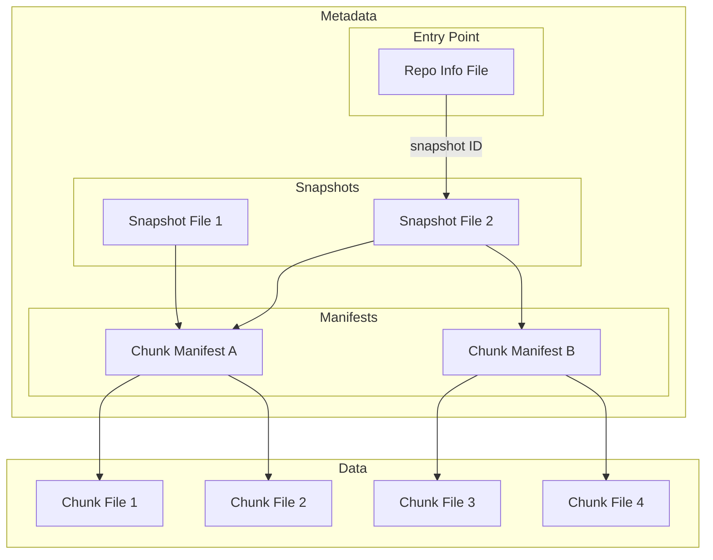

# Icechunk Specification

!!! Note

    The key words "MUST", "MUST NOT", "REQUIRED", "SHALL", "SHALL NOT", "SHOULD", "SHOULD NOT", "RECOMMENDED", "MAY", and "OPTIONAL" in this document are to be interpreted as described in [RFC 2119](https://www.rfc-editor.org/rfc/rfc2119.html).

## Introduction

The Icechunk specification is a storage specification for [Zarr](https://zarr-specs.readthedocs.io/en/latest/specs.html) data.
Icechunk is inspired by Apache Iceberg and borrows many concepts and ideas from the [Iceberg Spec](https://iceberg.apache.org/spec/#version-2-row-level-deletes).

This specification describes a single Icechunk **repository**.
A repository is defined as a Zarr store containing one or more Arrays and Groups.
The most common scenario is for a repository to contain a single Zarr group with multiple arrays, each corresponding to different physical variables but sharing common spatiotemporal coordinates.
However, formally a repository can be any valid Zarr hierarchy, from a single Array to a deeply nested structure of Groups and Arrays.
Users of Icechunk should aim to scope their repository only to related arrays and groups that require consistent transactional updates.

Icechunk defines a series of interconnected metadata and data files that together comprise the format.
All the data and metadata for a repository are stored in a directory in object storage or file storage.

## Goals

The goals of the specification are as follows:

1. **Object storage** - the format is designed around the consistency features and performance characteristics available in modern cloud object storage. No external database or catalog is required.
1. **Serializable isolation** - Reads will be isolated from concurrent writes and always use a committed snapshot of a repository. Writes to repositories will be committed atomically and will not be partially visible. Readers will not acquire locks.
1. **Time travel** - Previous snapshots of a repository remain accessible after new ones have been written.
1. **Chunk sharding and references** - Chunk storage is decoupled from specific file names. Multiple chunks can be packed into a single object (sharding). Zarr-compatible chunks within other file formats (e.g. HDF5, NetCDF) can be referenced.
1. **Schema Evolution** - Arrays and Groups can be added and removed from the hierarchy with minimal overhead.

### Non Goals

1. **Low Latency** - Icechunk is designed to support analytical workloads for large repositories. We accept that the extra layers of metadata files and indirection will introduce additional cold-start latency compared to regular Zarr.
1. **No Catalog** - The spec does not extend beyond a single repository or provide a way to organize multiple repositories into a hierarchy.
1. **Access Controls** - Access control is the responsibility of the storage medium.
The spec is not designed to enable fine-grained access restrictions (e.g. only read specific arrays) within a single repository.

### Storage Operations

Icechunk requires that the storage system support the following operations:

- **In-place write** - Strong read-after-write and list-after-write consistency is expected. Files are not moved or altered once they are written.
- **Write-if-not-exists** - For creating new references.
- **Conditional update** - For the commit process to be safe and consistent, the storage system must be able to atomically update a file only if the current version is known to the writer.
- **Seekable reads** - Chunk file formats may require seek support, or at least range-requests (e.g. for reading a chunk within a shard).
- **Deletes** - Delete files that are no longer used (via a garbage-collection operation).

These requirements are compatible with object stores, like S3, as well as with filesystems.

The storage system is not required to support random-access writes. Once written, most files are immutable until they are deleted. The only exception to this rule is the `RepoInfo` object, which is main entry point to a repository, stored an object with path `repo` under the repository prefix.

### Consistency and Optimistic Concurrency 

Icechunk achieves transactional consistency using only the limited consistency guarantees offered by object storage.
Icechunk V2 does this entirely via careful management of creation and conditional updating of the `RepoInfo` object.
(The exact contents of the `RepoInfo` object are defined in the format specification section below.)

When a client attempts to make a change to the repository, it fetches the latest version of the repo info object and applies its changes in memory first.
However, when updating the object in storage, the client must detect whether a _different session_ has updated the repo info in the interim, possibly retrying or failing the update if so.
This is an "optimistic concurrency" strategy; the resolution mechanism can be expensive, but conflicts are expected to be infrequent.

All major object stores support a "conditional update" operation.
In other words, object stores can guard against the race condition which occurs when two sessions attempt to update the same file at the same time. Only one of those will succeed.

This mechanism is used by Icechunk on all updates.
When it tries to update the repo info object, it attempts to conditionally update this file in an atomic "all or nothing" operation.
If this succeeds, the update is successful.
If this fails (because another client updated that file since the session started), the update fails. At this point the operation is retried.

If at any point during the update attempt an incompatible change is detected, the update operation is flagged as failed, the repo is not modified, and an error is shown to the user.
Some examples of incompatible changes are:

- A commit is attempted to a branch that was deleted by other session
- A branch is reset but it was deleted by other session

## Specification

### Overview

Icechunk uses a series of linked metadata files to describe the state of the repository.

- **Repository info file**, also called repo info or repo object, is the entry point linking to other files, particularly to snapshot files. Every change to the repository modifies this file in some way, doing conditional updates.
- **Snapshot files** record all of the different arrays and groups in a specific snapshot of the repository, plus their metadata. A single snapshot file describes a specific version of the repo, and every new commit creates a new snapshot file. The snapshot file contains pointers to one or more chunk manifest files.
- **Chunk manifests** store references to individual chunks. A single manifest may store references for multiple arrays or a subset of all the references for a single array. Anytime a commit is made which writes new chunks, a new manifest file is also written.
- **Chunk files** store the actual compressed chunk data, potentially containing data for multiple chunks in a single file (i.e. a shard).
- **Transaction log files**, an overview of the operations executed during a session, used for rebase and diffs.

When reading from object store, the client opens the repo info file to obtain a pointer to the relevant snapshot file.
The client then reads the snapshot file to determine the structure and hierarchy of the repository.
When fetching data from an array, the client first examines the chunk manifest file(s) for that array and finally fetches the chunks referenced therein.

When writing a new repository snapshot, the client first writes a new set of chunks and chunk manifests, and then generates a new snapshot file.
Finally, to commit the transaction, it updates the repo info file using an atomic conditional update operation.
This operation may fail if a different client has already committed the next snapshot.
In this case, the client may attempt to resolve the conflicts and retry the commit.



### File Layout

All data and metadata files are stored within a root directory (typically a prefix within an object store) using the following directory structure.

- `$ROOT` base URI (s3, gcs, local directory, etc.)
- `$ROOT/repo` repo info file, entry point for all operations
- `$ROOT/snapshots/` snapshot files
- `$ROOT/manifests/` chunk manifests
- `$ROOT/transactions/` transaction log files
- `$ROOT/chunks/` chunks
- `$ROOT/overwritten/` old versions of the repo info object, used as backup and to maintain the ops log

### File Formats

With the exception of chunk files, each type of file is encoded using [flatbuffers](https://github.com/google/flatbuffers). 
The IDL for the on-disk format can be found in [the fbs files directory in this repo](https://github.com/earth-mover/icechunk/blob/404100b584fb7ac70de860bd430aa8291df98c4d/icechunk-format/flatbuffers/).

The full set of file types and their definitions are:

- **Repo info files** ([flatbuffers definition](https://github.com/earth-mover/icechunk/blob/404100b584fb7ac70de860bd430aa8291df98c4d/icechunk-format/flatbuffers/repo.fbs))
- **Snapshot files** ([flatbuffers definition](https://github.com/earth-mover/icechunk/blob/404100b584fb7ac70de860bd430aa8291df98c4d/icechunk-format/flatbuffers/snapshot.fbs))
- **Manifest files** ([flatbuffers definition](https://github.com/earth-mover/icechunk/blob/404100b584fb7ac70de860bd430aa8291df98c4d/icechunk-format/flatbuffers/manifest.fbs))
- **Transaction Log files** ([flatbuffers definition](https://github.com/earth-mover/icechunk/blob/404100b584fb7ac70de860bd430aa8291df98c4d/icechunk-format/flatbuffers/transaction_log.fbs))
- **Chunk files** instead have their encoding defined by the Chunk Encoding section of the [Zarr specification](https://zarr-specs.readthedocs.io/en/latest/v3/core/index.html#chunk-encoding).

(Note that the flatbuffers also share some common utility definitions, defined in [`common.fbs`](https://github.com/earth-mover/icechunk/blob/404100b584fb7ac70de860bd430aa8291df98c4d/icechunk-format/flatbuffers/common.fbs).)

The rest of this section describes the meaning of the fields in each flatbuffers file, and any other concerns that implementations should be aware of.

#### Repo info file

This object is the main entry point for an Icechunk repository, and the only mutable object in an Icechunk V2 repo. Every read operation starts by fetching the repo info object. Every Icechunk update, from making a commit to deleting a tag, makes a conditional write on this object.

This object stores:

- The repository configuration.
- All branches, tags and deleted tag names.
- All valid snapshots with their ids, parent, timestamp and metadata.
- The repository ops log, with information about every operation done on the repo.
- The repository status (read-only, online, etc.).
- The repository level metadata (user attributes set at the repository level).
- The feature flags settings.

##### Updates to the repo info file

The repo info object is the only mutable object in an Icechunk repo. Before an attempt is made to overwrite it, the file
is copied to the `overwritten` prefix in the repo. The copy will be stored with a path that looks something like

```
repo.30729294865234.S0CHS5WSF158RN937BP0
```

The key is composed by:

- The literal `repo.`
- A number that is the current Unix timestamp in milliseconds subtracted from the timestamp
in milliseconds corresponding to the timestamp `3000-01-01T00:00:00`. This gives a "last one first" ordering when
listing the prefix, but Icechunk itself doesn't depend on this property.
- 12 random bytes encoded as Crockford base 32.

These backups of the repo info file are only used by Icechunk for its `ops_log` functionality. These files are linked in
the repo info object itself, and they form a single linked list for ops logs that go beyond the 1,000 operations limit.

##### References

Similar to Git, Icechunk supports the concept of _branches_ and _tags_.
These references point to a specific snapshot of the repository.

- **Branches** are _mutable_ references to a snapshot.
  Repositories may have one or more branches.
  The default branch name is `main`.
  Repositories must always have a `main` branch, which is used to detect the existence of a valid repository in a given path.
  After creation, branches may be updated to point to a different snapshot.
- **Tags** are _immutable_ references to a snapshot.
  A repository may contain zero or more tags.
  After creation, tags may never be updated, unlike in Git. Tag delete is allowed, but a new tag with the name of a deleted one cannot be added.

#### Snapshot Files

The snapshot file fully describes the schema of the repository, including all arrays and groups. Each commit to an Icechunk
repository creates a new snapshot file. This snapshot informs what are the available groups and arrays
in this commit, and provides a way to access the chunk manifests for each array.

The snapshot file is encoded using [flatbuffers](https://github.com/google/flatbuffers). The full IDL
can be found in [`snapshot.fbs`](https://github.com/earth-mover/icechunk/tree/main/icechunk-format/flatbuffers/snapshot.fbs).

The `Snapshot` table is the root type:

```protobuf
--8<-- "icechunk-format/flatbuffers/snapshot.fbs:snapshot_table"
```

The most important fields are:

- `id` — 12 random bytes, also encoded in the file name.
- `parent_id` — the id of the parent snapshot. All snapshots but the first one in the repository MUST have a parent.
- `flushed_at`, `message`, and `metadata` — the commit time, message string, and metadata map.
- `nodes` — a list of `NodeSnapshot`, one item for each group or array in the repository snapshot.
- `manifest_files` / `manifest_files_v2` — the list of all manifest files this snapshot points to.

Each node in the repository is represented by a `NodeSnapshot`:

```protobuf
--8<-- "icechunk-format/flatbuffers/snapshot.fbs:node_snapshot"
```

- `id` — 8 random bytes.
- `path` — the absolute path within the repository hierarchy, for example `foo/bar/baz`.
- `user_data` — any metadata used to create the node, this will usually be the Zarr metadata.
- `node_data` — a union that can be either an `ArrayNodeData` or a `GroupNodeData`.

`GroupNodeData` is empty, so it works as a pure marker signaling that the node is a group.

`ArrayNodeData` is a richer datastructure that keeps:

- The array shape, both for the whole array and its chunks.
- The array dimension names
- A list of `ManifestRef`

A `ManifestRef` is a pointer to a manifest file. It includes an id, that is used to determine the file path,
and a range of coordinates contained in the manifest for each array dimension.

Finally, a `ManifestFileInfo` is also a pointer to a manifest file, but it includes information about all the chunks held in the manifest. In V2 of the spec we introduced `ManifestFileInfoV2`, which is a similar
datastructure but include an `extra: [uint8]` field for future extensions.

#### Chunk Manifest Files

A chunk manifest file stores chunk references. Every `get` operation in Icechunk gets resolved using
the requested coordinates to a specific manifest file and, from there, possibly to a specific chunk file.
Chunk references from multiple arrays can be stored in the same chunk manifest.
The chunks from a single array can also be spread across multiple manifests.

Manifest files are encoded using flatbuffers. The IDL for the
on-disk format can be found in [the fbs file](https://github.com/earth-mover/icechunk/blob/9409c43ab49b4c5cc100c874ae3fce3fff08e77e/icechunk-format/flatbuffers/manifest.fbs)

A manifest file has:

- An id (12 random bytes), that is also encoded in the file name.
- A list of `ArrayManifest` sorted by node id.
- Information for virtual chunk location compression (algorithm and dictionary).

Each `ArrayManifest` contains chunk references for a given array. It contains the `node_id`
of the array and a list of `ChunkRef` sorted by the chunk coordinate.

`ChunkRef` is a complex data structure because chunk references in Icechunk can have three different types:

- Native, pointing to a chunk object within the Icechunk repository.
- Inline, an optimization for very small chunks that can be embedded directly in the manifest. Mostly used for coordinate arrays.
- Virtual, pointing to a region of a file outside of the Icechunk repository, for example,
  a chunk that is inside a NetCDF file in object store

These three types of chunks references are encoded in the same flatbuffers table, using optional fields.

For the case of virtual chunks, under certain conditions the `locations` can be compressed using zstd compression.
When locations are compressed, a compression dictionary is computed globally across the whole manifest and:

- Individual locations are stored in the `compressed_location` field of `ChunkRef`.
- The compression dictionary is stored in `location_dictionary`.
- `compression_algorithm` is set to `1`

#### Chunk Files

Chunk files contain the compressed binary chunks of a Zarr array.
Icechunk permits quite a bit of flexibility about how chunks are stored.
Chunk files can be:

- One chunk per chunk file (i.e. standard Zarr)
- Multiple contiguous chunks from the same array in a single chunk file (similar to Zarr V3 shards)
- Chunks from multiple different arrays in the same file
- Other file types (e.g. NetCDF, HDF5) which contain Zarr-compatible chunks

Applications may choose to arrange chunks within files in different ways to optimize I/O patterns.

#### Transaction logs

Transaction logs keep track of the operations done in a commit. They are not used to read objects
from the repo, but they are useful for features such as commit diff and conflict resolution.

Transaction logs are an optimization, to provide fast conflict resolution and commit diff. They are
not absolutely required, for read-only implementations, to implement the core Icechunk operations.

Transaction log files are encoded using flatbuffers. The IDL for the
on-disk format can be found in [the fbs file](https://github.com/earth-mover/icechunk/blob/9409c43ab49b4c5cc100c874ae3fce3fff08e77e/icechunk-format/flatbuffers/transaction_log.fbs)

The transaction log file maintains information about the id of modified objects:

- `new_groups`: list of node ids.
- `new_arrays`: list of node ids.
- `deleted_groups`: list of node ids.
- `deleted_arrays`: list of node ids.
- `updated_groups`: list of node ids.
- `updated_arrays`: list of node ids.
- `updated_chunks`: list of node ids and chunk indices.
- `moved_nodes`: list of `from`, `to` paths, sorted by first move first.

## Algorithms

### Initialize New Repository

A new repository is initialized by creating a new empty snapshot file, a new empty transaction log file,
and finally creating the repo info file that includes a `main` branch pointing to the new snapshot.
The first snapshot has a well known id, that encodes to a file name: `1CECHNKREP0F1RSTCMT0`. All object ids are
encoded in paths using Crockford base 32.

If another client attempts to initialize a repository in the same location, only one can succeed because the repo
object file is written to atomically.

### Read from Repository

#### From Snapshot ID

If the specific snapshot ID is known, a client can open it directly in read only mode.

1. Use the specified snapshot ID to fetch the snapshot file.
1. Inspect the snapshot to find the relevant manifest or manifests.
1. Fetch the relevant manifests and the desired chunks pointed by them.

#### From Branch

Usually, a client will want to read from the latest branch (e.g. `main`).

1. Read the repo info object in `repo` path.
1. Find the snapshot ID currently pointed by the `main` branch by scanning the `branches` field.
1. Use the snapshot ID to fetch the snapshot file.
1. Fetch the relevant manifests and the desired chunks pointed by them.

#### From Tag

1. Read the repo info object in `repo` path.
1. Find the snapshot ID currently pointed by the tag by scanning the `tags` field.
1. Use the snapshot ID to fetch the snapshot file.
1. Fetch the relevant manifests and the desired chunks pointed by them.

### Write New Snapshot

1. Open a repository at a specific branch as described above, keeping track of the sequence number and branch name in the session context.
1. [optional] Write new chunk files.
1. [optional] Write new chunk manifests.
1. Write a new transaction log file summarizing all changes in the session.
1. Write a new snapshot file with the new repository hierarchy and manifest links.
1. Do conditional update to write the new repo info file that contains the new snapshot and the new pointer for the branch
    1. If successful, the commit succeeded and the branch is updated.
    1. If unsuccessful because the branch was updated since the session started, attempt to reconcile and retry the commit.
    1. If unsuccessful because there was some other previous update to the repo info file, read the file again and retry

### Create New Tag

A tag can be created from any snapshot.

1. Open the repository at a specific snapshot.
1. Do conditional update to write the new repo info file that contains the new tag
    1. If successful, the update succeeded and the tag is created.
    1. If unsuccessful because there was some previous update, read the file again and retry
    1. If unsuccessful because the snapshot doesn't exist, fail the update

## Changes from spec version 1

- The repo info object was introduced as a single point of consistency and atomicity. This file is in the `repo` path, inside the repository tree. Many new fields are introduced in this object, such as feature flags, status, spec version and others.
- There is now a single mutable object: `repo`. Updates to this file first backup the original contents in `overwritten` prefix.
- There is no longer a `refs` prefix, branches and tags are stored in the repo info object.
- A transaction id is written for the first commit that initializes the repo.
- There is no longer a `config.yaml` file, repo configuration has been moved to the repo info object.
- Snapshots no longer store its parent in the snapshot file. This information has been moved to the repo info object.
- A new `extra` field has been added in the flatbuffers of most datastructures. This allows for future expansion without a format change.
- For each dimension of each array, instead of storing the `chunk_legth` in the snapshot, the `num_chunks` is now stored.
This will help with rectilinear chunk grids.
- Virtual chunk location can optionally be compressed inside the manifest.
