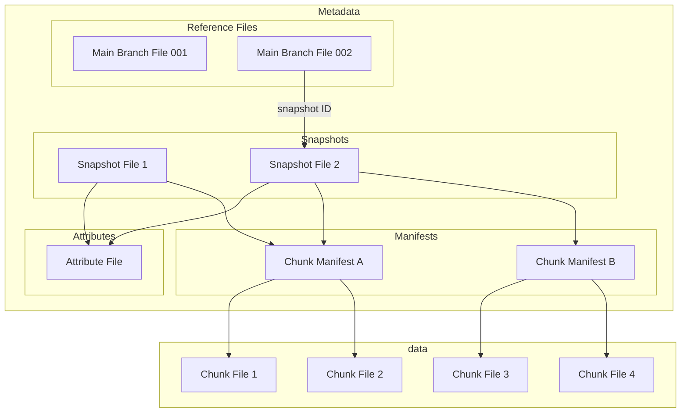

# Icechunk Specification

!!! note "Note" 
    The key words "MUST", "MUST NOT", "REQUIRED", "SHALL", "SHALL NOT", "SHOULD", "SHOULD NOT", "RECOMMENDED", "MAY", and "OPTIONAL" in this document are to be interpreted as described in [RFC 2119](https://www.rfc-editor.org/rfc/rfc2119.html).

## Introduction

The Icechunk specification is a storage specification for [Zarr](https://zarr-specs.readthedocs.io/en/latest/specs.html) data.
Icechunk is inspired by Apache Iceberg and borrows many concepts and ideas from the [Iceberg Spec](https://iceberg.apache.org/spec/#version-2-row-level-deletes).

This specification describes a single Icechunk **repository**.
A repository is defined as a Zarr store containing one or more Arrays and Groups.
The most common scenario is for a repository to contain a single Zarr group with multiple arrays, each corresponding to different physical variables but sharing common spatiotemporal coordinates.
However, formally a repository can be any valid Zarr hierarchy, from a single Array to a deeply nested structure of Groups and Arrays.
Users of Icechunk should aim to scope their repository only to related arrays and groups that require consistent transactional updates.

Icechunk defines a series of interconnected metadata and data files that together comprise the format.
All the data and metadata for a repository are stored in a directory in object storage or file storage.

## Goals

The goals of the specification are as follows:

1. **Object storage** - the format is designed around the consistency features and performance characteristics available in modern cloud object storage. No external database or catalog is required.
1. **Serializable isolation** - Reads will be isolated from concurrent writes and always use a committed snapshot of a repository. Writes to repositories will be committed atomically and will not be partially visible. Readers will not acquire locks.
1. **Time travel** - Previous snapshots of a repository remain accessible after new ones have been written.
1. **Chunk sharding and references** - Chunk storage is decoupled from specific file names. Multiple chunks can be packed into a single object (sharding). Zarr-compatible chunks within other file formats (e.g. HDF5, NetCDF) can be referenced.
1. **Schema Evolution** - Arrays and Groups can be added, renamed, and removed from the hierarchy with minimal overhead.

### Non Goals

1. **Low Latency** - Icechunk is designed to support analytical workloads for large repositories. We accept that the extra layers of metadata files and indirection will introduce additional cold-start latency compared to regular Zarr. 
1. **No Catalog** - The spec does not extend beyond a single repository or provide a way to organize multiple repositories into a hierarchy.
1. **Access Controls** - Access control is the responsibility of the storage medium.
The spec is not designed to enable fine-grained access restrictions (e.g. only read specific arrays) within a single repository.

### Storage Operations

Icechunk requires that the storage system support the following operations:

- **In-place write** - Strong read-after-write and list-after-write consistency is expected. Files are not moved or altered once they are written.
- **Conditional write if-not-exists** - For the commit process to be safe and consistent, the storage system must guard against two files of the same name being created at the same time.
- **Seekable reads** - Chunk file formats may require seek support (e.g. shards).
- **Deletes** - Delete files that are no longer used (via a garbage-collection operation).
- **Sorted List** - The storage system must allow the listing of directories / prefixes in a consistent sorted order.

These requirements are compatible with object stores, like S3, as well as with filesystems.

The storage system is not required to support random-access writes. Once written, chunk and metadata files are immutable until they are deleted.

## Specification

### Overview

Icechunk uses a series of linked metadata files to describe the state of the repository.

- The **Snapshot file** records all of the different arrays and groups in the repository, plus their metadata. Every new commit creates a new snapshot file. The snapshot file contains pointers to one or more chunk manifest files and [optionally] attribute files.
- **Chunk manifests** store references to individual chunks. A single manifest may store references for multiple arrays or a subset of all the references for a single array.
- **Attributes files** provide a way to store additional user-defined attributes for arrays and groups outside of the structure file. This is important when the attributes are very large.
- **Chunk files** store the actual compressed chunk data, potentially containing data for multiple chunks in a single file.
- **Reference files** track the state of branches and tags, containing a lightweight pointer to a snapshot file. Transactions on a branch are committed by creating the next branch file in a sequence.

When reading from store, the client opens the latest branch or tag file to obtain a pointer to the relevant snapshot file.
The client then reads the snapshot file to determine the structure and hierarchy of the repository.
When fetching data from an array, the client first examines the chunk manifest file[s] for that array and finally fetches the chunks referenced therein.

When writing a new repository snapshot, the client first writes a new set of chunks and chunk manifests, and then generates a new snapshot file.
Finally, in an atomic put-if-not-exists operation, to commit the transaction, it creates the next branch file in the sequence.
This operation may fail if a different client has already committed the next snapshot.
In this case, the client may attempt to resolve the conflicts and retry the commit.




### File Layout

All data and metadata files are stored within a root directory (typically a prefix within an object store) using the following directory structure.

- `$ROOT` base URI (s3, gcs, local directory, etc.)
- `$ROOT/r/` reference files
- `$ROOT/s/` snapshot files
- `$ROOT/a/` attribute files
- `$ROOT/m/` chunk manifests
- `$ROOT/c/` chunks

### File Formats

> [!WARNING]  
> The actual file formats used for each type of metadata file are in flux. The spec currently describes the data structures encoded in these files, rather than a specific file format.


### Reference Files

Similar to Git, Icechunk supports the concept of _branches_ and _tags_.
These references point to a specific snapshot of the repository.

- **Branches** are _mutable_ references to a snapshot.
  Repositories may have one or more branches.
  The default branch name is `main`.
  Repositories must have a `main` branch.
  After creation, branches may be updated to point to a different snapshot.
- **Tags** are _immutable_ references to a snapshot.
  A repository may contain zero or more tags.
  After creation, tags may never be updated, unlike in Git.

References are very important in the Icechunk design.
Creating or updating references is the point at which consistency and atomicity of Icechunk transactions is enforced.
Different client sessions may simultaneously create two inconsistent snapshots; however, only one session may successfully update a reference to that snapshot.

References (both branches and tags) are stored as JSON files with the following schema

```json
{
  "$schema": "http://json-schema.org/draft-07/schema#",
  "title": "RefData",
  "type": "object",
  "required": [
    "properties",
    "snapshot",
    "timestamp"
  ],
  "properties": {
    "properties": {
      "type": "object",
      "additionalProperties": true
    },
    "snapshot": {
      "$ref": "#/definitions/ObjectId"
    },
    "timestamp": {
      "type": "string",
      "format": "date-time"
    }
  },
  "definitions": {
    "ObjectId": {
      "description": "The id of a file in object store",
      "type": "array",
      "items": {
        "type": "integer",
        "format": "uint8",
        "minimum": 0.0
      },
      "maxItems": 16,
      "minItems": 16
    }
  }
}
```

#### Creating and Updating Branches

The process of creating and updating branches is designed to use the limited consistency guarantees offered by object storage to ensure transactional consistency.
When a client checks out a branch, it obtains a specific snapshot ID and uses this snapshot as the basis for any changes it creates during its session.
The client creates a new snapshot and then updates the branch reference to point to the new snapshot (a "commit").
However, when updating the branch reference, the client must detect whether a _different session_ has updated the branch reference in the interim, possibly retrying or failing the commit if so.
This is an "optimistic concurrency" strategy; the resolution mechanism can be expensive, and conflicts are expected to be infrequent.

The simplest way to do this would be to store the branch reference in a specific file (e.g. `main.json`) and update it via an atomic "compare and swap" operation.
Unfortunately not all popular object stores support this operation (AWS S3 notably does not).

However, all popular object stores _do_ support a comparable operation: "create if not exists".
In other words, object stores can guard against the race condition which occurs when two sessions attempt to create the same file at the same time.
This motivates the design of Icechunk's branch file naming convention.

Each commit to an Icechunk branch augments a counter called the _sequence number_.
The first commit creates sequence number 0.
The next commit creates sequence number 1. Etc.
This sequence number is encoded into the branch reference file name.

When a client checks out a branch, it keeps track of its current sequence number _N_.
When it tries to commit, it attempts to create the file corresponding to sequence number _N + 1_ in an atomic "create if not exists" operation.
If this succeeds, the commit is successful.
If this fails (because another client created that file already), the commit fails.
At this point, the client may choose retry its commit (possibly re-reading the updated data) and then create sequence number _N + 2_.

Branch references are stored in the `r/` directory within a subdirectory corresponding to the branch name: `r/$BRANCH_NAME/`.
Branch names may not contain the `/` character.

To facilitate easy lookups of the latest branch reference, we use the following encoding for the sequence number.
- subtract the sequence number from the integer `1099511627775`
- encode the resulting integer as a string using [Base 32 Crockford](https://www.crockford.com/base32.html)
- left-padding the string with 0s to a length of 8 characters
This produces a deterministic sequence of branch file names in which the latest sequence always appears first when sorted lexicographically, facilitating easy lookup by listing the object store.

The full branch file name is then given by `r/$BRANCH_NAME/$ENCODED_SEQUENCE.json`.

For example, the first main branch file is in a store, corresponding with sequence number 0, is always named `r/main/ZZZZZZZZ.json`.
The branch file for sequence number 100 is `r/main/ZZZZZZWV.json`.
The maximum number of commits allowed in an Icechunk repository is consequently `1099511627775`,
corresponding to the state file `r/main/00000000.json`.

#### Tags

Since tags are immutable, they are simpler than branches.

Tag files follow the pattern `r/$TAG_NAME.json`.

When creating a new tag, the client attempts to create the tag file using a "create if not exists" operation.
If successful, the tag is created successful.
If not, that means another client has already created that tag.

Tags cannot be deleted once created.

### Snapshot Files

The snapshot file fully describes the schema of the repository, including all arrays and groups.
 
The snapshot file has the following JSON schema:

<details>
<summary>JSON Schema for Snapshot File</summary>

```json
{
  "$schema": "http://json-schema.org/draft-07/schema#",
  "title": "Snapshot",
  "type": "object",
  "required": [
    "metadata",
    "nodes",
    "properties",
    "short_term_history",
    "short_term_parents",
    "started_at",
    "total_parents"
  ],
  "properties": {
    "metadata": {
      "$ref": "#/definitions/SnapshotMetadata"
    },
    "nodes": {
      "type": "object",
      "additionalProperties": {
        "$ref": "#/definitions/NodeSnapshot"
      }
    },
    "properties": {
      "type": "object",
      "additionalProperties": true
    },
    "short_term_history": {
      "type": "array",
      "items": {
        "$ref": "#/definitions/SnapshotMetadata"
      }
    },
    "short_term_parents": {
      "type": "integer",
      "format": "uint16",
      "minimum": 0.0
    },
    "started_at": {
      "type": "string",
      "format": "date-time"
    },
    "total_parents": {
      "type": "integer",
      "format": "uint32",
      "minimum": 0.0
    }
  },
  "definitions": {
    "ChunkIndices": {
      "description": "An ND index to an element in a chunk grid.",
      "type": "array",
      "items": {
        "type": "integer",
        "format": "uint64",
        "minimum": 0.0
      }
    },
    "ChunkKeyEncoding": {
      "type": "string",
      "enum": [
        "Slash",
        "Dot",
        "Default"
      ]
    },
    "ChunkShape": {
      "type": "array",
      "items": {
        "type": "integer",
        "format": "uint64",
        "minimum": 1.0
      }
    },
    "Codec": {
      "type": "object",
      "required": [
        "name"
      ],
      "properties": {
        "configuration": {
          "type": [
            "object",
            "null"
          ],
          "additionalProperties": true
        },
        "name": {
          "type": "string"
        }
      }
    },
    "DataType": {
      "oneOf": [
        {
          "type": "string",
          "enum": [
            "bool",
            "int8",
            "int16",
            "int32",
            "int64",
            "uint8",
            "uint16",
            "uint32",
            "uint64",
            "float16",
            "float32",
            "float64",
            "complex64",
            "complex128"
          ]
        },
        {
          "type": "object",
          "required": [
            "rawbits"
          ],
          "properties": {
            "rawbits": {
              "type": "integer",
              "format": "uint",
              "minimum": 0.0
            }
          },
          "additionalProperties": false
        }
      ]
    },
    "FillValue": {
      "oneOf": [
        {
          "type": "object",
          "required": [
            "Bool"
          ],
          "properties": {
            "Bool": {
              "type": "boolean"
            }
          },
          "additionalProperties": false
        },
        {
          "type": "object",
          "required": [
            "Int8"
          ],
          "properties": {
            "Int8": {
              "type": "integer",
              "format": "int8"
            }
          },
          "additionalProperties": false
        },
        {
          "type": "object",
          "required": [
            "Int16"
          ],
          "properties": {
            "Int16": {
              "type": "integer",
              "format": "int16"
            }
          },
          "additionalProperties": false
        },
        {
          "type": "object",
          "required": [
            "Int32"
          ],
          "properties": {
            "Int32": {
              "type": "integer",
              "format": "int32"
            }
          },
          "additionalProperties": false
        },
        {
          "type": "object",
          "required": [
            "Int64"
          ],
          "properties": {
            "Int64": {
              "type": "integer",
              "format": "int64"
            }
          },
          "additionalProperties": false
        },
        {
          "type": "object",
          "required": [
            "UInt8"
          ],
          "properties": {
            "UInt8": {
              "type": "integer",
              "format": "uint8",
              "minimum": 0.0
            }
          },
          "additionalProperties": false
        },
        {
          "type": "object",
          "required": [
            "UInt16"
          ],
          "properties": {
            "UInt16": {
              "type": "integer",
              "format": "uint16",
              "minimum": 0.0
            }
          },
          "additionalProperties": false
        },
        {
          "type": "object",
          "required": [
            "UInt32"
          ],
          "properties": {
            "UInt32": {
              "type": "integer",
              "format": "uint32",
              "minimum": 0.0
            }
          },
          "additionalProperties": false
        },
        {
          "type": "object",
          "required": [
            "UInt64"
          ],
          "properties": {
            "UInt64": {
              "type": "integer",
              "format": "uint64",
              "minimum": 0.0
            }
          },
          "additionalProperties": false
        },
        {
          "type": "object",
          "required": [
            "Float16"
          ],
          "properties": {
            "Float16": {
              "type": "number",
              "format": "float"
            }
          },
          "additionalProperties": false
        },
        {
          "type": "object",
          "required": [
            "Float32"
          ],
          "properties": {
            "Float32": {
              "type": "number",
              "format": "float"
            }
          },
          "additionalProperties": false
        },
        {
          "type": "object",
          "required": [
            "Float64"
          ],
          "properties": {
            "Float64": {
              "type": "number",
              "format": "double"
            }
          },
          "additionalProperties": false
        },
        {
          "type": "object",
          "required": [
            "Complex64"
          ],
          "properties": {
            "Complex64": {
              "type": "array",
              "items": [
                {
                  "type": "number",
                  "format": "float"
                },
                {
                  "type": "number",
                  "format": "float"
                }
              ],
              "maxItems": 2,
              "minItems": 2
            }
          },
          "additionalProperties": false
        },
        {
          "type": "object",
          "required": [
            "Complex128"
          ],
          "properties": {
            "Complex128": {
              "type": "array",
              "items": [
                {
                  "type": "number",
                  "format": "double"
                },
                {
                  "type": "number",
                  "format": "double"
                }
              ],
              "maxItems": 2,
              "minItems": 2
            }
          },
          "additionalProperties": false
        },
        {
          "type": "object",
          "required": [
            "RawBits"
          ],
          "properties": {
            "RawBits": {
              "type": "array",
              "items": {
                "type": "integer",
                "format": "uint8",
                "minimum": 0.0
              }
            }
          },
          "additionalProperties": false
        }
      ]
    },
    "Flags": {
      "type": "array",
      "items": [],
      "maxItems": 0,
      "minItems": 0
    },
    "ManifestExtents": {
      "type": "array",
      "items": {
        "$ref": "#/definitions/ChunkIndices"
      }
    },
    "ManifestRef": {
      "type": "object",
      "required": [
        "extents",
        "flags",
        "object_id"
      ],
      "properties": {
        "extents": {
          "$ref": "#/definitions/ManifestExtents"
        },
        "flags": {
          "$ref": "#/definitions/Flags"
        },
        "object_id": {
          "$ref": "#/definitions/ObjectId"
        }
      }
    },
    "NodeData": {
      "oneOf": [
        {
          "type": "string",
          "enum": [
            "Group"
          ]
        },
        {
          "type": "object",
          "required": [
            "Array"
          ],
          "properties": {
            "Array": {
              "type": "array",
              "items": [
                {
                  "$ref": "#/definitions/ZarrArrayMetadata"
                },
                {
                  "type": "array",
                  "items": {
                    "$ref": "#/definitions/ManifestRef"
                  }
                }
              ],
              "maxItems": 2,
              "minItems": 2
            }
          },
          "additionalProperties": false
        }
      ]
    },
    "NodeSnapshot": {
      "type": "object",
      "required": [
        "id",
        "node_data",
        "path"
      ],
      "properties": {
        "id": {
          "type": "integer",
          "format": "uint32",
          "minimum": 0.0
        },
        "node_data": {
          "$ref": "#/definitions/NodeData"
        },
        "path": {
          "type": "string"
        },
        "user_attributes": {
          "anyOf": [
            {
              "$ref": "#/definitions/UserAttributesSnapshot"
            },
            {
              "type": "null"
            }
          ]
        }
      }
    },
    "ObjectId": {
      "description": "The id of a file in object store",
      "type": "array",
      "items": {
        "type": "integer",
        "format": "uint8",
        "minimum": 0.0
      },
      "maxItems": 16,
      "minItems": 16
    },
    "SnapshotMetadata": {
      "type": "object",
      "required": [
        "id",
        "message",
        "written_at"
      ],
      "properties": {
        "id": {
          "$ref": "#/definitions/ObjectId"
        },
        "message": {
          "type": "string"
        },
        "written_at": {
          "type": "string",
          "format": "date-time"
        }
      }
    },
    "StorageTransformer": {
      "type": "object",
      "required": [
        "name"
      ],
      "properties": {
        "configuration": {
          "type": [
            "object",
            "null"
          ],
          "additionalProperties": true
        },
        "name": {
          "type": "string"
        }
      }
    },
    "UserAttributes": {
      "type": "object"
    },
    "UserAttributesRef": {
      "type": "object",
      "required": [
        "flags",
        "location",
        "object_id"
      ],
      "properties": {
        "flags": {
          "$ref": "#/definitions/Flags"
        },
        "location": {
          "type": "integer",
          "format": "uint32",
          "minimum": 0.0
        },
        "object_id": {
          "$ref": "#/definitions/ObjectId"
        }
      }
    },
    "UserAttributesSnapshot": {
      "oneOf": [
        {
          "type": "object",
          "required": [
            "Inline"
          ],
          "properties": {
            "Inline": {
              "$ref": "#/definitions/UserAttributes"
            }
          },
          "additionalProperties": false
        },
        {
          "type": "object",
          "required": [
            "Ref"
          ],
          "properties": {
            "Ref": {
              "$ref": "#/definitions/UserAttributesRef"
            }
          },
          "additionalProperties": false
        }
      ]
    },
    "ZarrArrayMetadata": {
      "type": "object",
      "required": [
        "chunk_key_encoding",
        "chunk_shape",
        "codecs",
        "data_type",
        "fill_value",
        "shape"
      ],
      "properties": {
        "chunk_key_encoding": {
          "$ref": "#/definitions/ChunkKeyEncoding"
        },
        "chunk_shape": {
          "$ref": "#/definitions/ChunkShape"
        },
        "codecs": {
          "type": "array",
          "items": {
            "$ref": "#/definitions/Codec"
          }
        },
        "data_type": {
          "$ref": "#/definitions/DataType"
        },
        "dimension_names": {
          "type": [
            "array",
            "null"
          ],
          "items": {
            "type": [
              "string",
              "null"
            ]
          }
        },
        "fill_value": {
          "$ref": "#/definitions/FillValue"
        },
        "shape": {
          "type": "array",
          "items": {
            "type": "integer",
            "format": "uint64",
            "minimum": 0.0
          }
        },
        "storage_transformers": {
          "type": [
            "array",
            "null"
          ],
          "items": {
            "$ref": "#/definitions/StorageTransformer"
          }
        }
      }
    }
  }
}
```

</details>

### Attributes Files

Attribute files hold user-defined attributes separately from the snapshot file.

> [!WARNING]  
> Attribute files have not been implemented.

### Chunk Manifest Files

A chunk manifest file stores chunk references.
Chunk references from multiple arrays can be stored in the same chunk manifest.
The chunks from a single array can also be spread across multiple manifests.

<details>
<summary>JSON Schema for Chunk Manifest Files</summary>

```json
{
  "$schema": "http://json-schema.org/draft-07/schema#",
  "title": "Manifest",
  "type": "object",
  "required": [
    "chunks"
  ],
  "properties": {
    "chunks": {
      "type": "object",
      "additionalProperties": {
        "$ref": "#/definitions/ChunkPayload"
      }
    }
  },
  "definitions": {
    "ChunkPayload": {
      "oneOf": [
        {
          "type": "object",
          "required": [
            "Inline"
          ],
          "properties": {
            "Inline": {
              "type": "array",
              "items": {
                "type": "integer",
                "format": "uint8",
                "minimum": 0.0
              }
            }
          },
          "additionalProperties": false
        },
        {
          "type": "object",
          "required": [
            "Virtual"
          ],
          "properties": {
            "Virtual": {
              "$ref": "#/definitions/VirtualChunkRef"
            }
          },
          "additionalProperties": false
        },
        {
          "type": "object",
          "required": [
            "Ref"
          ],
          "properties": {
            "Ref": {
              "$ref": "#/definitions/ChunkRef"
            }
          },
          "additionalProperties": false
        }
      ]
    },
    "ChunkRef": {
      "type": "object",
      "required": [
        "id",
        "length",
        "offset"
      ],
      "properties": {
        "id": {
          "$ref": "#/definitions/ObjectId"
        },
        "length": {
          "type": "integer",
          "format": "uint64",
          "minimum": 0.0
        },
        "offset": {
          "type": "integer",
          "format": "uint64",
          "minimum": 0.0
        }
      }
    },
    "ObjectId": {
      "description": "The id of a file in object store",
      "type": "array",
      "items": {
        "type": "integer",
        "format": "uint8",
        "minimum": 0.0
      },
      "maxItems": 16,
      "minItems": 16
    },
    "VirtualChunkRef": {
      "type": "object",
      "required": [
        "length",
        "location",
        "offset"
      ],
      "properties": {
        "length": {
          "type": "integer",
          "format": "uint64",
          "minimum": 0.0
        },
        "location": {
          "type": "string"
        },
        "offset": {
          "type": "integer",
          "format": "uint64",
          "minimum": 0.0
        }
      }
    }
  }
}
```

</details>

### Chunk Files

Chunk files contain the compressed binary chunks of a Zarr array.
Icechunk permits quite a bit of flexibility about how chunks are stored.
Chunk files can be:

- One chunk per chunk file (i.e. standard Zarr)
- Multiple contiguous chunks from the same array in a single chunk file (similar to Zarr V3 shards)
- Chunks from multiple different arrays in the same file
- Other file types (e.g. NetCDF, HDF5) which contain Zarr-compatible chunks

Applications may choose to arrange chunks within files in different ways to optimize I/O patterns.

## Algorithms

### Initialize New Repository

A new repository is initialized by creating a new [possibly empty] snapshot file and then creating the first file in the main branch sequence.

If another client attempts to initialize a repository in the same location, only one can succeed. 

### Read from Repository

#### From Snapshot ID

If the specific snapshot ID is known, a client can open it directly in read only mode.

1. Use the specified shapshot ID to fetch the snapshot file.
1. Fetch desired attributes and values from arrays.

#### From Branch

Usually, a client will want to read from the latest branch (e.g. `main`).

1. List the object store prefix `r/$BRANCH_NAME/` to obtain the latest branch file in the sequence. Due to the encoding of the sequence number, this should be the _first file_ in lexicographical order.
1. Read the branch file to obtain the snapshot ID.
1. Use the shapshot ID to fetch the snapshot file.
1. Fetch desired attributes and values from arrays.

#### From Tag

Opening a repository from a tag results in a read-only view.

1. Read the tag file found at `r/$TAG_NAME.json` to obtain the snapshot ID.
1. Use the shapshot ID to fetch the snapshot file.
1. Fetch desired attributes and values from arrays.

### Write New Snapshot

Writing can only be done on a branch.

1. Open a repository at a specific branch as described above, keeping track of the sequence number and branch name in the session context.
1. [optional] Write new chunk files.
1. [optional] Write new chunk manifests.
1. Write a new snapshot file.
1. Attempt to write the next branch file in the sequence
   a. If successful, the commit succeeded and the branch is updated.
   b. If unsuccessful, attempt to reconcile and retry the commit.

### Create New Tag

A tag can be created from any snapshot.

1. Open the repository at a specific snapshot.
1. Attempt to create the tag file.
   a. If successful, the tag was created.
   b. If unsuccessful, the tag already exists.

## Appendices

### Comparison with Iceberg

Like Iceberg, Icechunk uses a series of linked metadata files to describe the state of the repository.
But while Iceberg describes a table, the Icechunk repository is a Zarr store (hierarchical structure of Arrays and Groups.)

| Iceberg Entity | Icechunk Entity | Comment |
|--|--|--|
| Table | Repository | The fundamental entity described by the spec |
| Column | Array | The logical container for a homogenous collection of values | 
| Snapshot | Snapshot | A single committed snapshot of the repository |
| Catalog | N/A | There is no concept of a catalog in Icechunk. Consistency provided by object store. |
