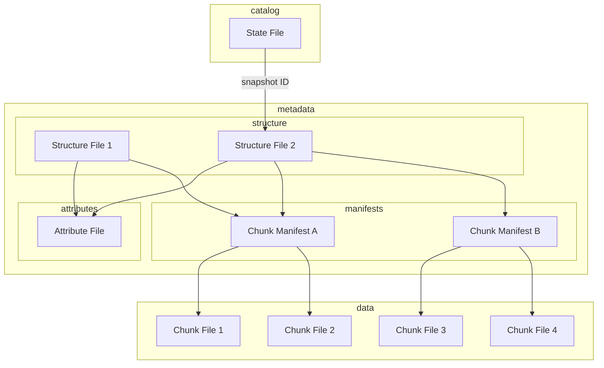

# Icechunk Specification

The Icechunk specification is a storage specification for [Zarr](https://zarr-specs.readthedocs.io/en/latest/specs.html) data.
Icechunk is inspired by Apache Iceberg and borrows many concepts and ideas from the [Iceberg Spec](https://iceberg.apache.org/spec/#version-2-row-level-deletes).

This specification describes a single Icechunk **dataset**.
A dataset is defined as a Zarr store containing one or more interrelated Arrays and Groups which must be updated consistently.
The most common scenarios is for a dataset to contain a single Zarr group with multiple arrays, each corresponding to different physical variables but sharing common spatiotemporal coordinates.

## Comparison with Iceberg

| Iceberg Entity | Icechunk Entity |
|--|--|
| Table | Dataset |
| Column | Array |
| Catalog | State File |
| Snapshot | Snapshot |

## Goals

The goals of the specification are as follows:

1. **Serializable isolation** - Reads will be isolated from concurrent writes and always use a committed snapshot of a dataset. Writes across multiple arrays and chunks will be commited via a single atomic operation and will not be partially visible. Readers will not acquire locks.
2. **Chunk sharding and references** - Chunk storage is decoupled from specific file names. Multiple chunks can be packed into a single object (sharding). Zarr-compatible chunks within other file formats (e.g. HDF5, NetCDF) can be referenced.

[TODO: there must be more, but these seem like the big ones for now]

### Filesytem Operations

The required filesystem operations are identical to Iceberg. Icechunk only requires that file systems support the following operations:

- **In-place write** - Files are not moved or altered once they are written.
- **Seekable reads** - Chunk file formats may require seek support (e.g. shards).
- **Deletes** - Datasets delete files that are no longer used (via a garbage-collection operation).

These requirements are compatible with object stores, like S3.

Datasets do not require random-access writes. Once written, chunk and metadata files are immutable until they are deleted.

## Specification

### Overview

Like Iceberg, Icechunk uses a series of linked metadata files to describe the state of the dataset.

- The **state file** is the entry point to the dataset. It stores a record of snapshots, each of which is a pointer to a single structure file.
- The **structure file** records all of the different arrays and groups in the dataset, plus their metadata. Every new commit creates a new structure file. The structure file contains pointers to one or more chunk manifests files and [optionally] attribute files.
- **Chunk Manifests** store references to individual chunks.
- **Attributes files** provide a way to store additional user-defined attributes for arrays and groups outside of the structure file.
- **Chunk files** store the actual compressed chunk data.

When reading a dataset, the client first open the state file and chooses a specific snapshot to open.
The client then reads the structure file to determine the structure and hierarchy of the dataset.
When fetching data from an array, the client first examines the chunk manifest file[s] for that array and finally fetches the chunks referenced therein.

When writing a new dataset snapshot, the client first writes a new set of chunks and chunk manifests, and then generates a new structure file. Finally, in an atomic swap operation, it replaces the state file with a new state file recording the presence of the new snapshot .




### State File

The **state file** records the current state of the dataset.
All transactions occur by updating or replacing the state file.
The state file contains, at minimum, a pointer to the latest structure file snapshot.


The state file is a JSON file. It contains the following required and optional fields.

[TODO: convert to JSON schema]

| Name | Required | Type | Description |
|--|--|--|--|
| id | YES | str UID | A unique identifier for the dataset |
| generation | YES | int | An integer which must be incremented whenever the state file is updated |
| store_root | NO | str | A URI which points to the root location of the store in object storage. If blank, the store root is assumed to be in the same directory as the state file itself. | 
| snapshots | YES | array[snapshot] | A list of all of the snapshots. |
| refs | NO | mapping[reference] | A mapping of references to snapshots |

A snapshot contains the following properties

| Name | Required | Type | Description |
|--|--|--|--|
| snapshot-id | YES | str UID | Unique identifier for the snapshot |
| parent-snapshot-id | NO | str UID | Parent snapshot (null for no parent) |
| timestamp-ms | YES | int | When was snapshot commited |
| structure-file | YES | str | Name of the structure file for this snapshot |
| properties | NO | object | arbitrary user-defined attributes to associate with this snapshot | 

References are a mapping of string names to snapshots


| Name | Required | Type | Description |
|--|--|--|--|
| name | YES | str | Name of the reference|
| snapshot-id | YES | str UID | What snaphot does it point to |
| type | YES | "tag" / "branch" | Whether the reference is a tag or a branch | 

### File Layout

The state file can be stored separately from the rest of the data or together with it. The rest of the data files in the dataset must be kept in a directory with the following structure.

- `$ROOT` base URI (s3, gcs, file, etc.)
- `$ROOT/state.json` (optional) state file
- `$ROOT/s/` for the structure files
- `$ROOT/a/` arrays and groups attribute information
- `$ROOT/i/` array chunk manifests (i for index or inventory)
- `$ROOT/c/` array chunks

### Structure Files

The structure file fully describes the schema of the dataset, including all arrays and groups.

The structure file is a Parquet file.
Each row of the file represents an individual node (array or group) of the Zarr dataset. 

The structure file has the following Arrow schema:

```
id: uint16 not null
  -- field metadata --
  description: 'unique identifier for the node'
type: string not null
  -- field metadata --
  description: 'array or group'
path: string not null
  -- field metadata --
  description: 'path to the node within the store'
array_metadata: struct<shape: list<item: uint16> not null, data_type: string not null, fill_value: binary, dimension_names: list<item: string>, chunk_grid: struct<name: string not null, configuration: struct<chunk_shape: list<item: uint16> not null> not null>, chunk_key_encoding: struct<name: string not null, configuration: struct<separator: string not null> not null>, codecs: list<item: struct<name: string not null, configuration: binary>>>
  child 0, shape: list<item: uint16> not null
      child 0, item: uint16
  child 1, data_type: string not null
  child 2, fill_value: binary
  child 3, dimension_names: list<item: string>
      child 0, item: string
  child 4, chunk_grid: struct<name: string not null, configuration: struct<chunk_shape: list<item: uint16> not null> not null>
      child 0, name: string not null
      child 1, configuration: struct<chunk_shape: list<item: uint16> not null> not null
          child 0, chunk_shape: list<item: uint16> not null
              child 0, item: uint16
  child 5, chunk_key_encoding: struct<name: string not null, configuration: struct<separator: string not null> not null>
      child 0, name: string not null
      child 1, configuration: struct<separator: string not null> not null
          child 0, separator: string not null
  child 6, codecs: list<item: struct<name: string not null, configuration: binary>>
      child 0, item: struct<name: string not null, configuration: binary>
          child 0, name: string not null
          child 1, configuration: binary
  -- field metadata --
  description: 'All the Zarr array metadata'
inline_attrs: binary
  -- field metadata --
  description: 'user-defined attributes, stored inline with this entry'
attrs_reference: struct<attrs_file: string not null, row: uint16 not null, flags: uint16>
  child 0, attrs_file: string not null
  child 1, row: uint16 not null
  child 2, flags: uint16
  -- field metadata --
  description: 'user-defined attributes, stored in a separate attributes ' + 4
inventories: list<item: struct<inventory_file: string not null, row: uint16 not null, extent: list<item: fixed_size_list<item: uint16>[2]> not null, flags: uint16>>
  child 0, item: struct<inventory_file: string not null, row: uint16 not null, extent: list<item: fixed_size_list<item: uint16>[2]> not null, flags: uint16>
      child 0, inventory_file: string not null
      child 1, row: uint16 not null
      child 2, extent: list<item: fixed_size_list<item: uint16>[2]> not null
          child 0, item: fixed_size_list<item: uint16>[2]
              child 0, item: uint16
      child 3, flags: uint16
```

### Attributes Files

[TODO: do we really need attributes files?]

### Chunk Manifest Files

A chunk manifest file stores chunk references.
Chunk references from multiple arrays can be stored in the same chunk manifest.
The chunks from a single array can also be spread across multiple manifests.

Chunk manifest files are Parquet files.
They have the following arrow schema.

```
id: uint32 not null
array_id: uint32 not null
coord: binary not null
inline_data: binary
chunk_file: string
offset: uint64
length: uint32 not null
```

- **id** - unique ID for the chunk.
- **array_id** - ID for the array this is part of
- **coord** - position of the chunk within the array. See _chunk coord encoding_ for more detail
- **chunk_file** - the name of the file in which the chunk resides
- **offset** - offset in bytes
- **length** - size in bytes

#### Chunk Coord Encoding

Chunk coords are tuples of positive ints (e.g. `(5, 30, 10)`).
In normal Zarr, chunk keys are encoded as strings (e.g. `5.30.10`).
We want an encoding is:
- efficient (minimal storage size)
- sortable
- useable as a predicate in Arrow

The first two requirements rule out string encoding.
The latter requirement rules out structs or lists.

So we opt for a variable length binary encoding.

### Chunk Files

Chunk files contain the compressed binary chunks of a Zarr array.
Icechunk permits quite a bit of flexibility about how chunks are stored.
Chunk files can be:

- One chunk per chunk file (i.e. standard Zarr)
- Multiple contiguous chunks from the same array in a single chunk file (similar to Zarr V3 shards)
- Chunks from multiple different arrays in the same file
- Other file types (e.g. NetCDF, HDF5) which contain Zarr-compatible chunks

Applications may choose to arrange chunks within files in different ways to optimize I/O patterns.

## Algorithms

### Initialize New Store

### Write Snapshot

### Read Snapshot

### Expire Snapshots
