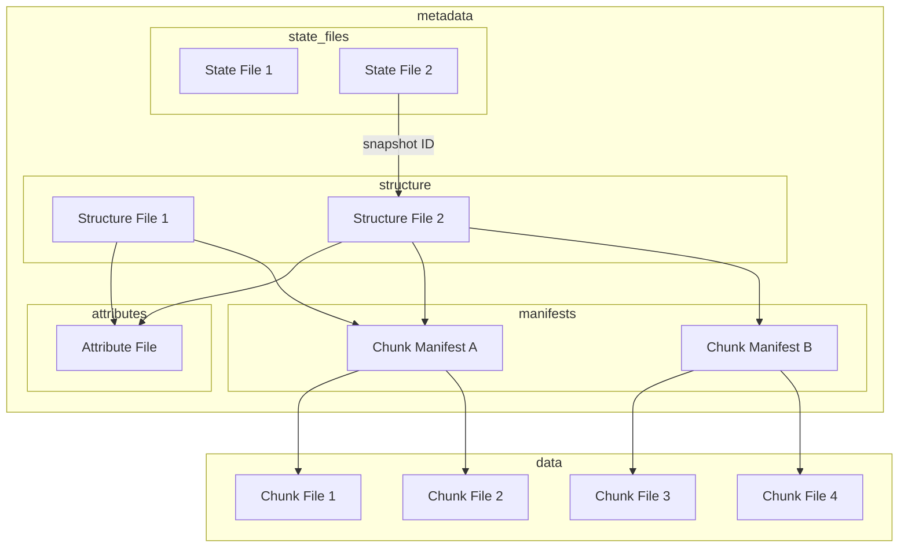

# Icechunk Specification

The key words "MUST", "MUST NOT", "REQUIRED", "SHALL", "SHALL NOT", "SHOULD", "SHOULD NOT", "RECOMMENDED", "MAY", and "OPTIONAL" in this document are to be interpreted as described in [RFC 2119](https://www.rfc-editor.org/rfc/rfc2119.html).

## Introduction

The Icechunk specification is a storage specification for [Zarr](https://zarr-specs.readthedocs.io/en/latest/specs.html) data.
Icechunk is inspired by Apache Iceberg and borrows many concepts and ideas from the [Iceberg Spec](https://iceberg.apache.org/spec/#version-2-row-level-deletes).

This specification describes a single Icechunk **store**.
A store is defined as a Zarr store containing one or more Arrays and Groups.
The most common scenario is for a store to contain a single Zarr group with multiple arrays, each corresponding to different physical variables but sharing common spatiotemporal coordinates.
However, formally a store can be any valid Zarr hierarchy, from a single Array to a deeply nested structure of Groups and Arrays.
Users of Icechunk SHOULD aim to scope their stores only to related arrays and groups that require consistent transactional updates.

All the data and metadata for a store are stored in a directory in object storage or file storage.
Optionally, an external _synchronization endpoint_ can be used to help coordinate transactional updates for storage systems which don't support atomic compare-and-swap operations.

## Goals

The goals of the specification are as follows:

1. **Serializable isolation** - Reads will be isolated from concurrent writes and always use a committed snapshot of a store. Writes to arrays will be commited via a single atomic operation and will not be partially visible. Readers will not acquire locks.
2. **Chunk sharding and references** - Chunk storage is decoupled from specific file names. Multiple chunks can be packed into a single object (sharding). Zarr-compatible chunks within other file formats (e.g. HDF5, NetCDF) can be referenced.
3. **Time travel** - Previous snapshots of a store remain accessible after new ones have been written. Reverting to an early snapshot is trivial and inexpensive.
4. **Schema Evolution** - Arrays and Groups can be added, renamed, and removed from the hierarchy with minimal overhead.

### Non Goals

1. **Low Latency** - Icechunk is designed to support analytical workloads for large stores. We accept that the extra layers of metadata files and indirection will introduce additional cold-start latency compared to regular Zarr. 

### Storage Operations

Icechunk requires that the storage system support the following operations:

- **In-place write** - Files are not moved or altered once they are written. Strong read-after-write and list-after-write consistency is expected.
- **Conditional write if-not-exists** - For the commit process to be safe and consistent, the storage system must guard against two files of the same name being created at the same time.
- **Seekable reads** - Chunk file formats may require seek support (e.g. shards).
- **Deletes** - Delete files that are no longer used (via a garbage-collection operation).

These requirements are compatible with object stores, like S3, as well as with filesystems.

The storage system does is not required to support random-access writes. Once written, chunk and metadata files are immutable until they are deleted.

## Specification

### Overview

Icechunk uses a series of linked metadata files to describe the state of the store.

- The **state file** is the entry point to the store. It stores a record of snapshots, each of which is a pointer to a single structure file. The latest state file is always copied to `icechunk.json`.
- The **structure file** records all of the different arrays and groups in the store, plus their metadata. Every new commit creates a new structure file. The structure file contains pointers to one or more chunk manifest files and [optionally] attribute files.
- **Chunk Manifests** store references to individual chunks. A single manifest may store references for multiple arrays or a subset of all the references for a single array.
- **Attributes files** provide a way to store additional user-defined attributes for arrays and groups outside of the structure file. This is important when the attributes are very large.
- **Chunk files** store the actual compressed chunk data, potentially containing data for multiple chunks in a single file.

When reading a store, the client opens the latest state file and then chooses a structure file corresponding to a specific snapshot to open.
The client then reads the structure file to determine the structure and hierarchy of the store.
When fetching data from an array, the client first examines the chunk manifest file[s] for that array and finally fetches the chunks referenced therein.

When writing a new store snapshot, the client first writes a new set of chunks and chunk manifests, and then generates a new structure file and state file.
Finally, in an atomic compare-and-swap operation, it updates the `icechunk.json` file to complete the commit.
Storage systems that don't support atomic compare-and-swap may use an external synchronization endpoint.




### File Layout

All data and metadata files are stored in a warehouse (typically an object store) using the following directory structure.

- `$ROOT` base URI (s3, gcs, file, etc.)
- `$ROOT/icechunk.json` copy of latest state file
- `$ROOT/t/` state files
- `$ROOT/s/` for the structure files
- `$ROOT/a/` for attribute files
- `$ROOT/m/` for array chunk manifests
- `$ROOT/c/` for array chunks

### State File

The **state file** records the current state and history of the store.
All commits occur by creating a new state file.
The state file contains a list of active (non-expired) snapshots.
Each snapshot includes a pointer to the structure file for that snapshot.

The state file is a JSON file with the following JSON schema:

[TODO: convert to JSON schema]

| Name | Required | Type | Description |
|--|--|--|--|
| id | YES | str UID | A unique identifier for the store |
| generation | YES | int | An integer which must be incremented whenever the state file is updated |
| store_root | YES | str | A URI which points to the root location of the store in object storage. | 
| snapshots | YES | array[snapshot] | A list of all of the snapshots. |
| refs | NO | mapping[reference] | A mapping of references (string names) to snapshots |

A snapshot contains the following properties

| Name | Required | Type | Description |
|--|--|--|--|
| snapshot-id | YES | str UID | Unique identifier for the snapshot |
| parent-snapshot-id | YES |  null OR str UID | Parent snapshot (null for no parent) |
| timestamp-ms | YES | int | When was snapshot commited |
| structure-file | YES | str | Name of the structure file for this snapshot |
| properties | NO | object | arbitrary user-defined attributes to associate with this snapshot | 

References are a mapping of string names to snapshots

| Name | Required | Type | Description |
|--|--|--|--|
| name | YES | str | Name of the reference|
| snapshot-id | YES | str UID | What snaphot does it point to |
| type | YES | "tag" / "branch" | Whether the reference is a tag or a branch | 

### Structure Files

The structure file fully describes the schema of the store, including all arrays and groups.

The structure file is a Parquet file.
Each row of the file represents an individual node (array or group) of the Zarr store. 

The structure file has the following Arrow schema:

```
id: uint32 not null
  -- field metadata --
  description: 'unique identifier for the node'
type: string not null
  -- field metadata --
  description: 'array or group'
path: string not null
  -- field metadata --
  description: 'path to the node within the store'
array_metadata: struct<shape: list<item: uint16> not null, data_type: string not null, fill_value: binary, dimension_names: list<item: string>, chunk_grid: struct<name: string not null, configuration: struct<chunk_shape: list<item: uint16> not null> not null>, chunk_key_encoding: struct<name: string not null, configuration: struct<separator: string not null> not null>, codecs: list<item: struct<name: string not null, configuration: binary>>>
  child 0, shape: list<item: uint16> not null
      child 0, item: uint16
  child 1, data_type: string not null
  child 2, fill_value: binary
  child 3, dimension_names: list<item: string>
      child 0, item: string
  child 4, chunk_grid: struct<name: string not null, configuration: struct<chunk_shape: list<item: uint16> not null> not null>
      child 0, name: string not null
      child 1, configuration: struct<chunk_shape: list<item: uint16> not null> not null
          child 0, chunk_shape: list<item: uint16> not null
              child 0, item: uint16
  child 5, chunk_key_encoding: struct<name: string not null, configuration: struct<separator: string not null> not null>
      child 0, name: string not null
      child 1, configuration: struct<separator: string not null> not null
          child 0, separator: string not null
  child 6, codecs: list<item: struct<name: string not null, configuration: binary>>
      child 0, item: struct<name: string not null, configuration: binary>
          child 0, name: string not null
          child 1, configuration: binary
  -- field metadata --
  description: 'All the Zarr array metadata'
inline_attrs: binary
  -- field metadata --
  description: 'user-defined attributes, stored inline with this entry'
attrs_reference: struct<attrs_file: string not null, row: uint16 not null, flags: uint16>
  child 0, attrs_file: string not null
  child 1, row: uint16 not null
  child 2, flags: uint16
  -- field metadata --
  description: 'user-defined attributes, stored in a separate attributes ' + 4
manifests: list<item: struct<manifest_id: uint16 not null, row: uint16 not null, extent: list<item: fixed_size_list<item: uint16>[2]> not null, flags: uint16>>
  child 0, item: struct<manifest_id: uint16 not null, row: uint16 not null, extent: list<item: fixed_size_list<item: uint16>[2]> not null, flags: uint16>
      child 0, manifest_id: uint16 not null
      child 1, row: uint16 not null
      child 2, extent: list<item: fixed_size_list<item: uint16>[2]> not null
          child 0, item: fixed_size_list<item: uint16>[2]
              child 0, item: uint16
      child 3, flags: uint16
```

The most recent committed state file MUST be replicated to the file `icechunk.json` at the top-level store directory.
During the commit process, this file is replaced with an atomic compare-and-swap operation.
Storage systems that don't support atomic compare-and-swap may use an external synchronization endpoint for updates.

### Attributes Files

Attribute files hold user-defined attributes separately from the structure file.

### Chunk Manifest Files

A chunk manifest file stores chunk references.
Chunk references from multiple arrays can be stored in the same chunk manifest.
The chunks from a single array can also be spread across multiple manifests.

Chunk manifest files are Parquet files.
They have the following arrow schema.

```
array_id: uint32 not null
coord: binary not null
inline_data: binary
chunk_id: binary
virtual_path: string
offset: uint64
length: uint32 not null
```

- **id** - unique ID for the chunk.
- **array_id** - ID for the array this is part of
- **coord** - position of the chunk within the array. See _chunk coord encoding_ for more detail
- **chunk_file** - the name of the file in which the chunk resides
- **offset** - offset in bytes
- **length** - size in bytes

#### Chunk Coord Encoding

Chunk coords are tuples of positive ints (e.g. `(5, 30, 10)`).
In normal Zarr, chunk keys are encoded as strings (e.g. `5.30.10`).
We want an encoding is:
- efficient (minimal storage size)
- sortable
- useable as a predicate in Arrow

The first two requirements rule out string encoding.
The latter requirement rules out structs or lists.

So we opt for a variable length binary encoding.
The chunk coord is created by encoding each element of the tuple a big endian `uint16` and then simply concatenating the bytes together in order. For the common case of arrays <= 4 dimensions, this would use 8 bytes or less per chunk coord.

### Chunk Files

Chunk files contain the compressed binary chunks of a Zarr array.
Icechunk permits quite a bit of flexibility about how chunks are stored.
Chunk files can be:

- One chunk per chunk file (i.e. standard Zarr)
- Multiple contiguous chunks from the same array in a single chunk file (similar to Zarr V3 shards)
- Chunks from multiple different arrays in the same file
- Other file types (e.g. NetCDF, HDF5) which contain Zarr-compatible chunks

Applications may choose to arrange chunks within files in different ways to optimize I/O patterns.

## Synchronization Endpoint

Some storage systems (notably AWS S3) do not support an atomic compare-and-swap operation.
To support transactions in this scenario, Icechunk defines an external _synchronization endpoint_, a stateful JSON-based REST API supporting the following operations.

[TODO: flesh out API specification]

```yaml
paths:
  /{storeIdentifier}:
    get:
      summary: Retrieve the latest state file metadata for an Icechunk store
      responses:
        '200':
          description: State file metadata.
          content:
            application/json:
              schema:
                type: object
                properties:
                ...
    post:
      summary: Commit new state file metadata for an Icechunk store
      ...
```

The synchronization endpoint must reject updates which are not compatible with the existing stored state.

When using an external synchronization endpoint, following a successful commit, the client should replicate the same data to `icechunk.json`.

[TODO: how do we prevent client from accidentally just committing to `icechunk.json` without posting to the synchronization endpoint? I think synchronization endpoint needs to go in `icechunk.json`.]

## Algorithms

### Initialize New Store

### Write Snapshot

### Read Snapshot

### Expire Snapshots


## Appendices

### Comparison with Iceberg

Like Iceberg, Icechunk uses a series of linked metadata files to describe the state of the store.
But while Iceberg describes a table, the Icechunk store is a Zarr store (hierarchical structure of Arrays and Groups.)

| Iceberg Entity | Icechunk Entity | Comment |
|--|--|--|
| Table | Store | The fundamental entity described by the spec |
| Column | Array | The logical container for a homogenous collection of values | 
| Metadata File | State File | The highest-level entry point into the dataset |
| Snapshot | Snapshot | A single committed snapshot of the dataset |
